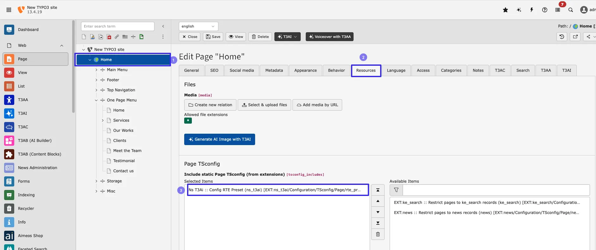
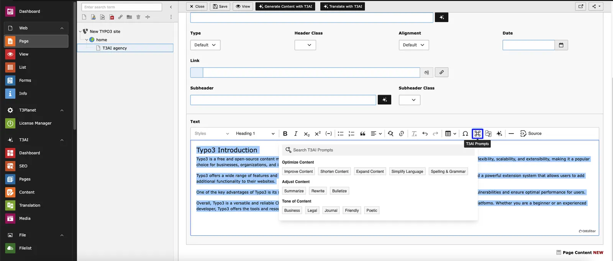
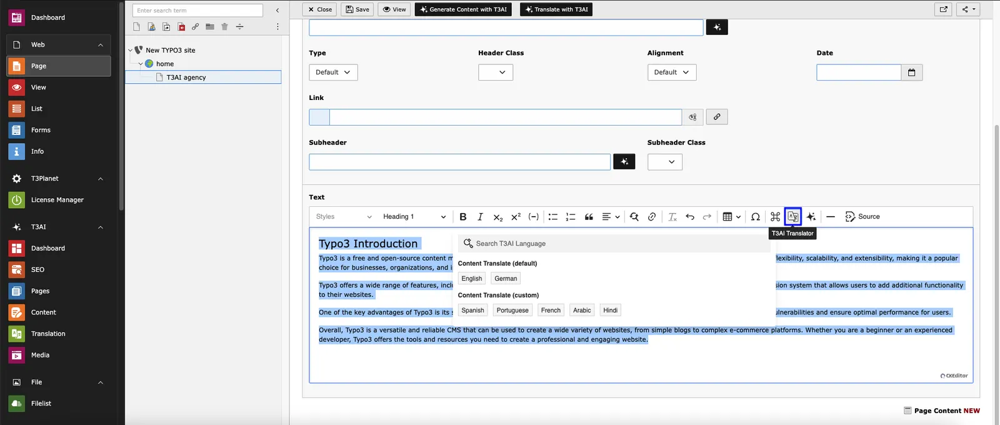
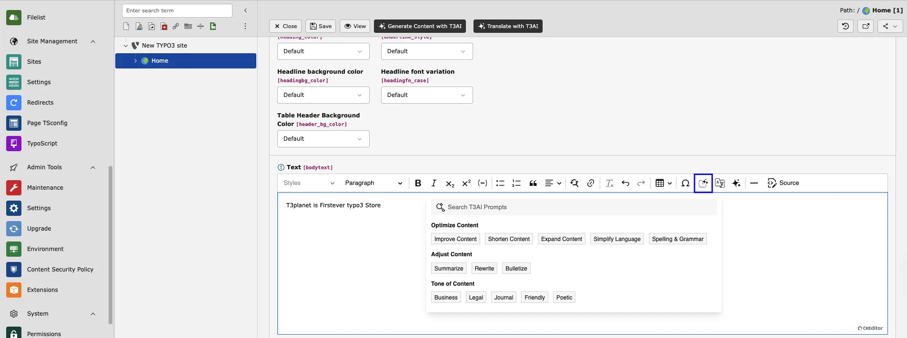
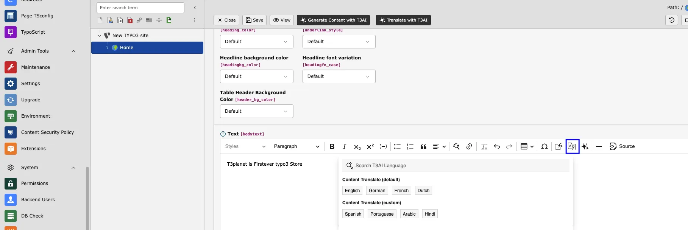
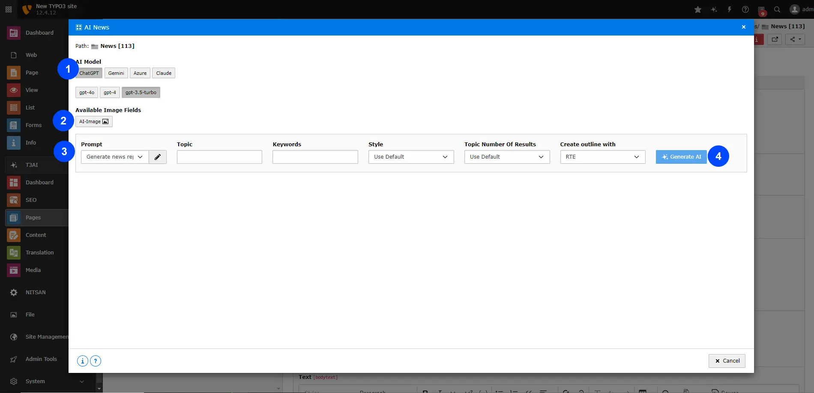

## RTE AI Copilot

<iframe src="https://app.supademo.com/embed/cmfparfqb2e1z1d3nuc7u27hg?embed_v=2&utm_source=embed" loading="lazy" title="AI Co pilot" allow="clipboard-write" frameBorder="0" webkitallowfullscreen="true" mozallowfullscreen="true" allowfullscreen></iframe>

This feature adds an AI copilot to the TYPO3 Rich Text Editor (RTE), making it easier for users to add and update content. The copilot offers helpful suggestions and simplifies editing and formatting, improving the overall user experience.

Follow below Step to Use this feature,

- **Step 1** - goto page module and Select the page
- **Step 2** - click on edit Page property
- **Step 3** - go to Tab Resources
- **Step 4** - include **Ns T3Ai :: Config RTE Preset (ns_t3ai)** in Include static Page TSconfig and Save the configuration

Now add RTE in into page and you can see AI-copilot in RTE

## T3AI Prompts

This feature helps optimize your inserted content using prompts.

## T3AI Transalator

This feature allows you to translate selected content into your chosen language.

## T3AI Prompts

This feature helps optimize your inserted content using prompts.

## T3AI Transalator

This feature allows you to translate selected content into your chosen language.

## Content Rewriter

<iframe src="https://app.supademo.com/embed/cmfo05vp51bih1d3nx2mm01pa?step=1" loading="lazy" title="AI Co pilot" allow="clipboard-write" frameBorder="0" webkitallowfullscreen="true" mozallowfullscreen="true" allowfullscreen></iframe>

Stop spending hours rewriting content by hand. T3AI Content Writer lets you generate fresh and unique content quickly and easily. Whether you need blog posts, news articles, or website content, T3AI Content Writer has you covered. Generate tailored content in seconds.

**Note: Please select the Storage folder from the page tree. We recommend using GPT-4.0 for better results.**

**Step 1:** Navigate to the **‘T3AI’** Module, click **‘Content,’** tab and then choose” **Content Rewriter”.**

**Step 2:** Open the ‘Content Rewriter’’ tab.

- Choose the AI model and its version.
- Select a prompt and customize it if needed.
- Add your **“Select Record Page,”** **“Topic,” “Writing Style,” “Word Count,” “Additional Instructions,”** and **“Auto Link.”**
- Click the **“Generate AI”** button.

**Record type -**

- Blog: Refresh your blog content quickly with just a few clicks.
- News: Update your news articles instantly with our easy-to-use tool

**Writing Style -**

**Casual** - Keep it light and friendly for a more relaxed feel.

**Approachable** - Make your content welcoming and easy to connect with users.

**Easy readability** - this style Ensures your content is clear and simple for everyone to understand.

**Rewrite in Different Styles -**

**Internal**:Choose a news page from the Page Tree and rewrite it in your preferred style.

**External**: Add an external news URL, fill in the required fields, and click “Generate AI.” The system will fetch content from the provided news website and generate rewritten news content accordingly.

**Text**:Enter your news content in the text box, select the content type, and click “Generate AI.” The system will rewrite the news content based on the text entered in the fields.

**Step 3:**

- Select the content outline
- Click the “Generate Content” button to create the news content.
- Click the “Save News Records” button.

**Step 4:** Edit Your Content

- Edit the news headline, URL, t easer, and RTE text.
- Edit the keywords and meta description.
- If you need more content ideas, click on “Get AI Suggestions.”
- Once you’re done, click “Close Page.” Your news will be saved to your storage!

**Step 5:** Go to the List module

- 1.Click on your respective storage folder.
- 2.Click and view the generated news.

## News Content Rewriter

<iframe src="https://app.supademo.com/embed/cmfqja3b60yda130uutqwjfwr?embed_v=2&utm_source=embed" loading="lazy" title="AI Co pilot" allow="clipboard-write" frameBorder="0" webkitallowfullscreen="true" mozallowfullscreen="true" allowfullscreen></iframe>

No more manual rewriting! T3AI Content Writer helps you create fresh content quickly and easily. Use our AI tool to generate original articles in seconds. Our online AI tool helps you generate original articles in just a few seconds.

**Note: Please select the Storage folder from the page tree. We recommend using GPT-4.0 for better results.**

**Step 1:** Navigate to the **‘T3AI’** Module, click **‘Content,’** tab and then choose” **News Content Rewriter”.**

**Step 2:** Open the ‘Content Rewriter’’ tab.

- Choose the AI model and its version.
- Select a prompt and customize it if needed.
- Add your **“Select Record Page,” “Topic,” “Writing Style,” “Word Count,” “Additional Instructions,”** and **“Auto Link.”**
- Choose **“Generate News Records”**  from the Storage Folder.
- Click the **“Generate AI”** button.

**Record type -**

- Blog: Refresh your blog content quickly with just a few clicks.
- News: Update your news articles instantly with our easy-to-use tool

**Writing Style -**

**Casual** - Keep it light and friendly for a more relaxed feel.

**Approachable** - Make your content welcoming and easy to connect with users.

**Easy readability** - this style Ensures your content is clear and simple for everyone to understand.

**Rewrite in Different Styles -**

**Internal**: Choose a page from the Page Tree and rewrite it in your preferred style.

**External**: Add an external URL, fill in the required fields, and click “Generate AI.” The system will fetch content from the provided website URL and generate rewritten content accordingly.

**Text**: Enter your content in the text box, choose the content type, and click “Generate AI.” The system will rewrite the content based on the text entered in the fields.

**Step 3:** Choose the element type and edit the content.

- Click the “Save” button.
- Your news is now rewritten!

**Step 4:** Your Rewritten content is stored in your elements !

**Step 5:**

- Go to the List module
- Select your storage folder.
- Edit & View your News by Select “ News records”.

## Blog Content Rewriter

<iframe src="https://app.supademo.com/embed/cmfqj657f0y6c130ud3zh0goi?embed_v=2&utm_source=embed" loading="lazy" title="AI Co pilot" allow="clipboard-write" frameBorder="0" webkitallowfullscreen="true" mozallowfullscreen="true" allowfullscreen></iframe>

Generate fresh and unique content in seconds with our T3AI rewriting tool.Create original articles and contents with the assistance of our online AI content rewriting tool in just a few seconds.

**Note: Please select the Storage folder from the page tree. We recommend using GPT-4.0 for better results.**

**Step 1:** Navigate to the **‘T3AI’** Module, click **‘Content,’** tab and then choose” **Blog Content Rewriter”.**

**Step 2:** Open the ‘Blog Content Rewriter’ tab.

- Select the AI model and its version.
- Choose the rewriter type: Internal, External, or Text.
- Enter the blog topic and select the record type.
- Choose your preferred writing style.
- Set the word count and add any additional instructions, including Auto Link and Text.
- Click the ‘Generate AI’ button

**Types of Blog Rewriter AI -**

**Internal Blog Rewriter** – Select a blog from the page list and rewrite its content instantly with a single click using T3AI.

**External Blog Rewriter AI** - Simply provide the URL of an external blog and follow the same steps. T3AI can rewrite the blog in just a few clicks!

**Text** - Enter your content manually or add text from an external source. T3AI will rewrite the blog content quickly and efficiently.

**Step 3:** Edit and choose the elements you want to rewrite in your blog content.

- T3AI lets you select different element types.
- Edit the content of each element as needed.
- You can also delete and regenerate content if needed.
- Click the ‘Save’ button when you’re done.

**Step 4:** Your Rewritten content is stored in your elements !

**Step 5:**

- Go to the List module
- Select your storage folder.
- Edit & View your News by Select “ Blog records”.

## Content Elements (Create)

<iframe src="https://app.supademo.com/embed/cmfqip70w0xi6130um9g1ndwf?embed_v=2&utm_source=embed" loading="lazy" title="AI Co pilot" allow="clipboard-write" frameBorder="0" webkitallowfullscreen="true" mozallowfullscreen="true" allowfullscreen></iframe>

Create AI-powered content elements effortlessly. With advanced AI, you can easily generate TYPO3 core elements, along with custom content elements and blocks that match your design. This feature allows you to quickly build and customize content, saving you time and making your work more efficient.

**Step 1:** Go to the Page module and select the page where you want to create an element.

**Step 2:** Add content elements by selecting ‘Create Element with T3AI’ from the top bar.

**Step 3:** Create the element using T3AI.

- Enter your content element prompt and choose the text fields (headers, sub-headers, text).
- Add an AI image prompt, choose the AI image settings, and select the AI image models.
- Click the ‘Generate AI’ button.

**Step 4:** your Regenerate Content is stored in your selected Element filed.

## Content Elements (Edit)

### Guidance

<iframe src="https://app.supademo.com/embed/cmfqju3jw0yyq130uvav5h5r1" loading="lazy" title="AI Co pilot" allow="clipboard-write" frameBorder="0" webkitallowfullscreen="true" mozallowfullscreen="true" allowfullscreen></iframe>

Didn’t get the information you wanted? T3AI lets you edit and regenerate elements in seconds, saving you time and effort. Easily edit AI-generated TYPO3 core components, as well as custom content elements and blocks you’ve created.

**Note - Follow the steps outlined above under -**

**Step 1:** Go to the Page module and select the page where you want to create an element.

## Content Translate

<iframe src="https://app.supademo.com/embed/cmfpdagob2ias1d3n5w7nptm0?embed_v=2&utm_source=embed" loading="lazy" title="AI Co pilot" allow="clipboard-write" frameBorder="0" webkitallowfullscreen="true" mozallowfullscreen="true" allowfullscreen></iframe>

With this T3AI feature, you can easily translate your page content elements with just one click! It simplifies the translation process, saving you time and effort. No more manual copying and pasting—just select the content, choose your language, and let T3AI handle the rest

- **Step 1** - Go to your T3AI module and select the **‘Page’** module.
  - Choose the page from your page tree and navigate to it.
- **Step 2** - Edit Your Content Element and Select Transalte with the T3AI button.
- **Step 3** - Select your AI model and language. Click on the **‘Translate Record’** button.
Your content element will be translated

## Content Fields

The **Content Field** feature allows you to generate AI-powered content for all fields using a single prompt.
This helps streamline content creation by automatically filling multiple fields with relevant, high-quality text.

**How it works:**

1. Enter a prompt describing the content you want.
2. The AI generates content for all configured fields simultaneously.
3. Select the Content and click **Save**.
