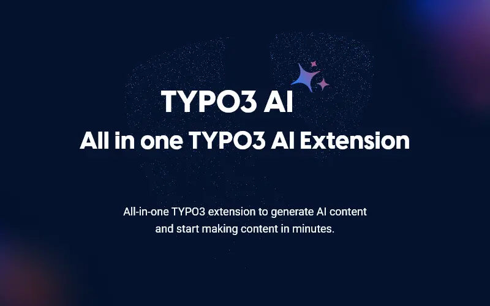

## EXT:ns_t3ai

## EXT:ns_t3ai - What does it do?

Curious about your beloved TYPO3 CMS and Generative AI? Welcome to **T3AI—a truly revolutionary TYPO3 extension.**

Our all-in-one TYPO3 extension is here to transform how you create, manage, and optimize your site content with just a few clicks. Whether you’re running a small business, a medium-sized company, or an enterprise-level site, this innovative TYPO3 KI Extension uses the power of artificial intelligence to make your workflow easier and boost your site’s performance.

Say goodbye to the traditional content management. The future of AI-powered TYPO3 is here, and it’s ready to transform the way you manage your digital presence.
T3AI is more than just an extension; it’s your AI Assistant.

T3AI now works as a child extension of T3AF (`ns_t3af`), which provides the shared AI providers, common configuration, and core AI services used by the extension.

## Helpful Links

<Note>
- Product: [https://t3planet.de/t3ai-typo3-extension](https://t3planet.de/t3ai-typo3-extension)
- TYPO3 Backend Live Demo: [https://t3-extension-live.t3planet.de/typo3/?TYPO3_AUTOLOGIN_USER=editor-ns-t3ai](https://t3-extension-live.t3planet.de/typo3/?TYPO3_AUTOLOGIN_USER=editor-ns-t3ai)
- Get Support- [https://t3planet.de/support](https://t3planet.de/support)
</Note>
