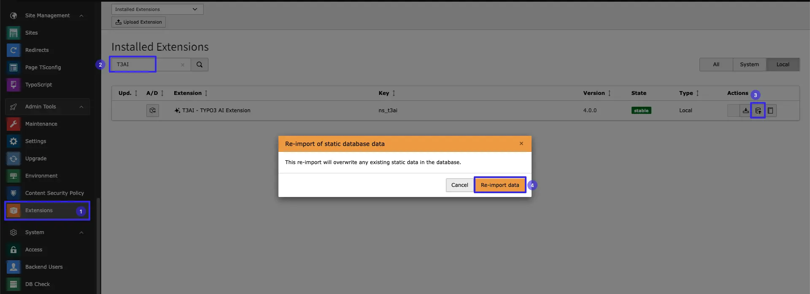

## Synchronize AI Prompts

We continuously improve AI prompts, refining existing ones or adding new ones with each update. To ensure smooth operation, follow the steps below to synchronize AI prompts

<Warning>
Before updating, back up your database to ensure its safety.
</Warning>

- **Step 1:** Go to Extension Module
- **Step 2:** In installed extension > search “T3Ai”
- **Step 3:** Click on Import DB Button
- **Step 4:** Click on Button **Re-import data**

<Warning>
Please be aware that any custom prompts you’ve created will be overwritten during synchronization. After the process is complete, you’ll need to manually recreate your custom AI prompts. We apologize for the inconvenience
</Warning>

Test the updated T3AI features to ensure everything is working properly :)

## Report Problems

Currently, we do not have any known problems from customers. If you encounter any issues, please report them to us at [https://t3planet.de/support](https://t3planet.de/support)
