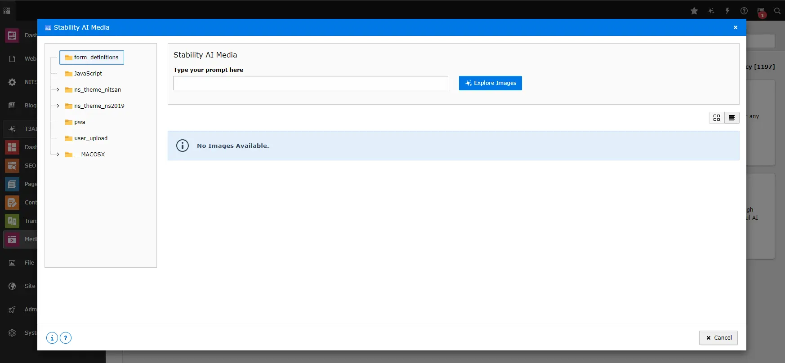

Make AI-generated images, audio, and videos quickly and easily. Use trusted tools like DALL-E, MidJourney, Stability AI, Unsplash, Openverse, and Pixabay to create your media.

## DALL-E AI Images

<iframe src="https://app.supademo.com/embed/cmfqkhpxd0z50130uzyzl117z?embed_v=2&utm_source=embed" loading="lazy" title="AI Co pilot" allow="clipboard-write" frameBorder="0" webkitallowfullscreen="true" mozallowfullscreen="true" allowfullscreen></iframe>

Your T3AI’s image generation capabilities are now even stronger with DALL-E integration. Create high-quality AI-generated images with just one click!

**Note: Before Starting AI image generation, you need to select folders from Your folder tree.**

**Step 1** : Navigate to Your T3AI Module and select the Media tab.

**Step 2** : Open the “ Dall-E AI images“ module.

**Step 3** : Enter the AI image prompt describing the image you want to create.

- Choose the image style, like realistic or sketch.
- Select the image size that fits your needs.
- Enter the number of image results you want to generate.
- Click the “Generate AI Image” button.

**Step 4** : Select the image you want to save. Additionally, you can sort the images in either row or list format.

**Step 5** : Click the “Save Image” button, and your AI-generated image will be saved in the appropriate folder.

## MidJourney AI Images

Create any image you can imagine in seconds! With T3AI’s powerful integration with Midjourney AI, you can create high-quality images from simple text prompts for free. Just type a description of the image you want, and you’ll get amazing results.

**Note: Before Starting AI image generation, you need to select folders from Your folder tree.**

**Step 1** : Navigate to Your T3AI Module and select the Media tab.

**Step 2** : Open the **“MidJourney“** module.

**Step 3** : Enter the AI image prompt describing the image you want to create.

- Click the **“Generate AI Image”** button.

**Step 4** : Select the image you want to save. Additionally, you can sort the images in either row or list format.

**Step 5** : Click the “Save Image” button, and your AI-generated image will be saved in the appropriate folder.

## Stability AI Images

<iframe src="https://app.supademo.com/embed/cmfqklmcs0za6130urytvd8w4?embed_v=2&utm_source=embed" loading="lazy" title="AI Co pilot" allow="clipboard-write" frameBorder="0" webkitallowfullscreen="true" mozallowfullscreen="true" allowfullscreen></iframe>

Create cutting-edge AI images and videos with advanced AI technology. Stability AI media can do it with one click!

**Step 1** : Navigate to Your T3AI Module and select the Media tab.

**Step 2** : Open the **“Stability“** module.

**Step 3** : Enter the AI image prompt describing the image you want to create.

> Click the **“Generate AI Image”** button.

**Step 4** : Select the image you want to save. Additionally, you can sort the images in either row or list format.

**Step 5** : Click the “Save Image” button, and your AI-generated image will be saved in the appropriate folder.

## Unsplash AI

<iframe src="https://app.supademo.com/embed/cmfqkmi8z0zb6130utw8gvpbm?embed_v=2&utm_source=embed" loading="lazy" title="AI Co pilot" allow="clipboard-write" frameBorder="0" webkitallowfullscreen="true" mozallowfullscreen="true" allowfullscreen></iframe>

Looking for a collection of stock images? Explore a diverse selection of AI-generated images, perfect for any project or theme. Easily integrated into your work, these images are ready to enhance your creativity.

**Step 1** : Navigate to Your T3AI Module and select the Media tab.

**Step 2** : Open the **“Unsplash“** module.

**Step 3** : Enter the AI image prompt describing the image you want to create.

- Click the **“Generate AI Image”** button.

**Step 4** : Select the image you want to save. Additionally, you can sort the images in either row or list format.

**Step 5** : Click the **“Save Image”** button, and your AI-generated image will be saved in the appropriate folder.

## Openverse AI

<iframe src="https://app.supademo.com/embed/cmfqknksy0zda130u8yqeb2jx?embed_v=2&utm_source=embed" loading="lazy" title="AI Co pilot" allow="clipboard-write" frameBorder="0" webkitallowfullscreen="true" mozallowfullscreen="true" allowfullscreen></iframe>

Discover a vast collection of freely licensed media. Easily search for and use images, audio, and videos from Openverse for all your creative projects. Whether you’re working on a website, presentation, or any other project, Openverse provides high-quality resources that are easy to integrate and use.

**Step 1** : Navigate to Your T3AI Module and select the Media tab.

**Step 2** : Open the [**](#id1)“Openverse“* module.

**Step 3** : Enter the AI image prompt describing the image you want to create.

- Add Proper Image size & Number of images you want to create.
- Click the **“Generate AI Image”** button.

**Step 4** : Select the image you want to save. Additionally, you can sort the images in either row or list format.

**Step 5** : Click the **“Save Image”** button, and your AI-generated image will be saved in the appropriate folder.

## Pixabay

<iframe src="https://app.supademo.com/embed/cmfqkoe5s0zeo130uin27pkh8?embed_v=2&utm_source=embed" loading="lazy" title="AI Co pilot" allow="clipboard-write" frameBorder="0" webkitallowfullscreen="true" mozallowfullscreen="true" allowfullscreen></iframe>

Choose from a wide variety of images and videos to fit any project with Pixabay integration. Whether you’re designing a website, creating a presentation, or working on a marketing campaign, Pixabay offers a rich collection of high-quality media that’s easy to access and use in your projects.

**Step 1** : Navigate to Your T3AI Module and select the Media tab.

**Step 2** : Open the **“Pixabay“** module

**Step 3** : Enter the AI image prompt describing the image you want to create.

- Add Proper Image size & Number of images you want to create.
- Select the Number of images you want to create.

**Step 4** : Select the image you want to save. Additionally, you can sort the images in either row or list format.

**Step 5** : Click the **“Save Image”** button, and your AI-generated image will be saved in the appropriate folder.

## Pexels

<iframe src="https://app.supademo.com/embed/cmfqkpjae0zga130uix5y1g49?embed_v=2&utm_source=embed" loading="lazy" title="AI Co pilot" allow="clipboard-write" frameBorder="0" webkitallowfullscreen="true" mozallowfullscreen="true" allowfullscreen></iframe>

Generate and use high-quality, free stock photos from Pexels to easily enhance your content. Whether you’re working on a blog, social media post, or any other project, Pexels provides a wide selection of beautiful images that can be seamlessly integrated to make your content stand out.

**Step 1** : Navigate to Your T3AI Module and select the Media tab.

**Step 2** : Open the **“Pexels“** module.

**Step 3** : Enter the AI image prompt describing the image you want to create.

- Add Proper Image size & Number of images you want to create.
- Select the Number of images you want to create.

**Step 4** : Select the image you want to save. Additionally, you can sort the images in either row or list format.

**Step 5** : Click the **“Save Image”** button, and your AI-generated image will be saved in the appropriate folder.

## Interactive demos

<iframe src="https://app.supademo.com/embed/cmraqyvk01egeqmhxy26psv3d?utm_source=link" loading="lazy" title="AI Co pilot" allow="clipboard-write" frameBorder="0" webkitallowfullscreen="true" mozallowfullscreen="true" allowfullscreen></iframe>

<iframe src="https://app.supademo.com/embed/cmrar00ng1el4qmhxadb8be0z?utm_source=link" loading="lazy" title="AI Co pilot" allow="clipboard-write" frameBorder="0" webkitallowfullscreen="true" mozallowfullscreen="true" allowfullscreen></iframe>

