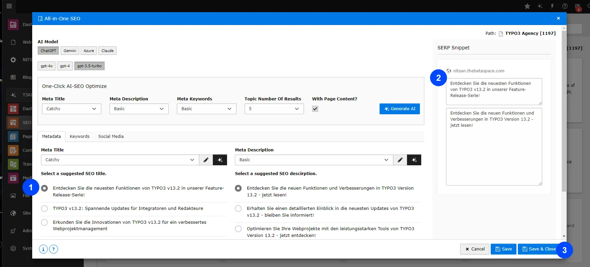

## T3AI SEO

Improve your TYPO3 site’s online presence with Smart T3AI SEO Suggestions. Optimize your website for better rankings on Google, saving you time and effort in seconds.

**Step 1**: Go to the T3AI module

**Step 2**: Click on the **“SEO module”** Tab.

## One-Click SEO Optimization

<iframe src="https://app.supademo.com/embed/cmfnpq0nh0sqx1d3nhc543m2a?embed_v=2&utm_source=embed" loading="lazy" title="AI Co pilot" allow="clipboard-write" frameBorder="0" webkitallowfullscreen="true" mozallowfullscreen="true" allowfullscreen></iframe>

Tired of manual SEO tasks? It’s time to upgrade your SEO techniques! With T3AI’s One-Click SEO feature, you can instantly generate all your SEO metadata, like titles, keywords, descriptions, and social media tags, including OG titles, descriptions, and images in Seconds!

**Note: Please select pages from the page tree. We recommend using GPT-4.0 for better results**

**Step 1:** Navigate to the ‘**T3AI**’ Module, click ‘**SEO,**’ tab and then choose ‘**One-Click AI SEO**.

**Step 2:** **Open the ‘All-in-One SEO’ tab.**

> Any AI mode you want to use for generating SEO data.
> Click on ‘**Select Model Type.**’ i.e  **Gpt 4.0**
> Enter your SEO title, description, and meta keywords.
> Click on the ‘**Generate AI**’ button.

**Writing Styles**-

**Basic :** The term **“Basic “** describes the content without using complex language or flashy words. The focus is on delivering the essential information in a simple, concise manner.

**Catchy :** A “Catchy style” Term of writing is all about grabbing the reader’s attention quickly and keeping them engaged throughout the content.

**High Click-through rate:** A high click-through rate (CTR) meta title grabs attention, is relevant and encourages users to click on your link instead of your competitors’ links.

**Step 3:** after the next step click on select meta title and meta description, similarly check in Keyword and OG graphs.

## New SEO

<iframe src="https://app.supademo.com/embed/cmfnv8rz311qk1d3ny5x3424r?embed_v=2&utm_source=embed" loading="lazy" title="AI Co pilot" allow="clipboard-write" frameBorder="0" webkitallowfullscreen="true" mozallowfullscreen="true" allowfullscreen></iframe>

Define your SEO strategy and create smarter, AI-driven SEO. Start a new page and set up your SEO by adding titles, meta keywords, descriptions, and OG metadata.

**Note: Please select pages from the page tree. We recommend using GPT-4.0 for better results.**

**Step 1:** Navigate to the ‘**T3AI**’ Module, click **‘SEO,’** and then choose **“Create AI SEO”**

**Step 2:** Open the ‘Create AI SEO’ tab.

> Add keywords, Topic, and number of results
> Select meta titles, descriptions, Keywords style, and tone.
> Click on **“Generate AI“.**

**Step 3:** after the next step click on select meta title and meta description, similarly check in Keyword and OG graphs.

> Edit your SERP results
> Click on the “Save & Close” button.
> Your data is now saved in your page properties.

## Optimized Meta

Generate SEO metadata for your page by letting AI analyze the content. It will create meta titles, keywords, descriptions, and other essential SEO details in a few clicks!

**Note: Please select pages from the page tree. We recommend using GPT-4.0 for better results**

**Step 1:** Navigate to the ‘**T3AI**’ Module, click **‘SEO,’** and then choose **‘Optimize metadata”**

**Step 2:** Open the ‘All-in-One SEO’ tab.

> Choose any AI mode you want to use for generating SEO data.
> Click on **‘Select Model Type.** ‘ i.e  **Gpt 5.0**
> Enter the number of results.
> Click on the **‘Generate AI’** button.

**Step 3:** after the next step click on select meta title and meta description, similarly check in Keyword and OG graphs.

> Edit your SERP results
> Click on the “Save & Close” button.
> Your data is now saved in your page properties.

## Social Meta

<iframe src="https://app.supademo.com/embed/cmfqibpkz0wx4130u4uuh6lez?embed_v=2&utm_source=embed" loading="lazy" title="AI Co pilot" allow="clipboard-write" frameBorder="0" webkitallowfullscreen="true" mozallowfullscreen="true" allowfullscreen></iframe>

This feature ensures your content is optimized for social media by managing OG tags, descriptions, and images to improve how your content is displayed.

**Note: Please select pages from the page tree.**

**Step 1:** Navigate to the ‘**T3AI**’ Module, click **‘SEO,’** and then choose **“Social Meta”.**

**Step 2:** Open the ‘Social Media Meta’ tab.

> Choose any AI mode you want to use for generating OG data.
> Click on **‘Select Model Type.**’ i.e  **Gpt 4.0**
> Enter the number of results.
> Click on the **‘Generate AI’** button.

**Step 3:** after the next step click on Generate & Select SEO OG data..

> Edit your SERP results.
> Click on the “Save & Close” button.
> Your data is now saved in your page properties.

## SERP Snippet

<iframe src="https://app.supademo.com/embed/cmfnvcgn0126v1d3n0nb2jiav?embed_v=2&utm_source=embed" loading="lazy" title="AI Co pilot" allow="clipboard-write" frameBorder="0" webkitallowfullscreen="true" mozallowfullscreen="true" allowfullscreen></iframe>

Check how your website appears on Google by previewing the snippet with Advance T3AI SERP Snippet. Adjust the title, description, and content to make it more appealing to visitors.

**Note: Please select pages from the page tree.**

**Step 1:** Navigate to the ‘**T3AI**’ Module, click **‘SEO,’** and then choose **“Perview SERP Snippet”.**

## Content Analysis

<iframe src="https://app.supademo.com/embed/cmfnw8uie13g11d3norwrr1f2?embed_v=2&utm_source=embed" loading="lazy" title="AI Co pilot" allow="clipboard-write" frameBorder="0" webkitallowfullscreen="true" mozallowfullscreen="true" allowfullscreen></iframe>

Looking for an efficient way to analyze your TYPO3 content? T3AI simplifies the process with one-click analysis and AI recommendations to boost your global audience.

**Note: Please select pages from the page tree. We recommend using GPT-4.0 for better results.**

**Step 1:** Navigate to the ‘**T3AI**’ Module, click **‘SEO,’** and then choose **“Content Analysis”.**

**Step 2:** Open the ‘Content Analysis’ tab.

- Choose any AI mode you want to use for generating a Content Report.
- Click on **‘Select Model Type.’** i.e  **Gpt 4.0**
- Select the **“Current page”.**
- Click on the **‘Generate AI’** button

**Step 3:** After clicking the next step, click on ‘Generate Analysis’ to get the content report.

## SEO Page Score

<iframe src="https://app.supademo.com/embed/cmfnwcerb13ps1d3n72xx9h6s?embed_v=2&utm_source=embed" loading="lazy" title="AI Co pilot" allow="clipboard-write" frameBorder="0" webkitallowfullscreen="true" mozallowfullscreen="true" allowfullscreen></iframe>

Get a quick look at your TYPO3 website’s SEO score with just one click! You can easily check your SEO score, see how to improve your ranking, and get recommendations.

**Note: Please select pages from the page tree. We recommend using GPT-4.0 for better results.**

**Step 1:** Navigate to the ‘**T3AI**’ Module, click **‘SEO,’** and then choose **“SEO Page Score”.**

**Step 2:** Open the ‘SEO Page Score’ tab.

- Pick the AI mode you want to use for generating the SEO Page Score
- Click on ‘Select Model Type,’ like GPT-4.0.
- Enter the page URL or choose the page you want to check for SEO score

**Step 3:** Click on **“Generate SEO Score“** and Get the Content Score of your pages.

## Schema Markup

## 1.AI Schema for Page

<iframe src="https://app.supademo.com/embed/cmfo1q8ti1exm1d3n6ocpte99?embed_v=2&utm_source=embed" loading="lazy" title="AI schema" allow="clipboard-write" frameBorder="0" webkitallowfullscreen="true" mozallowfullscreen="true" allowfullscreen></iframe>

Boost your site’s visibility with T3AI’s AI Schema feature! Instantly generate structured data, helping search engines understand your content better and improving your SEO performance. With just a few clicks, make your TYPO3 site more search-friendly and accessible!

- **Step 1** - Select a page from the page tree and choose ‘AI Schema’ from the T3AI dropdown menu.
  - Navigate to the SEO tab and select the TYPO3 AI Schema feature.
- **Step 2** - As per your need Select your AI model and pages and AI prompt for generating schema.
  - Select schema type i.e Product , website
  - Select for what to generate to schema for example news , blog

**Step 3** - Now, select the AI-generated schema and click on ‘Save.’ Your schema is now implemented on your selected pages.

## 2.AI Schema for Blog

You can generate Schema for blogs also please follow below Steps.

> Go to blog page/You can Select page from Drop dropdown
> Select Record type Blog

## AI Schema for News

You can Generate Schema For news also,follow below steps.

Before using the Generate AI Schema feature for news, you need to configure and verify the settings in the Settings tab.

- Go to the Settings tab and select T3AI from the list.
- Then, navigate to the SEO tab, scroll to the bottom, and enter your News detail page ID to enable schema generation.
- Select Record type News and select News for which you want to generate Schema

### T3AI Slug

<iframe src="https://app.supademo.com/embed/cmfqip70w0xi6130um9g1ndwf?embed_v=2&utm_source=embed" loading="lazy" title="AI Slug" allow="clipboard-write" frameBorder="0" webkitallowfullscreen="true" mozallowfullscreen="true" allowfullscreen></iframe>

Easily create SEO-friendly URLs with the AI Slug feature! T3AI helps you generate clear, optimized slugs for your pages,blogs and news , making your content easier for search engines and users to understand.

- **Step 1** - Move to your TYPO3 Page and select any type of page from list.
- **Step 2** - Select your AI powered Slug and click on save and your slug is generated !

**You can Generate slugs for Blog and News Page Also!**

## Interactive demos

<iframe src="https://app.supademo.com/embed/cmranl2rf12m9qmhxqwmx41z4?utm_source=link" loading="lazy" title="T3AI Mass SEO Demo" allow="clipboard-write" frameBorder="0" webkitallowfullscreen="true" mozallowfullscreen="true" allowfullscreen></iframe>

<iframe src="https://app.supademo.com/embed/cmq7sizd80nqcqml6hobhev7r?utm_source=embed" loading="lazy" title="T3AI Mass SEO Scheduler Demo" allow="clipboard-write" frameBorder="0" webkitallowfullscreen="true" mozallowfullscreen="true" allowfullscreen></iframe>

<iframe src="https://app.supademo.com/embed/cmrc2khs118r3qmo5stu972a6?utm_source=link" loading="lazy" title="T3AI Page Wise Mass SEO Demo" allow="clipboard-write" frameBorder="0" webkitallowfullscreen="true" mozallowfullscreen="true" allowfullscreen></iframe>

<iframe src="https://app.supademo.com/embed/cmrc2s2uw19cnqmo5qdlz7g7h?utm_source=link" loading="lazy" title="T3AI Recursive Mass SEO Demo" allow="clipboard-write" frameBorder="0" webkitallowfullscreen="true" mozallowfullscreen="true" allowfullscreen></iframe>

<iframe src="https://app.supademo.com/embed/cmr95u4pt21q0qm3agmdu390p?utm_source=link" loading="lazy" title="AI schema" allow="clipboard-write" frameBorder="0" webkitallowfullscreen="true" mozallowfullscreen="true" allowfullscreen></iframe>

<iframe src="https://app.supademo.com/embed/cmpkvewkb2mhxqms9l3b4ikuh?embed_v=2&utm_source=embed" loading="lazy" title="Edit Generated Schema" allow="clipboard-write" frameBorder="0" webkitallowfullscreen="true" mozallowfullscreen="true" allowfullscreen></iframe>

<iframe src="https://app.supademo.com/embed/cmr94eqvt1zdaqm3a1p8ofvxi?utm_source=link" loading="lazy" title="AI Co pilot" allow="clipboard-write" frameBorder="0" webkitallowfullscreen="true" mozallowfullscreen="true" allowfullscreen></iframe>

<iframe src="https://app.supademo.com/embed/cmr95394o20qzqm3ab4lc8iau?utm_source=link" loading="lazy" title="AI Co pilot" allow="clipboard-write" frameBorder="0" webkitallowfullscreen="true" mozallowfullscreen="true" allowfullscreen></iframe>

<iframe src="https://app.supademo.com/embed/cmrbsktxn0l6fqmo5uizi0x3x?utm_source=link" loading="lazy" title="AI Co pilot" allow="clipboard-write" frameBorder="0" webkitallowfullscreen="true" mozallowfullscreen="true" allowfullscreen></iframe>

<iframe src="https://app.supademo.com/embed/cmranwwej12ywqmhxd1dkm9mm?utm_source=link" loading="lazy" title="AI Co pilot" allow="clipboard-write" frameBorder="0" webkitallowfullscreen="true" mozallowfullscreen="true" allowfullscreen></iframe>

<iframe src="https://app.supademo.com/embed/cmrbngb3z0camqmo5q29vt80k?utm_source=link" loading="lazy" title="AI Co pilot" allow="clipboard-write" frameBorder="0" webkitallowfullscreen="true" mozallowfullscreen="true" allowfullscreen></iframe>

<iframe src="https://app.supademo.com/embed/cmr958hz620v5qm3acmu4m2c4?utm_source=link" loading="lazy" title="AI Co pilot" allow="clipboard-write" frameBorder="0" webkitallowfullscreen="true" mozallowfullscreen="true" allowfullscreen></iframe>

<iframe src="https://app.supademo.com/embed/cmr95o3j821g3qm3amu8k68ox?utm_source=link" loading="lazy" title="AI Co pilot" allow="clipboard-write" frameBorder="0" webkitallowfullscreen="true" mozallowfullscreen="true" allowfullscreen></iframe>

