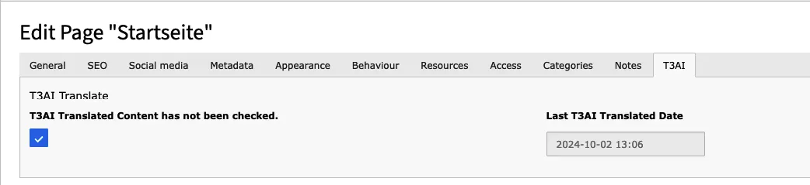

## Preview tagging for translated pages

**To enable tagging for automatically translated pages and content, the process of activating translated pages was updated to include a control option. This information is passed to the Page Context Fluid template, where it can be used to customize the page's appearance. You can also use this feature easily in the extension's Partial.**

```html
<f:if condition="{data.tx_nst3ai_content_not_checked}" >
    <div style="background: #006494; border: #0000cc 1px solid; color: #fff; padding: 10px; text-align: center">
        <f:translate key="LLL:EXT:ns_t3ai/Resources/Private/Language/locallang_be:preview.flag" extensionName="ns_t3ai" />
        <f:if condition="{data.tx_nst3ai_translated_time} > 0" >
            <f:format.date format="{dateFormat}">{data.tx_nst3ai_translated_time}</f:format.date>
        </f:if>
    </div>
</f:if>
```

**Backend Image**



**Frontend image without preview mode**


**Backend Image**


**Preview mode image**


**Frontend image without preview mode**


<div className="t3-embed"><iframe src="https://app.supademo.com/embed/cmran84i811r1qmhxkpvvp2rw?embed_v=2&utm_source=embed" loading="lazy" title="Activate Translated Content" allow="clipboard-write; fullscreen" frameBorder="0" webkitallowfullscreen="true" mozallowfullscreen="true" allowfullscreen></iframe></div>

<div className="t3-embed"><iframe src="https://app.supademo.com/embed/cmfpid1c3048o130uzzi54lbw?embed_v=2&utm_source=embed" loading="lazy" title="AI Co pilot" allow="clipboard-write; fullscreen" frameBorder="0" webkitallowfullscreen="true" mozallowfullscreen="true" allowfullscreen></iframe></div>
Tired of spending time manually enabling or disabling translated content on your TYPO3 pages? T3AI makes it easy and quick! By default, translated content is turned off, but with just one click on the “Activate Translated Content” button, you can instantly enable it. Save time and let T3AI handle the work for you!

**Step 1**: Open your TYPO3 backend.

**Step 2**: Go to the Page module and select a page from your page tree.

**Step 3**: On your TYPO3 page, choose the language layout.

**Step 4**: Translate your page with T3AI.

**Step 5**: Click the “Translate with T3AI” button.

**Step 6**: Once the page is translated, simply click the “Activate Translated Content” button.

With one click, all your disabled content and elements will be activated.

After translation, this feature controls how hidden content elements are handled.

- **Enabled:** All hidden content elements are automatically activated in every language after translation.
- **Disabled:** Only those content elements that were active in the main language before translation are activated afterward.

Follow below steps to enable this feature.


1. Open the desired **Page** in TYPO3.
2. Click **Edit Page Properties**.
3. Navigate to the **T3AI** tab.
4. Enable the **Activate All Content Elements** option.

### Auto Activate All Content Elements

After translation, this feature controls how hidden content elements are handled.

- **Enabled:** All hidden content elements are automatically activated in every language after translation.
- **Disabled:** Only those content elements that were active in the main language before translation are activated afterward.

### How to Enable

Follow below steps to enable this feature.


1. Open the desired **Page** in TYPO3.
2. Click **Edit Page Properties**.
3. Navigate to the **T3AI** tab.
4. Enable the **Activate All Content Elements** option.
