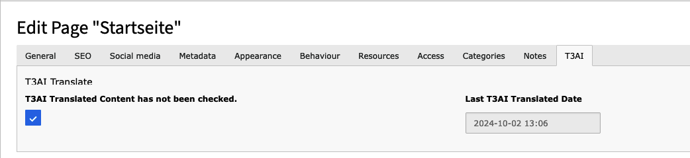
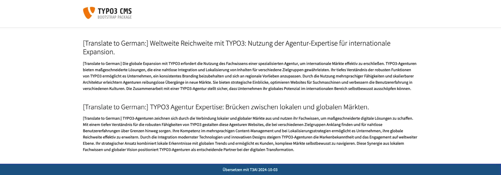
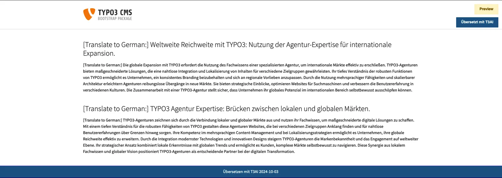
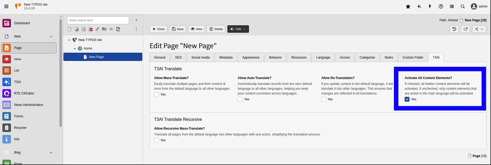

The T3AI Translation feature is a powerful tool designed to simplify content translation. With this feature, you can automatically translate your website’s content into multiple languages with just a few clicks.

<Note>
Translation is only supported for TCA columns, where fields with `l10n_mode` set to `prefixLangTitle` are detected as translatable. This is handled via a DataHandler hook, which only applies to TCA records, not to FlexForm fields.

FlexForm translation is supported only when using the **Standard FlexForm Structure**. For details, refer to the TYPO3 Official Documentation for [Standard FlexForm Structure](https://docs.typo3.org/m/typo3/reference-coreapi/main/en-us/ApiOverview/FlexForms/Index.html).
</Note>

## Mass Translation


<div className="t3-embed"><iframe src="https://app.supademo.com/embed/cmfpei6sj2kta1d3n7mns6mnh?embed_v=2&utm_source=embed" loading="lazy" title="AI Co pilot" allow="clipboard-write" frameBorder="0" webkitallowfullscreen="true" mozallowfullscreen="true" allowfullscreen></iframe></div>
The **Mass Translate** module is designed to manage and schedule translation tasks for multiple pages.
With this feature, you can select or deselect languages, or delete scheduled translation tasks.

**Key Features:**

- Manage a list of scheduled translation tasks.
- Change target languages for mass translation.
- Automate translation for multiple pages at once, saving time and effort.

## One-Clck Page Translations


<div className="t3-embed"><iframe src="https://app.supademo.com/embed/cmfqgwbd60vav130ug612bduz?embed_v=2&utm_source=embed" loading="lazy" title="AI Co pilot" allow="clipboard-write" frameBorder="0" webkitallowfullscreen="true" mozallowfullscreen="true" allowfullscreen></iframe></div>
This feature allows you to translate pages and their content elements from the default language to other languages.

There are two options for Translation

- **Translate Page**: This option allows you to translate the page into the selected or all other languages, but it only translates the pages, not the content.
- **Translate Page and & content**: This will Translate the Page along with its content from Defualt language to Selected/All languages

## Translate Pages


<div className="t3-embed"><iframe src="https://app.supademo.com/embed/cmfpe68xb2k5k1d3ndubefrlw?embed_v=2&utm_source=embed" loading="lazy" title="AI Co pilot" allow="clipboard-write" frameBorder="0" webkitallowfullscreen="true" mozallowfullscreen="true" allowfullscreen></iframe></div>
- **Go to Your TYPO3 Page, Then Translate Your Content element.**
- Go to your TYPO3 page and select the content element you want to translate.
- Click on **“Translate with AI.”**
- Choose your preferred AI model for the translation.
- Select the elements you want to translate
- Click the **“Translate”** button.

## News Translation


<div className="t3-embed"><iframe src="https://app.supademo.com/embed/cmfqgbidb0v1k130u4y4ewz6p?embed_v=2&utm_source=embed" loading="lazy" title="AI Co pilot" allow="clipboard-write" frameBorder="0" webkitallowfullscreen="true" mozallowfullscreen="true" allowfullscreen></iframe></div>
Expand your knowledge base with News Translations. Click ‘Translate with T3AI’ to get translated news directly in your backend.

**Step 1** - Go to the List module and choose the storage folder from the News list. Then, select the news item you want.

**Step 2** - **Localize Your Page in Your Preferred Language**

- Open the Page Module and select your page.
- Click the “Translate with T3AI” button.
- Choose your AI model and click “Translate.”

**Step 3** - Your News is Translated with T3AI.

<Note>
To ensure proper news translation, always set the container type to **News** in the News folder.

1. Go to the **News** folder in the TYPO3 backend.
2. Open **Edit Page Properties**.
3. Navigate to the **Behaviour** tab.
4. Set the **Container Plugin** to *News*.
</Note>

## Records TCA Translation


<div className="t3-embed"><iframe src="https://app.supademo.com/embed/cmfqgjyt10v3v130usjypjaae?embed_v=2&utm_source=embed" loading="lazy" title="AI Co pilot" allow="clipboard-write" frameBorder="0" webkitallowfullscreen="true" mozallowfullscreen="true" allowfullscreen></iframe></div>
Looking for a quick solution to transform your data and language? This T3AI feature lets you easily translate your records and data into different languages using a user-friendly tool.

**Note: We recommend using GPT-4.0 for better results.**

**Step 1** : Open your TYPO3 backend and go to the List module.

**Step 2** : Select the page from the page tree.

**Step 3** : Click on **“Translate with T3AI.”**

- Choose the model for translating your TYPO3 TCA records.
- Click the “Translate” button.

**Step 4** : Click on the “Translated Page.”

- Edit the translated page.
- On the top bar, click the “Translate with T3AI” button.
- Click the “Translate” button.
- Save your translated records.

## Extend Records Translation

ns_t3ai supports translation of specific fields of TCA records. It understands fields which need to be translated, only if their l10n_mode is set to prefixLangTitle.

For detecting translatable fields, ns_t3ai uses a DataHandler hook.

The following setup is needed, to get ns_t3ai work on your table:

`<extension_key>`/Configuration/TCA/Overrides/`<table_name>`.php

```python
$GLOBALS['TCA']['<table_name>']['columns']['<field_name>']['l10n_mode'] = 'prefixLangTitle';
$GLOBALS['TCA']['<table_name>']['columns']['<field_name>']['l10n_mode'] = 'prefixLangTitle';
```

## Re-Translate Pages


<div className="t3-embed"><iframe src="https://app.supademo.com/embed/cmfpiu19404xj130u5ah2ekrs?embed_v=2&utm_source=embed" loading="lazy" title="AI Co pilot" allow="clipboard-write" frameBorder="0" webkitallowfullscreen="true" mozallowfullscreen="true" allowfullscreen></iframe></div>
Forget about tedious manual translations. With one click, you can refresh and redo your translations instantly. No more manual translation is needed! Just click the ‘Re-Translate’ button. It will delete the current translations and start the language wizard to begin the translation process.

**Step 1**: Go to the **“Page”** tab and click on **“Pages.”**

- Click the **“Re-Translate Page”** button.
- Choose your preferred AI model for translation. i.e **Translate with ChatGPT4.0**
- Select the elements you want to translate.
- Click the **“Translate”** button.

**Step 2**: Click on **“Next.”**

- Your content will be re-translated!

**Step 3**: You can select and edit content directly from your page.

- Click on **“Edit Content.”**
- If you want to re-translate the page, select the AI model from the top bar.

**Step 4**: Click on Translate & Save the Content!

## AI translation

T3AI translations Some features for Page/ Content translation. follow below steps to Use this features

- **Step 1** - go to Page module select the page
- **Step 2** - select the page & click on edit Page property
- **step 3** - go to Tab **T3AI**

Lets undertstand all this features in detail one by one.

## Mass Pages Translation

Update numerous translated pages simultaneously. Refresh your website content using precise, current AI-driven translations.

<Note>
For Mass page translation, in all pages Allow Mass translation option should be enabled and if you add new pages do not forgot to perform step 5.
</Note>

you can translate multiple pages and their content from the default language to various other languages efficiently,follow below steps to use this feature.

- **Step 1** - go to page module
- **Step 2** - Select the page & Click on edit page properties
- **Step 3** - go to tab T3 AI
- **Step 4** - Enable option Allow mass translation
- **Step 5** - click on drop Down T3AI> Go to Mass translation> Click on **Add this page to scheduler queries**

Whenever the Scheduler will run successfully, all the pages will translate

## Run Mass Translation: From TYPO3-CLI

**T3AI Mass Translation feature** allows users to efficiently translate multiple elements or entire pages into different languages simultaneously.This is typically useful in multilingual websites where translating individual elements manually would be time-consuming.

To run a mass translation from the CLI (Command Line Interface), follow these general steps

- **Step 1:** Go to your command line/Terminal.
- **Step 2:** Run the following command

```Python
Syntax: <php-path> <typo3-bin-path> scheduler:run --task=<id> -f

Example: /usr/bin/php typo3/sysext/core/bin/typo3 scheduler:run --task=2 -f
```

## Recursive Mass-Translate


<div className="t3-embed"><iframe src="https://app.supademo.com/embed/cmfpeyoww2l6g1d3ns8fsb5z6?embed_v=2&utm_source=embed" loading="lazy" title="AI Co pilot" allow="clipboard-write" frameBorder="0" webkitallowfullscreen="true" mozallowfullscreen="true" allowfullscreen></iframe></div>
It will Translate all pages from the default language into other languages with one action, simplifying the translation process,follow below steps to use this feature

<Note>
For recursive mass translation, ensure the mass translation and Recursive Mass Translation option is enabled for all pages and follow step 2 when adding new pages.
</Note>

- **Step 1** - Please Enable “**Allow Recursive Mass-Translate?**” from Root page property
- **Step 2** - Select root page > click on drop Down T3AI > Go to Mass translation> **Click on Recursively add this page to the scheduler queue**

Whenever the Scheduler will run successfully, all the pages will translate

## Auto re-Translate Page


<div className="t3-embed"><iframe src="https://app.supademo.com/embed/cmfpfnj6801l3130u1i9exdl7?embed_v=2&utm_source=embed" loading="lazy" title="AI Co pilot" allow="clipboard-write" frameBorder="0" webkitallowfullscreen="true" mozallowfullscreen="true" allowfullscreen></iframe></div>
This feature Automatically translate pages and content from the site’s default language to all other languages, ensuring consistency,follow below steps to use this feature

- **Step 1** - go to page module
- **Step 2** - Select the page & Click on edit page properties
- **Step 3** - go to tab T3AI
- **Step 4** - Enable option Allow auto translation

Whenever you add any content in Default language it will automatically translate content into other languages.

## Language Glossary


<div className="t3-embed"><iframe src="https://app.supademo.com/embed/cmfqh1der0vd4130u3i14bm4f?embed_v=2&utm_source=embed" loading="lazy" title="AI Co pilot" allow="clipboard-write" frameBorder="0" webkitallowfullscreen="true" mozallowfullscreen="true" allowfullscreen></iframe></div>
The **Glossary** feature allows you to define specific terms and their replacements for use during translations.
This ensures consistency in terminology across all pages and languages.

**How to Add Glossary Terms:**

1. Go to the **List Module** in the TYPO3 Backend.
2. Select any page and click on **“New Records.”**
3. Navigate to the **“Create Glossary”** module and select the glossary.
4. Add your term in the text field (e.g., **“TYPO3 Developer”**) and the term you want to replace it with (e.g., **“TYPO3 Agency”**).

**Additional Options:**

- Set glossary terms for a particular language so that, during content translation, the system will automatically apply the translated glossary.

**To enable tagging for automatically translated pages and content, the process of activating translated pages was updated to include a control option. This information is passed to the Page Context Fluid template, where it can be used to customize the page’s appearance. You can also use this feature easily in the extension’s Partial.**

```Python
<f:if condition="{data.tx_nst3ai_content_not_checked}" >
    <div style="background: #006494; border: #0000cc 1px solid; color: #fff; padding: 10px; text-align: center">
        <f:translate key="LLL:EXT:ns_t3ai/Resources/Private/Language/locallang_be:preview.flag" extensionName="ns_t3ai" />
        <f:if condition="{data.tx_nst3ai_translated_time} > 0" >
            <f:format.date format="{dateFormat}">{data.tx_nst3ai_translated_time}</f:format.date>
        </f:if>
    </div>
</f:if>
```

**Backend Image**



**Frontend image without preview mode**



To enable tagging for automatically translated pages and content, the “Page Turned On” process for translated pages was updated to include a control option.

During each translation, the fields are automatically updated. The fields “Last translation date” and “T3AI Translated Content has not been checked” are transferred to the page object and can be used in Fluid templates.

This allows you to control information and notes in the Fluid template if needed, but a TYPO3 administrator or developer must add this feature to the template first.

When an editor previews a hidden page translated by T3AI, a T3AI badge will appear alongside the “Preview” badge in the upper right corner.

**Backend Image**


**Preview mode image**



**Frontend image without preview mode**


## Activate Translated Content


<div className="t3-embed"><iframe src="https://app.supademo.com/embed/cmfpid1c3048o130uzzi54lbw?embed_v=2&utm_source=embed" loading="lazy" title="AI Co pilot" allow="clipboard-write" frameBorder="0" webkitallowfullscreen="true" mozallowfullscreen="true" allowfullscreen></iframe></div>
Tired of spending time manually enabling or disabling translated content on your TYPO3 pages? T3AI makes it easy and quick! By default, translated content is turned off, but with just one click on the “Activate Translated Content” button, you can instantly enable it. Save time and let T3AI handle the work for you!

**Step 1**: Open your TYPO3 backend.

**Step 2**: Go to the Page module and select a page from your page tree.

**Step 3**: On your TYPO3 page, choose the language layout.

**Step 4**: Translate your page with T3AI.

**Step 5**: Click the “Translate with T3AI” button.

**Step 6**: Once the page is translated, simply click the “Activate Translated Content” button.

With one click, all your disabled content and elements will be activated.

After translation, this feature controls how hidden content elements are handled.

- **Enabled:** All hidden content elements are automatically activated in every language after translation.
- **Disabled:** Only those content elements that were active in the main language before translation are activated afterward.

Follow below steps to enable this feature.



1. Open the desired **Page** in TYPO3.
2. Click **Edit Page Properties**.
3. Navigate to the **T3AI** tab.
4. Enable the **Activate All Content Elements** option.

## Interactive demos

<div className="t3-embed"><iframe src="https://app.supademo.com/embed/cmmj3g9hy27jqzdh1s0clods6?embed_v=2&utm_source=embed" loading="lazy" title="AI Co-pilot Demo" allow="clipboard-write" frameBorder="0" webkitallowfullscreen="true" mozallowfullscreen="true" allowfullscreen></iframe></div>

<div className="t3-embed"><iframe src="https://app.supademo.com/embed/cmoclot811hxfs2tq5kqtysxw?embed_v=2&utm_source=embed" loading="lazy" title="AI Co-pilot Demo" allow="clipboard-write" frameBorder="0" webkitallowfullscreen="true" mozallowfullscreen="true" allowfullscreen></iframe></div>

<div className="t3-embed"><iframe src="https://app.supademo.com/embed/cmrakc1xg0vwcqmhxzehlh60d?utm_source=embed" loading="lazy" title="AI Co pilot" allow="clipboard-write" frameBorder="0" webkitallowfullscreen="true" mozallowfullscreen="true" allowfullscreen></iframe></div>

<div className="t3-embed"><iframe src="https://app.supademo.com/embed/cmrakfkin0w8pqmhxhm36f6l4?utm_source=embed" loading="lazy" title="AI Co pilot" allow="clipboard-write" frameBorder="0" webkitallowfullscreen="true" mozallowfullscreen="true" allowfullscreen></iframe></div>

<div className="t3-embed"><iframe src="https://app.supademo.com/embed/cmrakzni30xkaqmhxdqvhvky7?utm_source=link" loading="lazy" title="AI Co pilot" allow="clipboard-write" frameBorder="0" webkitallowfullscreen="true" mozallowfullscreen="true" allowfullscreen></iframe></div>

<div className="t3-embed"><iframe src="https://app.supademo.com/embed/cmral3lv90xpgqmhxzmi2p048?utm_source=link" loading="lazy" title="AI Co pilot" allow="clipboard-write" frameBorder="0" webkitallowfullscreen="true" mozallowfullscreen="true" allowfullscreen></iframe></div>

<div className="t3-embed"><iframe src="https://app.supademo.com/embed/cmralcltn0ycwqmhx52pq7pre?utm_source=link" loading="lazy" title="AI Co pilot" allow="clipboard-write" frameBorder="0" webkitallowfullscreen="true" mozallowfullscreen="true" allowfullscreen></iframe></div>

<div className="t3-embed"><iframe src="https://app.supademo.com/embed/cmraloedr0yqmqmhxmejplhxg?utm_source=link" loading="lazy" title="AI Co pilot" allow="clipboard-write" frameBorder="0" webkitallowfullscreen="true" mozallowfullscreen="true" allowfullscreen></iframe></div>

<div className="t3-embed"><iframe src="https://app.supademo.com/embed/cmramdz3d0zs0qmhxu84rlt2k?utm_source=link" loading="lazy" title="AI Co pilot" allow="clipboard-write" frameBorder="0" webkitallowfullscreen="true" mozallowfullscreen="true" allowfullscreen></iframe></div>

<div className="t3-embed"><iframe src="https://app.supademo.com/embed/cmran3ygl11dgqmhx8kbvjcfc?utm_source=link" loading="lazy" title="AI Co pilot" allow="clipboard-write" frameBorder="0" webkitallowfullscreen="true" mozallowfullscreen="true" allowfullscreen></iframe></div>

<div className="t3-embed"><iframe src="https://app.supademo.com/embed/cmran84i811r1qmhxkpvvp2rw?utm_source=link" loading="lazy" title="AI Co pilot" allow="clipboard-write" frameBorder="0" webkitallowfullscreen="true" mozallowfullscreen="true" allowfullscreen></iframe></div>

