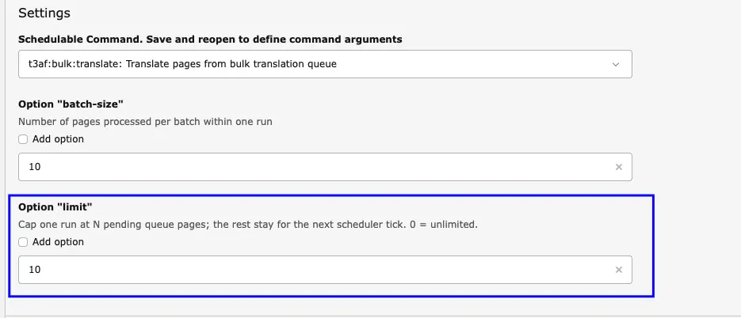

## Mass Translation


<div className="t3-embed"><iframe src="https://app.supademo.com/embed/cmfpei6sj2kta1d3n7mns6mnh?embed_v=2&utm_source=embed" loading="lazy" title="AI Co pilot" allow="clipboard-write; fullscreen" frameBorder="0" webkitallowfullscreen="true" mozallowfullscreen="true" allowfullscreen></iframe></div>

The **Mass Translate** module is designed to manage and schedule translation tasks for multiple pages.
With this feature, you can select or deselect languages, or delete scheduled translation tasks.

**Key Features:**

- Manage a list of scheduled translation tasks.
- Change target languages for mass translation.
- Automate translation for multiple pages at once, saving time and effort.

## Manage Mass Translation

<div className="t3-embed"><iframe src="https://app.supademo.com/embed/cmrakc1xg0vwcqmhxzehlh60d?embed_v=2&utm_source=embed" loading="lazy" title="Manage Mass Translation" allow="clipboard-write; fullscreen" frameBorder="0" webkitallowfullscreen="true" mozallowfullscreen="true" allowfullscreen></iframe></div>


<div className="t3-embed"><iframe src="https://app.supademo.com/embed/cmttyv0zu149lqmgz7dxycp3b?embed_v=2&utm_source=embed" loading="lazy" title="Manage Mass Translation Demo" allow="clipboard-write; fullscreen" frameBorder="0" webkitallowfullscreen="true" mozallowfullscreen="true" allowfullscreen></iframe></div>

The **Manage Mass Translation** module lets you queue, configure, and monitor translation tasks for multiple pages from one place.

Open it from **AI Assistant → Translation → Manage Mass Translation**.

**Key Features:**

- Select pages and add them to the translation queue.
- Configure target languages for mass translation and save the language mapping.
- Remove pages from the queue when they are no longer needed.
- Re-queue failed translation jobs so they can run again.
- Filter the queue by status: **Pending**, **Completed**, **Failed**, or **All**.
- Filter by site root or view pages across all sites.
- Add pages to the queue by page ID and choose the target language.
- Run the related Scheduler task to process queued translations.

**How to manage mass translations:**

1. Open **AI Assistant** and go to the **Translation** tab.
2. Click **Manage Mass Translation**.
3. Select the pages you want to translate (or use **Add pages to queue** and enter a page ID).
4. Open the language configuration, select the target languages, and click **Save**.
5. Review queue tabs (**Pending**, **Completed**, **Failed**, **All**) as needed.
6. Use **Re-queue failed** if any jobs failed and should be retried.
7. Open **Scheduler** and run the mass translation task to process the queue.

**Scheduler settings for Manage Mass Translation:**

Use the schedulable command:

`t3af:bulk:translate` — *Translate pages from bulk translation queue*

Configure these command options in the Scheduler task settings:

- **batch-size** — Number of pages processed per batch within one run.
- **limit** — Cap one run at N pending queue pages; the rest stay for the next scheduler tick. `0` = unlimited.



Example: set **batch-size** to `10` and **limit** to `10` so each scheduler run processes up to 10 pending pages in batches of 10. Remaining pending pages stay in the queue for the next tick.

## Mass Pages Translation

<div className="t3-embed"><iframe src="https://app.supademo.com/embed/cmralcltn0ycwqmhx52pq7pre?embed_v=2&utm_source=embed" loading="lazy" title="Mass Translate Pages" allow="clipboard-write; fullscreen" frameBorder="0" webkitallowfullscreen="true" mozallowfullscreen="true" allowfullscreen></iframe></div>


Update numerous translated pages simultaneously. Refresh your website content using precise, current AI-driven translations.

<Note>
For Mass page translation, in all pages Allow Mass translation option should be enabled and if you add new pages do not forgot to perform step 5.
</Note>

you can translate multiple pages and their content from the default language to various other languages efficiently,follow below steps to use this feature.

- **Step 1** - go to page module
- **Step 2** - Select the page & Click on edit page properties
- **Step 3** - go to tab T3 AI
- **Step 4** - Enable option Allow mass translation
- **Step 5** - click on drop Down T3AI> Go to Mass translation> Click on **Add this page to scheduler queries**

Whenever the Scheduler will run successfully, all the pages will translate

## Run Mass Translation: From TYPO3-CLI


**T3AI Mass Translation feature** allows users to efficiently translate multiple elements or entire pages into different languages simultaneously.This is typically useful in multilingual websites where translating individual elements manually would be time-consuming.

To run a mass translation from the CLI (Command Line Interface), follow these general steps

- **Step 1:** Go to your command line/Terminal.
- **Step 2:** Run the following command

```Python
Syntax: <php-path> <typo3-bin-path> scheduler:run --task=<id> -f

Example: /usr/bin/php typo3/sysext/core/bin/typo3 scheduler:run --task=2 -f
```
