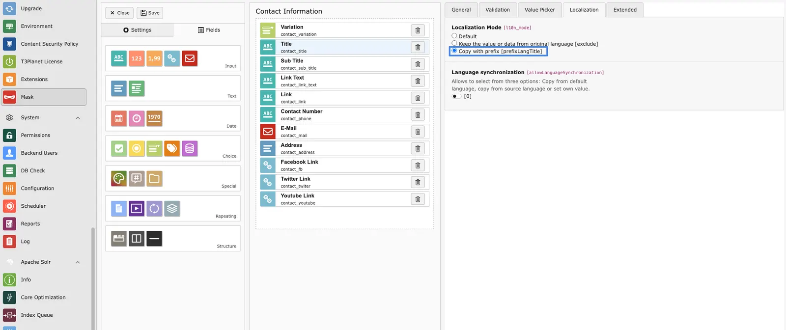

<Note>
Translation is supported only for **TCA-based fields**. Fields are considered translatable when the `l10n_mode` is set to `prefixLangTitle`. This functionality is implemented via a DataHandler hook, which applies exclusively to TCA records (not FlexForm fields).

For **Mask elements**, ensure that the option **Copy with prefix [prefixLangTitle]** is enabled for each field that should be translated. Without this configuration, the fields will be ignored during the translation process.


</Note>

<Note>
**FlexForm translation** is supported only when using the **Standard FlexForm Structure**. Custom or non-standard FlexForm configurations may not be processed correctly.

For more details, refer to the TYPO3 official documentation: [Standard FlexForm Structure](https://docs.typo3.org/m/typo3/reference-coreapi/main/en-us/ApiOverview/FlexForms/Index.html)

Additionally, **Flux-based content elements** support translation only **after the content element has been created and saved at least once**.
</Note>

<Note>
**DCE & FlexForm translation:** Translate DCE and other FlexForm fields with the sheet-aware field mapper. You do **not** need to enable **Map to TCA**.
</Note>


<Important>
By default, TYPO3 prefixes translated headlines with a label such as **Translate to: [Language]**.
This comes from TYPO3's `TCEMAIN.translateToMessage` setting, not from T3AI.

If you do not want this prefix in translated titles, disable it globally on the **root page**:

1. Open the TYPO3 Backend.
2. Select the **root page**.
3. Open **Page TSconfig**.
4. Add:

```typoscript
TCEMAIN {
    translateToMessage =
}
```
</Important>

## FlexForm field keys to skip from AI translation (comma-separated)


<div className="t3-embed"><iframe src="https://app.supademo.com/embed/cmoclot811hxfs2tq5kqtysxw?embed_v=2&utm_source=embed" loading="lazy" title="FlexForm field keys to skip Demo" allow="clipboard-write; fullscreen" frameBorder="0" webkitallowfullscreen="true" mozallowfullscreen="true" allowfullscreen></iframe></div>

Define **FlexForm field keys to skip from AI translation** to exclude specific fields from being translated.

Enter a comma-separated list of FlexForm field keys that should be ignored during the AI translation process.

**How it works:**

- The system reads the configured field keys.
- During translation, matching FlexForm fields are skipped.
- All other fields are translated normally by the AI.


Related setup for custom TCA tables: [Extend Records Translation](/en/latest/ExtNsT3AI/Translation/ExtendRecordsTranslation/Index).
