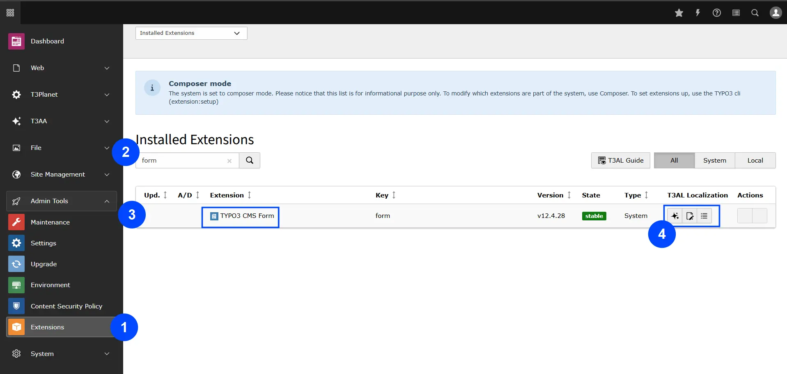
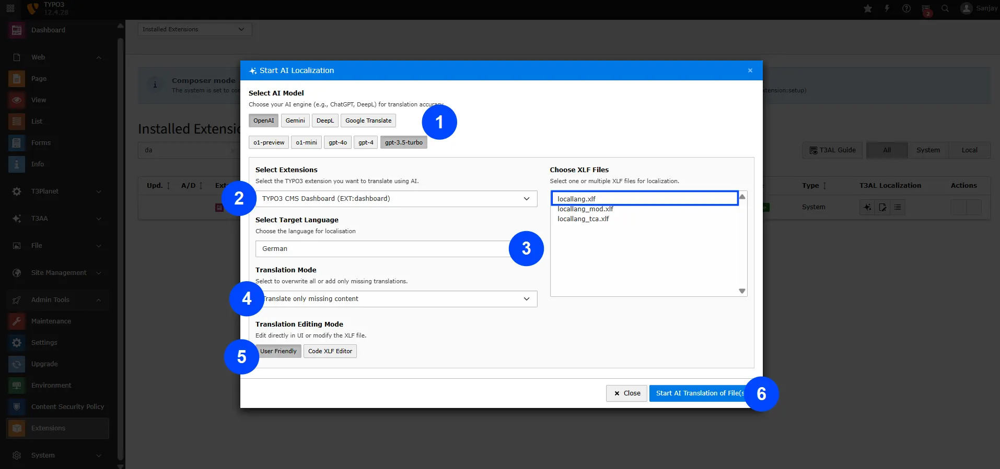
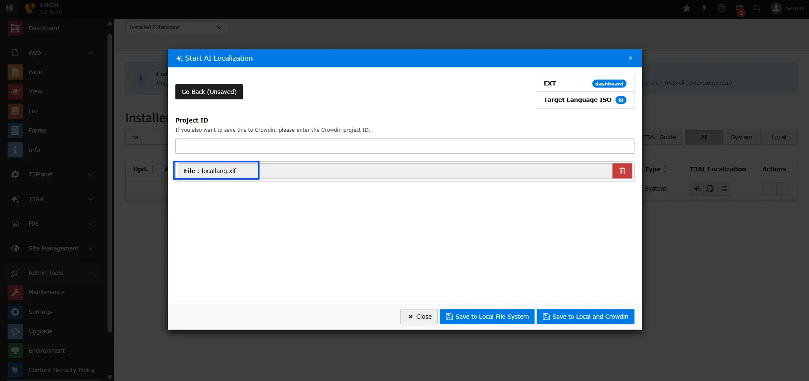
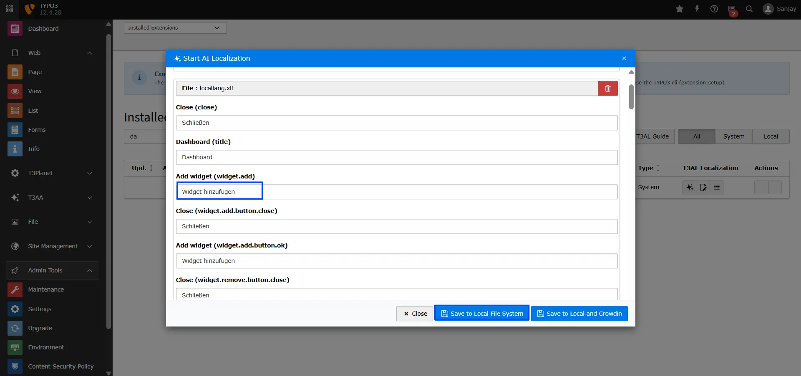

Easily translate multiple TYPO3 XLIFF files at once—no more repetitive copy-pasting.

## Initial Steps

**Step 1:** Go to the "Extension Manager" in your TYPO3 backend.

**Step 2:** From the dropdown menu, choose "Get the extension."

**Step 3:** Find and add your TYPO3 extension from the list.

**Step 4:** Once added, you'll see an AI icon—click it to start translating your XLIFF files with just one click.

## Translation Steps

Now you’ll see a pop-up box on your TYPO3 backend screen. Let’s translate your XLIFF file:

- **Step 1:** Choose the AI model for best results (e.g., OpenAI > GPT-4.0).
- **Step 2:** Select the TYPO3 extension whose XLIFF files you want to translate.
- **Step 3:** Pick the language you want to translate into (for example, German).
- **Step 4:** Choose the translation mode:
  \- Translate the whole file (even if it already has translations), or
  \- Translate only missing parts.
- **Step 5:** Select how you want to edit translations:
  \- Directly in the code editor, or
  \- With a user-friendly interface.
- **Step 6:** Choose the XLIFF file from your extension.
- **Step 7:** Click on "AI Start Localization" to begin the translation.

## Final Results

Here you’ll see the fully translated content of your XLIFF file.

## Next Step: Choose Where to Save Your File

- **Save to Local File System** – This will save the translated content to your TYPO3 server.
- **Save to Local and Crowdin** – This saves the content both in TYPO3 and directly to your Crowdin project.

That’s it! Close the pop-up box—your localization is all set!

