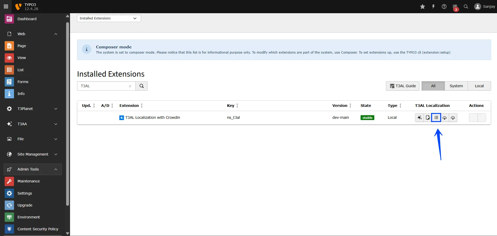
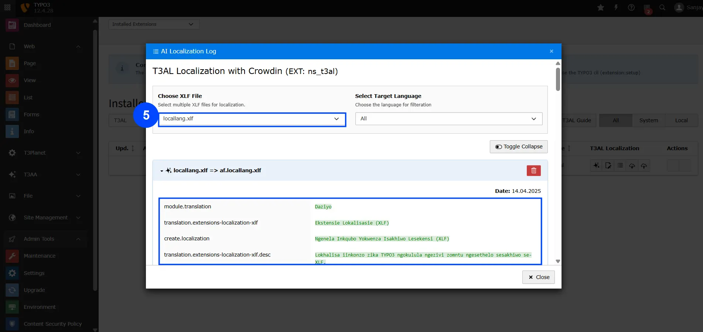

Track the status, progress, and history of all your XLIFF translations in one place.

## Steps to Access AI Logs

**Step 1:** Navigate to the "Extension Manager" module.

**Step 2:** Select "Get the extension" from the dropdown menu.

**Step 3:** Search with Extension Key **"ns_t3al"**.

**Step 4:** Click on the AI Logs icon **“☰”**, which represents AL Logs.

**Step 5:** Select your translated file, and you’ll be able to see the changes made by T3AL in your XLIFF file.

**Final Step:** Close the file — and that's it!

