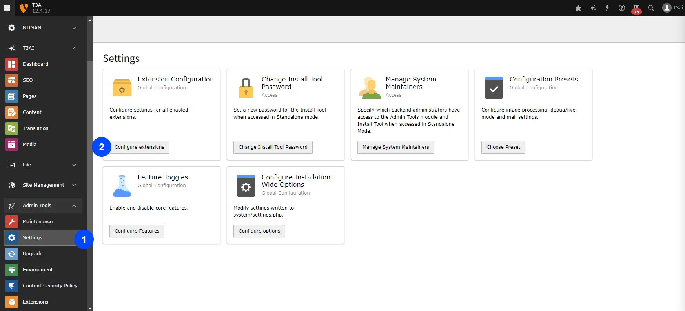
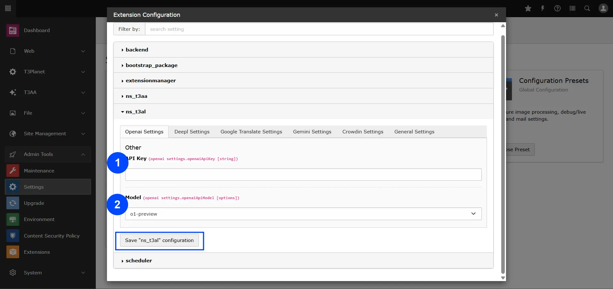
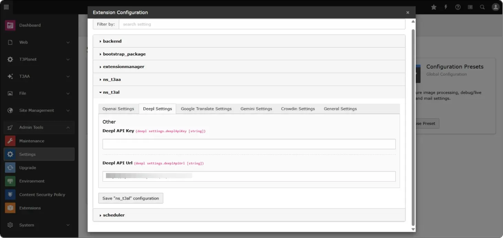
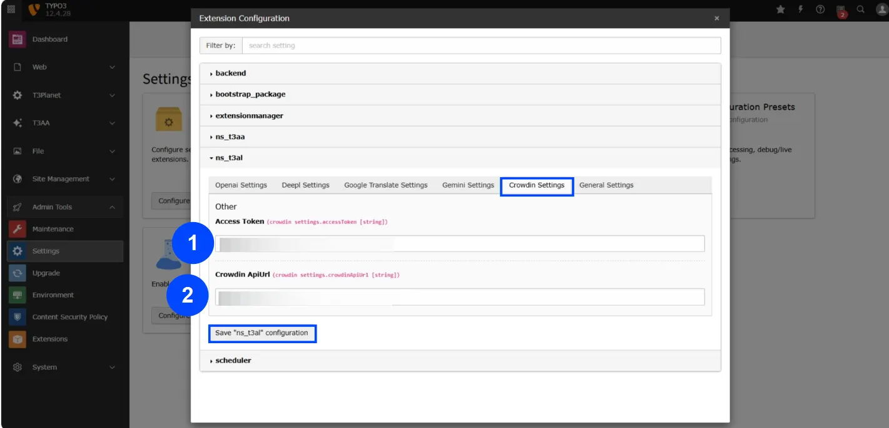

To set up the API for your AI models, follow these steps:

- Go to Admin Tools > Settings > Click on "Configure extensions"
- Click on "t3al" and set up your default AI Models
- Click "Save ns_t3al configuration" button

## Configure APIs of AI Model

Next, set up API keys and other information for your desired AI model:

- Go to Admin Tools > Settings > Click on "Configure extensions"
- Click on your chosen AI Model e.g., OpenAI
- Enter API keys and other information of that AI model
- Click "Save ns_t3al configuration" button

## Add Crowdin Access Token

You can find the Crowdin settings in the T3AL Configuration section.

**Step 1:** Go to the Crowdin tab and add your Access Token

**Step 2:** Enter your Crowdin API URL from the API list

**Step 3:** Click the "Save ns_t3al configuration" button to save your settings

And finish the setup!

<Note>

For guidance, refer to the official Crowdin documentation on Access Tokens:
https://support.crowdin.com/enterprise/account-settings/#access-tokens

</Note>

## API Key Generation Links for T3AL

Below are the links for generating API keys for various AI models used in T3AL. Please follow the respective links to create and obtain your API keys:

- [ChatGPT](https://platform.openai.com/docs/api-reference/introduction)
- [Deepl](https://support.deepl.com/hc/en-us/articles/360020695820-API-Key-for-DeepL-s-API)
- [Google Translate](https://cloud.google.com/docs/authentication/api-keys)
- [Gemini](https://ai.google.dev/gemini-api/docs/api-key)
- [Claude](https://docs.anthropic.com/en/api/getting-started#accessing-the-api)

## Figures

