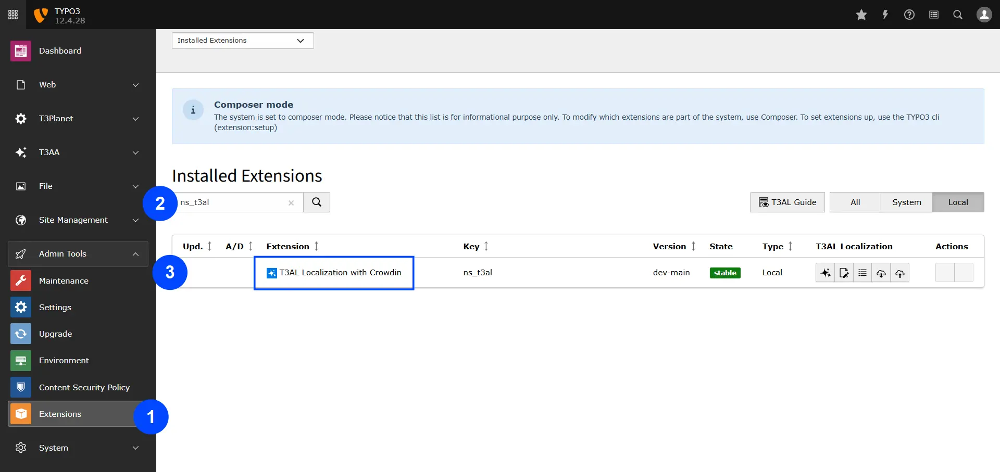

# Installation

Installing the T3AL—TYPO3 Extension is easy. Follow the steps below to add the extension to your TYPO3 environment.

> License Activation

______________________________________________________________________

To activate the license and install this premium TYPO3 product, please refer to the documentation:
[License documentation](/License/Index)

**Step 1:** Go to Extension modules

**Step 2:** Search with Extension Key "ns_t3al" and activate the extension

