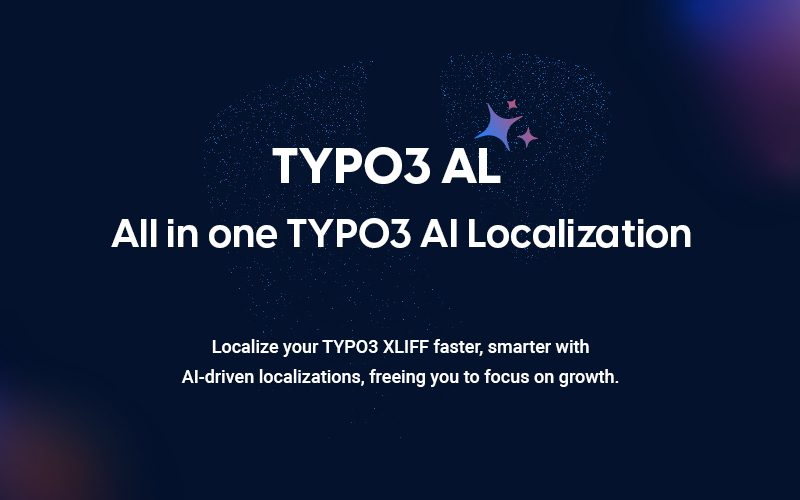

## NS T3AL

## What Does the TYPO3 AL Localization Extension Do?

The TYPO3 AI Localization (T3AL) extension helps you translate your TYPO3 Extension content using artificial intelligence.
It works with XLIFF files, which are used for translations in TYPO3.

This extension makes the translation process faster and easier by removing many manual steps.
It automatically creates and updates translation files, so you don’t have to do it all by hand.
This saves time and helps avoid mistakes.

Whether you’re a TYPO3 developer or a marketing manager working with translations,
T3AL helps you focus on quality content instead of spending time on file handling and manual edits.

## Helpful Links

<Note>

- **Product:** https://t3planet.de/en/t3al-typo3-extension
- **Get Support:** https://t3planet.de/support

</Note>
