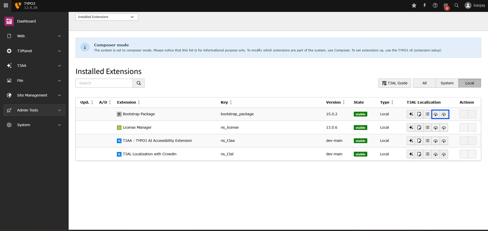
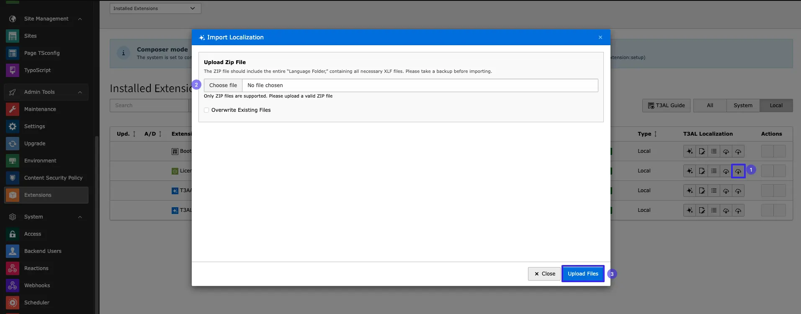

Easily import existing XLIFF files or export updated ones with just a few clicks. Whether you’re moving files between environments or syncing with external tools like Crowdin, T3AL makes the process fast, smooth, and error-free—no manual handling needed.

## Steps to Import or Export XLIFF Files

**Step 1:** Navigate to the “Extension Manager” module.

**Step 2:** Select extension from the dropdown menu.

**Step 3:** Search using the Extension Key (for example, “bootstrap_package”).

**Step 4:** To import or export a file, simply click the “📥” or “📤” icon—and you’re all set!

## Import

**Step 1:** Click on the “📥” icon to import an XLIFF file.

**Step 2:** Select file from your local system.

**Step 3:** Click on Button “Upload files”

That’s it! With T3AL, managing TYPO3 localization becomes faster, smarter, and easier. Now you can focus more on quality content and less on manual translation work.
