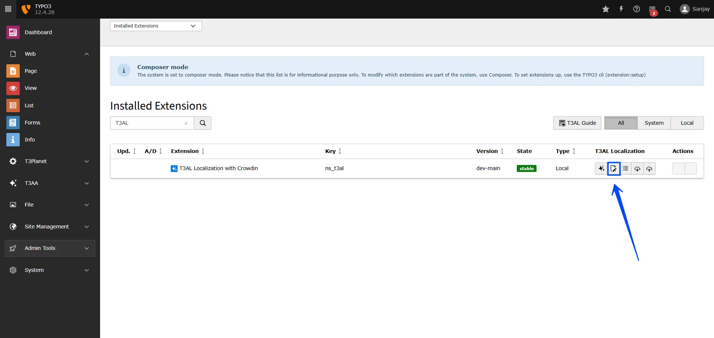
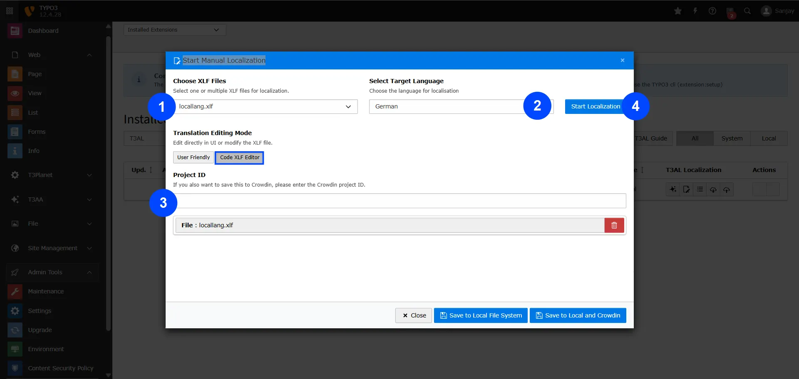
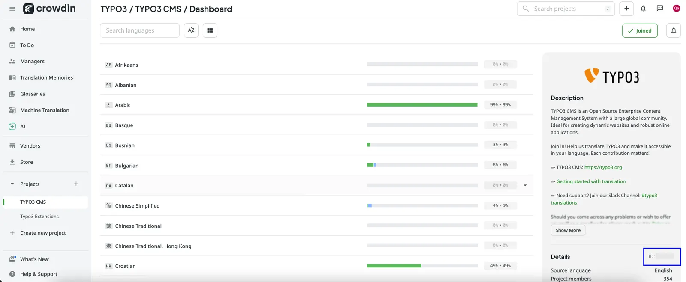
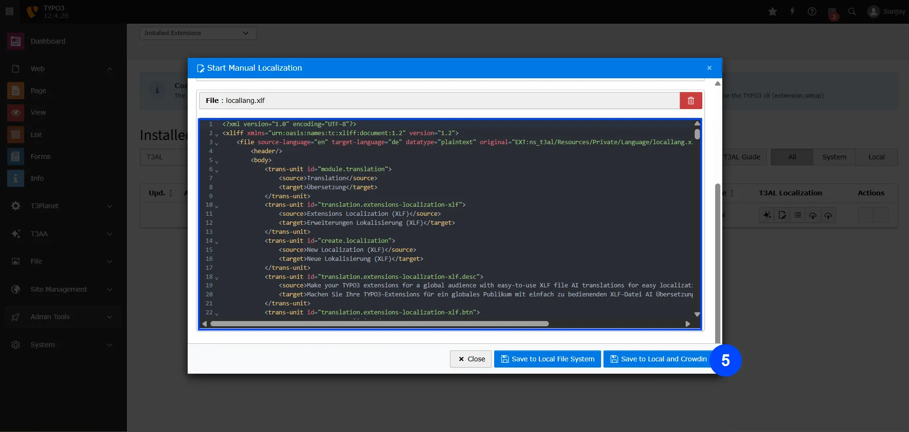

If you prefer to review or adjust translations yourself, you can manually edit the XLIFF file using the code editor or user interface. This gives you full control over every translated string.

## Steps to Start Manual Localization

**Step 1:** Navigate to the "Extension Manager" module.

**Step 2:** Select "Get the extension" from the dropdown menu.

**Step 3:** Search with Extension Key **"ns_t3al"**

**Step 4:** Click on the Manual Translation icon **"📝"**, which represents manual translation.

## Now Let’s Manually Translate the File and Make Any Corrections You Need

**Step 1:** Select the XLIFF file from your TYPO3 extension.

**Step 2:** Choose the language you want to translate into.

**Step 3:** Decide if you want to edit in the Code (XLF) Editor or the User Interface, and enter your Project ID.

**Step 4:** Click **"Start Localization"** to begin manual translation.

Adjust the translated content as needed, then choose where you want to save the file.

**You can find the project ID from your crowdin account as shown in the screenshot below**

**Step 5: Choose Where to Save Your File**

- **Save to Local File System** – This will save the translated content to your TYPO3 server.
- **Save to Local and Crowdin** – This saves the content both in TYPO3 and directly to your Crowdin project.

That’s it! Close the pop-up box — your localization is all set!

