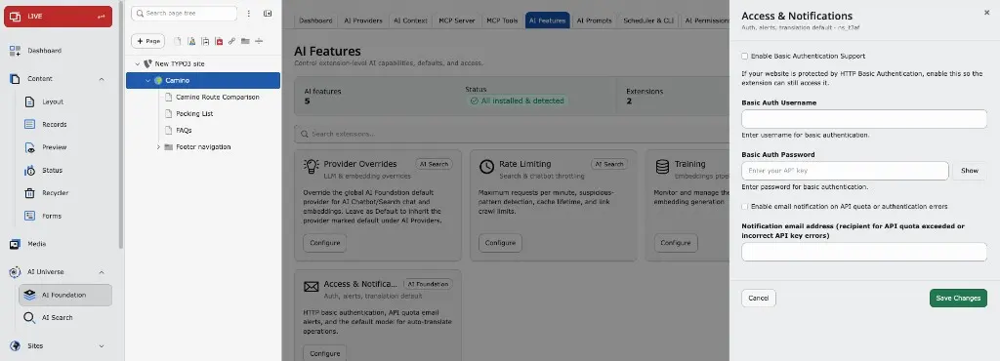

If you want to crawl URLs protected by htaccess / HTTP Basic Authentication, enable **Basic Authentication Support** and enter the username and password.

Open **T3AF → AI Features → Access & Notifications**, then enable the option and save your changes.

Configure Basic Authentication under **T3AF → AI Features → Access & Notifications**.
