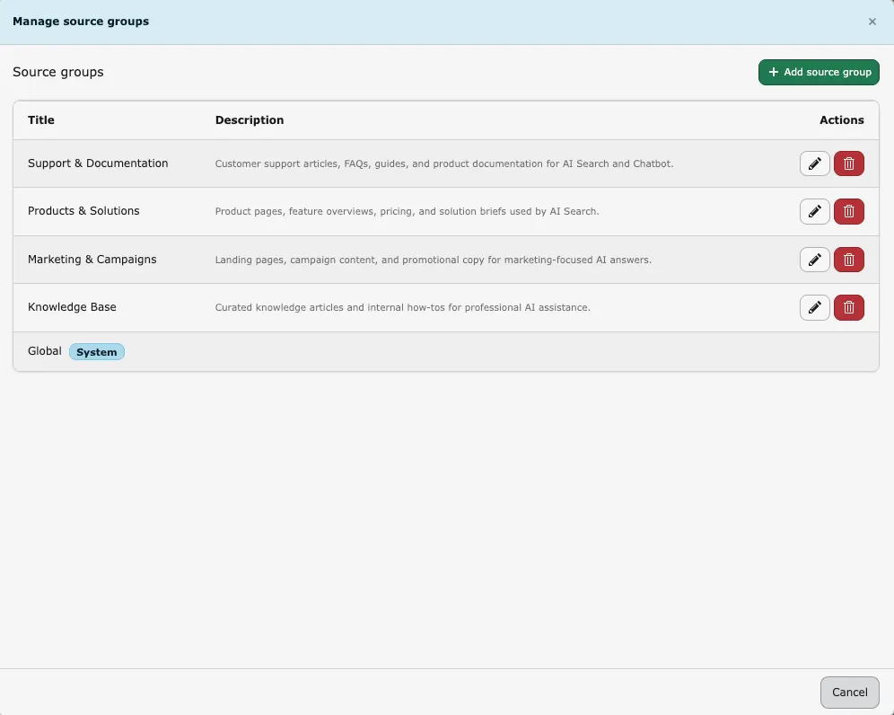
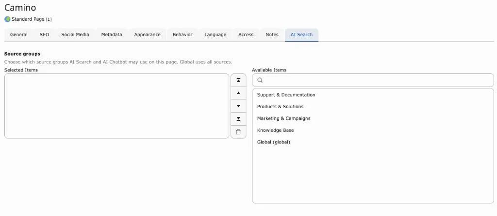
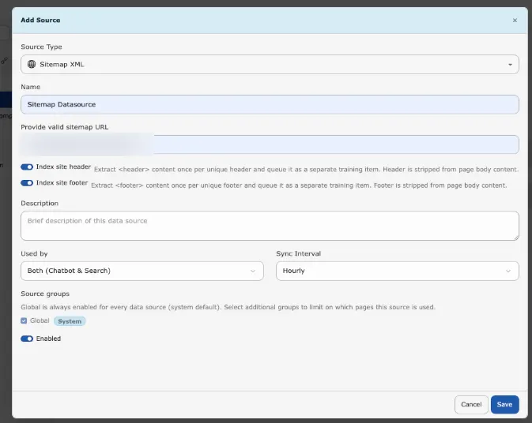
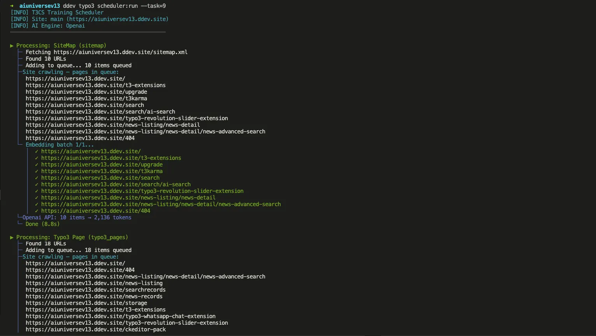
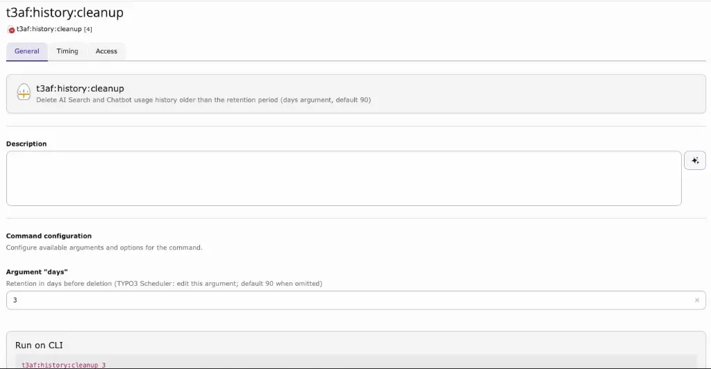

=============

T3AS uses AI Foundation for shared provider setup, model selection, prompts, and core AI services.
Complete the parent setup first, then review the T3AS-specific search and training settings below.

Helpful AI Foundation references:

- [AI Foundation Configuration ](/en/latest/ExtNsT3AF/Configuration/Index)
- [AI Providers ](/en/latest/ExtNsT3AF/Configuration/AIProviders/Index)
- [AI Features ](/en/latest/ExtNsT3AF/Configuration/AIFeatures/Index)
- [AI Prompts ](/en/latest/ExtNsT3AF/AIPrompts/Index)

## 1. AI Features (AI Foundation)

Shared AI settings for T3AS are managed in AI Foundation — not under **Admin Tools > Settings > Configure Extensions**.
Configure AI Foundation first, then return to T3AS for search, training, and source-specific setup.

<div className="t3-embed"><iframe src="https://app.supademo.com/embed/cmraj97pg0ryeqmhxt1yypwta?utm_source=link" loading="lazy" title="AI Features Demo" allow="clipboard-write; fullscreen" frameBorder="0" webkitallowfullscreen="true" mozallowfullscreen="true" allowfullscreen></iframe></div>

1. Go to the **TYPO3 backend**.
2. Open **AI Foundation** → **AI Features**.
3. Open the **T3AS** (`ns_t3as`) feature card and configure the shared settings.
4. Click **Save**.
5. Return to **T3AS** to continue with source, training, and search-specific settings.

For the shared module overview, see [AI Foundation AI Features ](/en/latest/ExtNsT3AF/Configuration/AIFeatures/Index).

## AI Search Features

T3AS focuses on AI search, training, and answer delivery on top of the shared AI Foundation setup.
Use these features when you want to connect project content to AI search, control answer behavior, and monitor how search performs after rollout.

Key T3AS capabilities include:

- Search and answer generation based on trained project content
- Data source syncing and training queue management
- Scheduler-based background processing
- Usage analytics, logs, and request statistics
- Prompt-controlled search answers and instructions

For shared model routing and central AI behavior, see [AI Foundation AI Features ](/en/latest/ExtNsT3AF/Configuration/AIFeatures/Index).

## 2. Dashboard

**Purpose**

The Dashboard gives an overview of your AI training pipeline for the current site.

<div className="t3-embed"><iframe src="https://app.supademo.com/embed/cmrajbhax0s8yqmhxoq4ikjrv?utm_source=link" loading="lazy" title="T3AS Dashboard Demo" allow="clipboard-write; fullscreen" frameBorder="0" webkitallowfullscreen="true" mozallowfullscreen="true" allowfullscreen></iframe></div>

**What you see**

- Which AI/embedding model is in use (e.g. OpenAI, Gemini, Mistral, Custom).
- Status of the **Search** and **Chatbot** modules (if installed): active/inactive, AI engine, base model, embedding model.
- Status of your data sources and training (e.g. how many items are pending, completed, or failed).
- **Training Pipeline** section: data sources count, queue size, and a link to CLI reference.
- **Usage Analytics** summary (e.g. total interactions, search queries, chat sessions over the last 7 days).
- A link to the **Scheduler** to run or check the automatic training task.

**Scheduler link**

From the Dashboard you can open the TYPO3 Scheduler and locate the automatic training task (typically named **T3AF Training** for this site). Use **Run All** or **Run Task Now** to process the training queue immediately.

## 3. Data Source

<div className="t3-embed"><iframe src="https://app.supademo.com/embed/cmrajdte10somqmhxdf258tv8?utm_source=link" loading="lazy" title="T3AS Data Source Demo" allow="clipboard-write; fullscreen" frameBorder="0" webkitallowfullscreen="true" mozallowfullscreen="true" allowfullscreen></iframe></div>

**Purpose**

Add and manage the sources of content that will be used for AI search, such as website pages, PDFs, and Q&A records.

**Adding a data source**

1. Click **+ Add Source**.
2. Choose the **type of source**, for example:

  - **Sitemap XML** – Your sitemap URL(s) (e.g. `https://example.com/sitemap.xml`).
  - **PDF Documents** – Folder path where PDFs are stored (and optionally upload PDFs).
  - **TYPO3 Pages** – Content from specific TYPO3 pages.
  - **Web Pages** – A website URL; optionally limit to a path (e.g. `https://example.com/blog/*`).
  - **Q&A Pairs** – Manual question-and-answer content.
  - **Indexed Search / Ke Search / Solr** – If the corresponding extensions are installed and indexed content is available.

3. Fill in the requested details (URLs, folder path, page selection, etc.) and give the source a **Name** (e.g. `Main Website`) and optional **Description**.
4. Set **Sync interval**: how often content should be refreshed (e.g. **Hourly**, **Daily**, **Weekly**). **Custom** means no automatic schedule (manual sync only).
5. Set **Used by** (formerly **Type**) to control where this source is available.
6. Set **Enabled** to on if the source should be active.
7. Click **Save**.

After saving, T3AS will:

- Create or update the data source.
- Sync content into the training queue (new or changed items).
- **Automatically create** the **T3AF Training** Scheduler task for this site (if it does not exist yet) and **run it at the frequency you set** (e.g. Hourly, Daily, Weekly). You do not need to create the scheduler task manually—it is created when the source is saved and will execute according to the chosen sync interval.

**Editing or deleting a source**

Use the actions next to each data source to **edit** (type, URLs, interval, usage) or **delete** it.

### Source Groups | Page-Level Source Configuration

Source Groups allow administrators and editors to organize data sources and control which content is available to AI Search and the AI Chatbot on a page-by-page basis.
This gives you precise control over retrieval because only the selected Source Groups are considered for that page.

Source Groups are used only during content retrieval.
They do **not** affect AI training, vector indexing, Scheduler execution, embedding generation, or data synchronization.
The filtering is applied by the **VectorService** during retrieval.

#### Backend Configuration

#### Manage Source Groups

Go to **Data Sources -> Source Groups** to manage Source Groups.
Administrators can:

- create Source Groups
- edit Source Groups
- delete Source Groups



*Create, edit, or delete Source Groups. The **Global** group is a system default and cannot be changed.*

<Note>
The **Global** Source Group is a system group and cannot be edited or deleted.
</Note>

#### Assign Source Groups to Data Sources

When creating or editing a data source, users can:

- select one or more Source Groups
- rely on the **Global** Source Group, which is assigned automatically
- configure the **Used by** field (formerly **Type**) to control where the source is available

Available **Used by** options:

- **AI Search**
- **AI Chatbot**
- **Both AI Search and AI Chatbot**

This setting controls where the data source can be used after retrieval starts.

#### Page-Level Configuration (T3AS / T3AC)

1. Open the desired TYPO3 page.
2. Open **Page Properties**.
3. Go to the **AI Search** tab.
4. Find the **Source groups** field.
5. Select the Source Groups that should be available on that page.



*Choose Source Groups under **Page Properties → AI Search** so AI Search and AI Chatbot use only those sources on that page.*

Only data sources assigned to the selected Source Groups are used on that page and their child/recursive pages.
This filtering applies to both **AI Search** and **AI Chatbot**, and different pages can use different Source Groups.

#### Practical Example

A company has separate documentation for **Products**, **HR**, and **Internal Policies**.

Three Source Groups are created:

- **Products**
- **HR**
- **Internal**

On product pages, only the **Products** Source Group is selected, so AI Search and AI Chatbot return product-related information.
On HR pages, only the **HR** Source Group is selected, so HR content is used while product information is excluded.

<Note>
Source Groups only affect content retrieval. Existing training data, embeddings, vector indexing, and scheduled synchronization continue to operate normally.
</Note>

<Note>
If no custom Source Groups are selected, the **Global** Source Group remains available according to the configured behavior.
</Note>

#### Header / Footer for Sitemap and Web-Page Source Types

These options help you keep repeated layout content out of the main page body while still making shared site information available to AI retrieval.



*Enable **Index site header** and **Index site footer** when adding or editing a Sitemap XML or Web Pages data source.*

**Index Site Header**

Use **Index Site Header** when the site header contains useful shared information that should be indexed only once.

Purpose:

- extract the website `<header>` content one time for each unique header
- store that content as a separate training item
- remove the same header content from the page body before indexing

Benefits:

- reduces duplicate information across many pages
- keeps repeated navigation or shared header text from being indexed over and over
- preserves useful shared site information for retrieval

When to enable:

- when the header contains meaningful text that supports AI answers
- when many pages share the same header content

Recommended use cases:

- websites with shared product navigation or service overviews in the header
- websites where the header contains reusable company or category information

**Index Site Footer**

Use **Index Site Footer** when the site footer contains shared information that should be indexed only once.

Purpose:

- extract the website `<footer>` content one time for each unique footer
- store that content as a separate training item
- exclude that footer content from the page body during indexing

Benefits:

- prevents duplicate footer text from being trained again on every page
- keeps the main page content cleaner for retrieval
- preserves useful global site information such as company details or support links

When to enable:

- when the footer contains helpful shared text for search or chatbot answers
- when the same footer appears on many pages

Recommended use cases:

- websites with shared contact details, policy references, or company summaries in the footer
- large sites where repeated footer content would otherwise be indexed many times

<Note>
Enable **Index Site Header** and/or **Index Site Footer** in the data source form when creating or editing a **Sitemap XML** or **Web Pages** source.
</Note>

<Warning>
Deleting a data source also removes its training queue and embedded data for that source.
</Warning>

**Sync**

**Sync** (per source or **Sync all**) refreshes content from the source into the training queue.

- Sync does **not** run AI training by itself.
- Training is performed by the Scheduler task or manually (see **Training Center**).

## Scheduler

**T3AF Training** is the shared console command `nst3af:training` (AI Foundation / T3CS). It powers automatic indexing for **AI Search (T3AS)**.

When you create a data source, T3AS will automatically create the **T3AF Training** Scheduler task for this site (if it does not exist yet) and **run it at the frequency you set** (e.g. Hourly, Daily, Weekly). You do not need to create the scheduler task manually—it is created when the source is saved and will execute according to the chosen sync interval.

From the Dashboard you can open the TYPO3 Scheduler and locate the automatic training task (typically named **T3AF Training** for this site). Use **Run All** or **Run Task Now** to process the training queue immediately.

<div className="t3-embed"><iframe src="https://app.supademo.com/embed/cmrakildl0wh8qmhx97rf9642?utm_source=link" loading="lazy" title="Scheduler Feature Demo" allow="clipboard-write; fullscreen" frameBorder="0" webkitallowfullscreen="true" mozallowfullscreen="true" allowfullscreen></iframe></div>

When the scheduler runs this task for a site, it:

1. **Syncs** enabled data sources for that site (crawl or refresh content into the **training queue**).
2. **Trains** pending queue items (chunks content and **generates embeddings** via your configured AI provider or T3Planet Credits).
3. **Cleans up** old completed/failed queue rows according to the retention setting (optional archive to CSV).

<Note>
**Sync** in the Data Sources UI only marks content for refresh. It does **not** call the AI or create embeddings by itself. Embeddings are created when **T3AF Training** runs (scheduler, CLI, or **Training Center** actions that trigger the same pipeline).
</Note>

### Command `nst3af:training` — all options

You can run the same command manually from the project root (for example with DDEV). Replace `<rootPageId>` with your site root page ID and `<taskUid>` with the numeric UID from the Scheduler module (do **not** assume a fixed ID such as `9`).

**Argument**

`rootPageId` (optional when using `scheduler:run --task=`)
   Site root page ID. Required for direct CLI runs unless the scheduler passes it via the task.

**Options**

`--source=ID`
   Process only one data source (must belong to the site).

`--detailed`
   Verbose output (each URL, PDF, and similar). **Enabled by default** on the automatic scheduler task. It will show the detailed progress in the CLI command.

`--dry-run`
   Preview only — no API calls and no database updates.

`--limit=N`
   Process at most *N* queue items per data source.

`--batch-size=N`
   Embedding batch size (default: extension **Batch size** or 100). **Set on the scheduler task** from extension settings when the task is created or updated.

`--skip-cleanup`
   Skip the post-training cleanup phase.

`--cleanup-only`
   Run cleanup only (no sync, no embedding).

`--retention-days=N`
   Delete or archive queue rows older than *N* days (default: extension **Retention days** or 30). **Set on the scheduler task** from extension settings.

`--no-archive`
   Delete old queue rows without writing a CSV archive first.

`--optimize-db`
   Run `OPTIMIZE TABLE` after cleanup.

`--queue-failed`
   Move **Failed** queue items back to **Pending** before processing.

`--force` / `-f`
   Re-train all: set all queue items (completed/failed/processing) back to **Pending** and process.

   It does **not** automatically set `sync_requested`. Sync still requires the **Sync** action from the DataSource tab.

**What the automatic scheduler task uses**

Only `rootPageId`, `--batch-size`, `--retention-days`, and `--detailed`. All other options are for **manual CLI** or custom scheduler tasks you create yourself.

**Example commands**

Composer / TYPO3 v13+ (typical):

```bash
ddev typo3 scheduler:run --task=<taskUid> -f
ddev typo3 nst3af:training <rootPageId> --detailed
ddev typo3 nst3af:training <rootPageId> --dry-run
ddev typo3 nst3af:training <rootPageId> --source=5 --limit=20
ddev typo3 nst3af:training <rootPageId> --cleanup-only
```

Legacy non-Composer installs may use `scheduler:execute` instead of `scheduler:run`; see the [TYPO3 Scheduler CLI documentation](https://docs.typo3.org/c/typo3/cms-scheduler/13.4/en-us/Administration/ConsoleTools/Running.html).



*Example of scheduler task output in the terminal.*


*Example showing queue processing and training completion summary.*

### Extension settings used by training (AI Foundation → AI Features)

These **T3CS / AI Chatbot & Search** settings are applied when the scheduler task is configured:

* **Batch size** → `--batch-size` on the task
* **Retention days** → `--retention-days` on the task
* **Chunk size**, **Max link crawl**, rate limits — affect sync and embedding behavior during the run
* **Log archive path** (optional) — where cleanup CSV archives are stored

<a id="t3as-history-cleanup"></a>

### Command `t3af:history:cleanup` — history log cleanup

**T3AF History Cleanup** is the shared console command `t3af:history:cleanup` (AI Foundation / T3CS). It deletes **AI Search** and **Chatbot** usage history older than the retention period.

This is separate from training-queue cleanup (`--retention-days` on `nst3af:training`). Use it to keep **Usage Analytics** history within a privacy or storage limit.

If the task does not exist yet, create it in the TYPO3 **Scheduler** module:

1. Create a new task and select **Execute console commands**.
2. Choose `t3af:history:cleanup`.
3. Set the **days** argument and the frequency on the **Timing** tab.
4. Save the task.

**Argument**

`days`
   Retention in days before deletion. Edit this argument on the scheduler task. Default is `90` when omitted.

**Example commands**

Composer / TYPO3 v13+ (typical):

```bash
ddev typo3 t3af:history:cleanup
ddev typo3 t3af:history:cleanup 3
ddev typo3 t3af:history:cleanup 90
```

The first command uses the default of **90** days. Setting `days` to `3` deletes usage history older than 3 days (CLI: `t3af:history:cleanup 3`).



*Configure **days** on the `t3af:history:cleanup` scheduler task. Default retention is 90 days when the argument is omitted.*

More options for other AI Foundation scheduler commands (MCP cleanup, and so on) are listed under **AI Foundation → Scheduler & CLI** in the TYPO3 backend.

## 4. Training Center

<div className="t3-embed"><iframe src="https://app.supademo.com/embed/cmrajhhoo0t19qmhxcu9sljuu?utm_source=link" loading="lazy" title="T3AS Training Center Demo" allow="clipboard-write; fullscreen" frameBorder="0" webkitallowfullscreen="true" mozallowfullscreen="true" allowfullscreen></iframe></div>

**Purpose**

View the training queue (items collected from all data sources) and control training and cleanup.

**What you see**

- **Summary counts**: Total items, Pending, Embedding (processing), Completed, Failed, and Tokens used.
- **All Sources**: List or summary of data sources and item counts.
- **Training Queue** table: Items with columns such as **Item**, **Status**, **Tokens**, **Created**, **Actions**.
- **Filters**: By data source, status (All Statuses), or search text.
- **Actions**: Select All, Delete, Re-queue (reset).

Queue item statuses:

- **Pending** – Waiting to be processed.
- **Processing / Embedding** – Currently being sent to the embeddings service.
- **Completed** – Successfully trained.
- **Failed** – Error during training.

**Actions**

**Sync**

Refreshes content from the data source into the queue (same as in the **Data Source** tab).

**Reset (Re-queue)**

Puts a **failed** or **completed** item back to **Pending** so it will be processed again on the next training run.

**Delete**

Removes selected queue items.

<Warning>
Deleted items will not be trained again unless they are added again by a new sync.
</Warning>

**Run training**

Use the link to the **Scheduler** module and run the **T3AF Training** task for this site.

When the task runs, it:

- Processes all **Pending** queue items (generates embeddings).
- Runs cleanup of old completed/failed items according to the retention setting.

**Training behaviour (simple terms)**

- Only items in status **Pending** are processed when training runs.
- **Processing** means: the text is sent to the configured embeddings service, and the result is stored for search usage.
- After success, the item is marked **Completed**; on error, **Failed**.
- How often training runs depends on the Sync interval of your data sources and on the Scheduler actually being triggered (e.g. via cron).

<a id="t3as-search-global-settings"></a>

## 5. Search tab
The **Search** tab controls AI search for the whole site. Here you turn search on, set how answers look, enable **Save search history**, style the widget, and manage suggested questions. Settings on a single page plugin can override these defaults.

<div className="t3-embed"><iframe src="https://app.supademo.com/embed/cmrajjqug0tgfqmhx211jb110?utm_source=link" loading="lazy" title="T3AS Search Global Settings Demo" allow="clipboard-write; fullscreen" frameBorder="0" webkitallowfullscreen="true" mozallowfullscreen="true" allowfullscreen></iframe></div>

**Step 1:** Open the **T3AS** module.

**Step 2:** Click the **Search** tab.

**Step 3:** Configure **Settings**, **Widget**, and **Questions**.

**Settings**

Turn AI search on and control answer behaviour.

- **Enable AI Search Globally** — Activates semantic AI search across the site
- **Enable Voiceover** — Adds a play button so visitors can hear the answer read aloud
- **Save search history** — Stores visitor search queries and answers for analytics
- **Enable Reference Links** — Shows source links below the answer (pages, PDFs, etc.)
- **Enable Search Feedback** — Shows thumbs up/down; ratings appear in **Usage Analytics**
- **Enable Chatbot Mode** — Lets visitors ask follow-up questions
- **Result Style** — **Summarize** (short) or **Long Answer** (detailed)
- **Search Class** — CSS class or ID of the third-party search input used when injecting
  the AI overview (ke_search, indexed_search, or Solr). See
  [inject-ai-search-results](#inject-ai-search-results).
- **Instructions** — Custom system instructions for how the AI should write answers

**Widget**

Style the search box and floating trigger button (for modal or floating layouts).

- **Widget Mode** — How the widget opens (e.g. `Modal Box (Centered)`)
- **Widget/Modal Trigger Button Position** — Trigger button position (e.g. `Left (bottom)`)
- **Trigger Button Size** — Size of the floating trigger button
- **Search Icon** — Icon on the search box or trigger
- **Trigger Button Background** — Background style of the trigger button
- **Select Style** — **Default Style** (site colours) or **Customized Style (plugin)**
- **Border Radius** — Corner roundness (e.g. `Semi Rounded`)
- **Select Loader** — **Skeleton Loader** or **Typing Loader** while the answer loads
- **Primary Color** / **Secondary Color** / **Text Color** — Only when **Customized Style** is selected
- **Recent Search** — Shows the visitor's previous searches in the search box
- **Search Form Type** — Input layout (e.g. `With Button`)
- **Button Type** — **Search Icon** or **With Label**

**Questions**

Set up clickable question suggestions in the search box.

- **Predefined Questions** — Enable suggested questions
- **Question Position** — Where they appear (e.g. `Bottom Search`)
- **Number of Questions to Show** — How many to display (e.g. `5`)
- **Questions Storage Folder(s)** — Page ID of the folder with question records (e.g. `681`)

<Note>
These settings apply site-wide. To override them on one page, use the **T3AS Search** frontend plugin. See [../FrontendPlugin/Index](/en/latest/ExtNsT3AS/FrontendPlugin/Index).
</Note>

## 6. Usage Analytics

The **Usage Analytics** tab records visitor search activity. You can see what was searched, what answer was given, feedback ratings, and reference links used.

<div className="t3-embed"><iframe src="https://app.supademo.com/embed/cmrakgchz0w9qqmhxlikxe9ac?utm_source=link" loading="lazy" title="T3AS Usage Analytics Demo" allow="clipboard-write; fullscreen" frameBorder="0" webkitallowfullscreen="true" mozallowfullscreen="true" allowfullscreen></iframe></div>

**Step 1:** Open the **T3AS** module.

**Step 2:** Click **Usage Analytics**.

**What you see**

Each row in the log list shows:

- **Search term** — What the visitor typed
- **AI answer** — Short summary of the result
- **Module** — e.g. **Search**
- **Feedback** — Thumbs up or down (when **Search Feedback** is enabled)
- **Reference links** — Number of source links shown
- **Page, language, time** — Where and when the search happened

**Open a log entry**

Click a row to see the full detail:

- **Negative feedback** and any visitor comment
- **Search badge** — Click to filter logs by that search term
- **Reference sources** — Pages or files used to build the answer
- **All messages** — Full chat history (when **Chatbot Mode** is on)
- **Delete This Log** — Remove a single entry

**Filter and export**

- **Search queries or responses** — Find text in the logs
- **All Modules** — Filter by module (e.g. Search only)
- **All Languages** — Filter by language
- **Export** — Download log data as a file

<Note>
Enable **Save search history** in **Search → Settings** so visitor queries and answers appear in this log.
Enable **Search Feedback** in **Search → Settings** or in the plugin **Search Results** tab to collect thumbs up/down ratings.
To delete old usage history automatically, use the `t3af:history:cleanup` scheduler task (see **Scheduler** on this page). Default retention is **90** days.
</Note>

When no data exists yet: *"No interaction logs yet. Search and search history will appear here when the modules are loaded and users interact."*

## 7. AILogs

**Purpose**

View log entries for the current site, including sync, training, and error events.

**What you see**

- **Search**: Use the search box (for example: `Search in message...`) to find specific log text.
- **Channel**: Filter by channel (default: `[all]`).
- **Level**: Filter by log level (for example: `Any`, Error, Warning, Info).
- **Max rows**: Set how many rows are shown per page (default: `50`).
- **Entry count**: The page shows a summary like *Showing up to 50 of 745 entries per page*.
- **Log table columns**:
- **Time**
- **Level**
- **User**
- **Details**

<div className="t3-embed"><iframe src="https://app.supademo.com/embed/cmrajs4hd0uedqmhxgmcj85tr?utm_source=link" loading="lazy" title="AI Logs Demo" allow="clipboard-write; fullscreen" frameBorder="0" webkitallowfullscreen="true" mozallowfullscreen="true" allowfullscreen></iframe></div>

## 8. AI Statistics

**Purpose**

View AI API usage statistics for the current site.

**What you see**

- **API Usage** summary for your search activity.
- **API Requests** count.
- **Tokens** usage details:
- **Total** tokens
- **Context** tokens
- **Generated** tokens

<div className="t3-embed"><iframe src="https://app.supademo.com/embed/cmrajqtof0u80qmhxjqczjqef?utm_source=link" loading="lazy" title="AI Statistics Demo" allow="clipboard-write; fullscreen" frameBorder="0" webkitallowfullscreen="true" mozallowfullscreen="true" allowfullscreen></iframe></div>

## 9. AI Prompts

Use AI Prompts to control how T3AS writes answers, summaries, and search-related responses.
This is useful when you want search output to follow a consistent tone, answer style, or instruction set across the whole site.

<div className="t3-embed"><iframe src="https://app.supademo.com/embed/cmrbog9to0dl9qmo5dmb8bj0m?utm_source=link" loading="lazy" title="T3AS AI Prompts Demo" allow="clipboard-write; fullscreen" frameBorder="0" webkitallowfullscreen="true" mozallowfullscreen="true" allowfullscreen></iframe></div>

Best practices:

- Keep instructions focused on answer quality, tone, and length.
- Test prompt changes with real user questions.
- Review [AI Foundation AI Prompts ](/en/latest/ExtNsT3AF/AIPrompts/Index) when you want shared prompt behavior across multiple AI Universe extensions.

## 10. Providers & MCP Tools

T3AS uses AI Foundation for shared provider setup and MCP-based integrations.
Review this area when you need to confirm that the correct provider, model, and MCP capabilities are available for search and training workflows.

See also:

- [AI Providers ](/en/latest/ExtNsT3AF/Configuration/AIProviders/Index)
- [MCP Server ](/en/latest/ExtNsT3AF/MCPServer/Index)
- [MCP Tools ](/en/latest/ExtNsT3AF/MCPTools/Index)

<div className="t3-embed"><iframe src="https://app.supademo.com/embed/cmrahnqkz0pajqmhx62he9g8r?utm_source=link" loading="lazy" title="T3AS Providers and MCP Tools Demo" allow="clipboard-write; fullscreen" frameBorder="0" webkitallowfullscreen="true" mozallowfullscreen="true" allowfullscreen></iframe></div>

## Solr Settings

If the selected search engine is **Solr**, please provide the following details in case your Solr server is secured with HTTP authentication.

- **Solr Username**
  Username for Solr authentication.

- **Solr Password**
  Password for Solr authentication.

## Hosted-Solr Server Integration for Solr

The **Hosted-Solr Server** feature enables you to connect your TYPO3 instance directly to the Hosted-Solr service for improved search indexing and data retrieval.
The following guide outlines how to configure **T3AS** and **Hosted Solr** in your TYPO3 instance using the Site Configuration module.

- Step 1: Open Site Configuration

1. In the TYPO3 backend, navigate to **Site Management → Sites**
2. Edit site configuration

- Step 2:Scroll down to the **Solr** section in the same T3AS tab and Configure Solr Integration

   - **Hosted Solr Server**: Enable this checkbox.
   - **Hosted Solr Cores**: Enter one or more Solr cores separated by commas
     (e.g., `core_en,core_de`).

- Step 4: Define Solr Connection Settings


- Switch to the **Solr** tab within the Site Configuration.
- Enable the **Enable Solr for this site** option.
- Provide the connection details:

  - **Scheme:** `http` or `https`
  - **Host:** Enter your Hosted-Solr host address
    (e.g., `562d8a85dc0-icy-tree-111:eecbaaae879b@node-14.hosted-solr.com`)
  - **Port:** Usually `443` for secure connections
  - **URL Path:** Provide the Solr path without `/solr/`
    (e.g., `/562d8a85dc0-icy-tree-111/`)

- Step 5: Save Configuration

## Getting Started

1. **Create an Account:**
   Sign up on the Hosted-Solr platform using your email address.

2. **Create a Solr Core:**
   Once your account is active, create a new Solr core.

3. **Configure in TYPO3:**
   Add your Solr core connection details within the **TYPO3 Site Settings**.

This integration allows you to seamlessly manage your Solr configuration and maintain consistent communication between TYPO3 and the Hosted-Solr environment.

## Verifying the Connection

After configuration, ensure that Solr is properly connected:

- Navigate to the **Info module** inside the **Solr tab** within your TYPO3 backend.
- Verify that the Solr connection status and indexing information appear correctly.

## Additional Fields Support

The extension now supports fetching **additional fields** from Solr beyond the standard predefined set.

This means you can include **custom or project-specific fields** in your search configuration to enhance indexing and display flexibility.

**Configuration Steps**

1. Go to **AI Foundation** → **AI Features** and open the **T3AS** feature card (or the related T3AS Solr settings in your project setup).
2. Specify which fields should be retrieved from Solr.
3. Save your settings to enable greater control over search results and data output.

By leveraging this feature, you can tailor your Solr-based search experience to match the exact needs of your TYPO3 project.

<Note>
Several default fields are automatically included for content retrieval from Solr: `id`, `site`, `type`, `uid`, `content`, `pid`, `url`, `changed`, and `access`. Ensure that Solr is properly configured and that the `content` field is available in your Solr-indexed data.
</Note>

## Using ke_search and indexed_search

When configuring T3AS with **ke_search** or **indexed_search**, ensure the website is fully indexed and the training scheduler has run. Full steps: [Injecting AI Search result in TYPO3 Search Extensions](/en/latest/ExtNsT3AS/InjectingAISearchResults/Index).

<a id="inject-ai-search-results"></a>

## Injecting AI Search result in TYPO3 Search Extensions

Show the T3AS AI overview together with **ke_search**, **indexed_search**, or **Solr** by setting **Search Class** and adding a Fluid injection snippet.

Full guide: [Injecting AI Search result in TYPO3 Search Extensions](/en/latest/ExtNsT3AS/InjectingAISearchResults/Index).

## Enable AI Search plugin using TypoScript

To render the standalone AI Search plugin via TypoScript, see [Enable AI Search plugin using TypoScript](/en/latest/ExtNsT3AS/InjectingAISearchResults/Index#enable-ai-search-plugin-using-typoscript).
