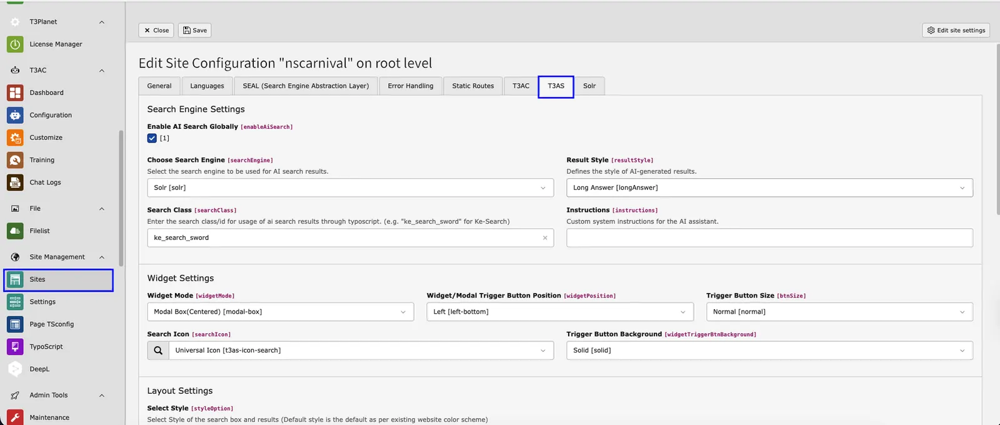
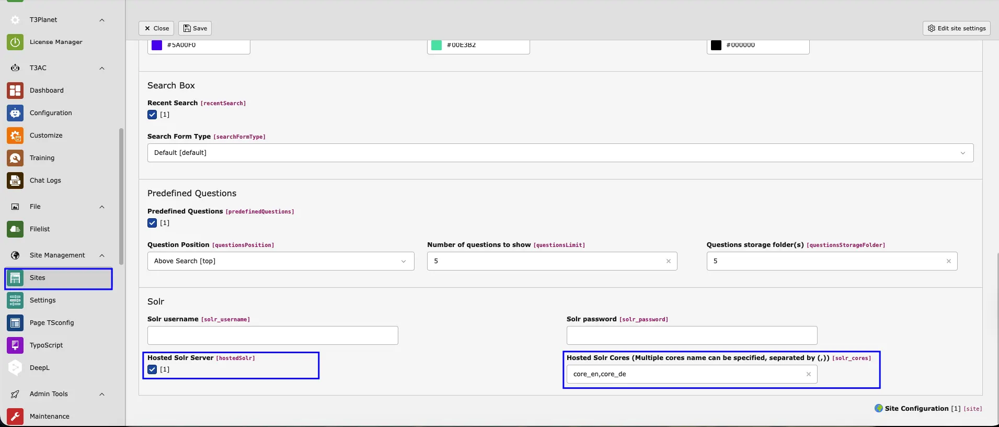
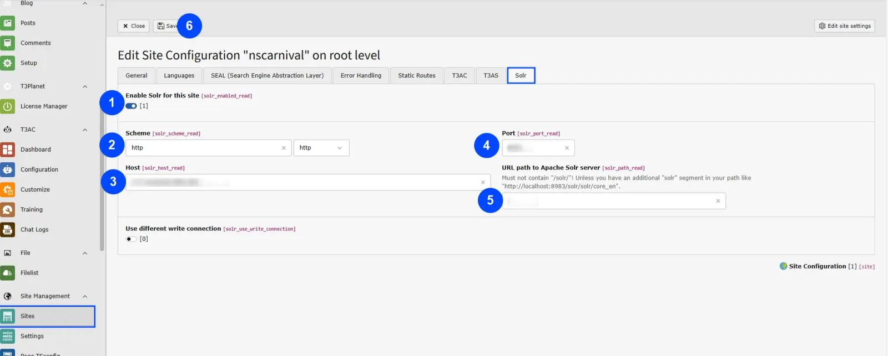
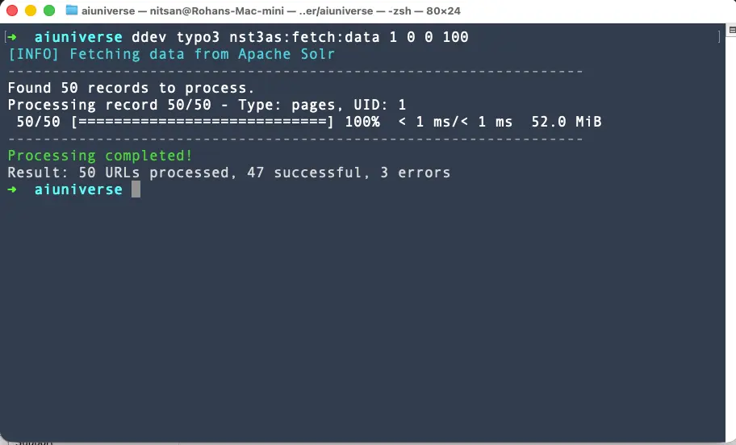
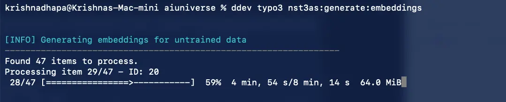
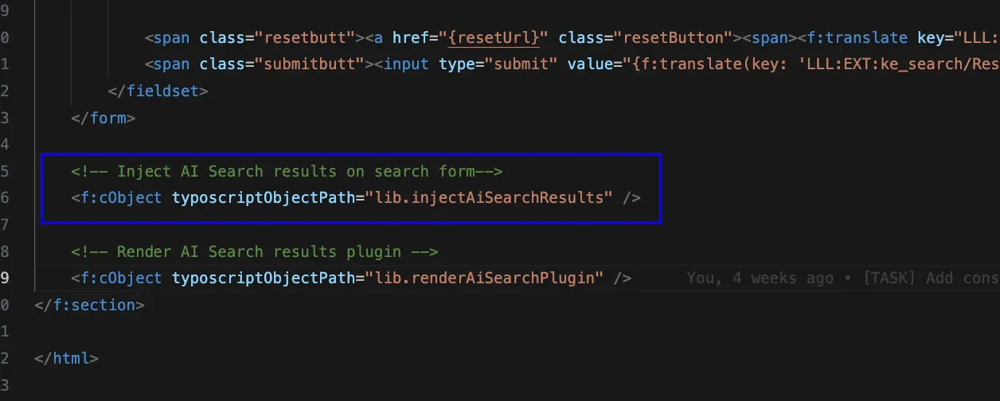

T3AS requires a few configuration steps to set up and run properly. Follow the sequence below to ensure a smooth integration.

## 1. Extension Settings


<div className="t3-embed"><iframe src="https://app.supademo.com/embed/cmgq8x6ck08tvletgdhmmbr56?utm_source=link" loading="lazy" title="AI FileMeta Overview Demo" allow="clipboard-write" frameBorder="0" webkitallowfullscreen="true" mozallowfullscreen="true" allowfullscreen></iframe></div>
Configure the basic extension settings, including your API key and other
required parameters.

1. Open the **Extension Configuration** module in the TYPO3 backend.
2. Locate **T3AS (TYPO3 AI Search)** in the list.
3. Depending on your AI provider, enter the API key in the appropriate tab:
  1. **ChatGPT Tab**:
  - Enter API Key.
  - Select Model (e.g., gpt-3.5-turbo).
  - Select Text Embedding Model (e.g., text-embedding-3-small).
  - Adjust Temperature if needed (default 0.7).
  2. **Custom LLM Tab**:
  - Enable Custom AI Engine by checking the box.
  - Enter the API Endpoint.
  - Enter the API Key for your Custom LLM.
  3. **Gemini Tab**:
  - If applicable, enter the API key and other configuration options specific to Gemini.

## 2. Site Configuration


<div className="t3-embed"><iframe src="https://app.supademo.com/embed/cmf3ojbni1gll39oz7onamw4h?utm_source=link" loading="lazy" title="AI FileMeta Overview Demo" allow="clipboard-write" frameBorder="0" webkitallowfullscreen="true" mozallowfullscreen="true" allowfullscreen></iframe></div>
Define the search type for your website. T3AS supports:

- **sitecontent**
- **ke_search**
- **indexed_search**
- **Solr**

Choose the search source that matches your project setup.

- Go to **Sites** module in the TYPO3 backend.
- Edit your site configuration.
- In the **T3AS Settings** Tab, select the **Search Type** that matches your setup and configur other settings as per your requiredment!
- Save and close the configuration.

Please find more details about each configuration below.

### Search Engine Settings

- **Enable AI Search Globally**
Activates AI search across the site.
- **Choose Search Engine**
Defines the search engine to be used for AI results.
Example: Site Content
*Note:* Supported search engines include Site Content, Ke Search, Indexed Search, and Solr.
- **Search Class**
Enter the CSS/id class for usage of AI search results through TypoScript.
*Example:* ke_search_sword for Ke Search.
- **Result Style**
Defines the display style of AI-generated results.
Example: Summarize
- **Instructions**
Custom system instructions for the AI assistant.

### Widget Settings

- **Widget Mode**
Defines how the search widget/modal is displayed.
Example: Modal Box (Centered)
- **Widget/Modal Trigger Button Position**
Sets the position of the trigger button.
Example: Left (bottom)
- **Trigger Button Size**
Adjusts the size of the trigger button.
Example: Normal
- **Search Icon**
Defines the icon displayed in the search box.
Example: Universal Icon
- **Trigger Button Background**
Sets the background style of the trigger button.
Example: Solid

### Layout Settings

- **Select Style**
Style for the search box and results.
Example: Customized Style (plugin)
*Note:* The default style matches the existing website color scheme.
- **Border Radius**
Adjusts the roundness of the search box corners.
Example: Semi Rounded
- **Primary Color**
Defines the primary color of the search box design.
Example: #ffa23b
- **Secondary Color**
Defines the secondary color for highlights or accents.
Example: #baadc2
- **Text Color**
Sets the color of text inside the search box.
Example: #962dff
- **Select Loader**
Defines the loader animation while fetching results.
Example: Skeleton Loader

### Search Box

- **Recent Search**
Enables the display of recent search queries.
- **Search Form Type**
Defines how the search input is displayed.
Example: With Button
- **Button Type**
Type of button used for the search form.
Example: Search Icon

### Predefined Questions

- **Predefined Questions**
Enables predefined search suggestions.
- **Question Position**
Defines the placement of predefined questions.
Example: Bottom Search
*Note:* Options include below search or near bottom.
- **Number of Questions to Show**
Maximum number of questions displayed.
Example: 5
- **Questions Storage Folder(s)**
Folder(s) where predefined questions are stored.
Example: 681

### Solr Settings

If the selected search engine is **Solr**, please provide the following details in case your Solr server is secured with HTTP authentication.

- **Solr Username**
Username for Solr authentication.
- **Solr Password**
Password for Solr authentication.

### Hosted-Solr Server Integration for Solr

The **Hosted-Solr Server** feature enables you to connect your TYPO3 instance directly to the Hosted-Solr service for improved search indexing and data retrieval.
The following guide outlines how to configure **T3AS** and **Hosted Solr** in your TYPO3 instance using the Site Configuration module.

- Step 1: Open Site Configuration



1. In the TYPO3 backend, navigate to **Site Management → Sites**
2. Edit site configuration

- Step 2:Scroll down to the **Solr** section in the same T3AS tab and Configure Solr Integration



- Step 4: Define Solr Connection Settings



- Step 5: Save Configuration

## Getting Started

1. **Create an Account:**
Sign up on the Hosted-Solr platform using your email address.
2. **Create a Solr Core:**
Once your account is active, create a new Solr core.
3. **Configure in TYPO3:**
Add your Solr core connection details within the **TYPO3 Site Settings**.

This integration allows you to seamlessly manage your Solr configuration and maintain consistent communication between TYPO3 and the Hosted-Solr environment.

## Verifying the Connection

After configuration, ensure that Solr is properly connected:

- Navigate to the **Info module** inside the **Solr tab** within your TYPO3 backend.
- Verify that the Solr connection status and indexing information appear correctly.

## Additional Fields Support

The extension now supports fetching **additional fields** from Solr beyond the standard predefined set.

This means you can include **custom or project-specific fields** in your search configuration to enhance indexing and display flexibility.

1. Go to the **Extension Settings** in TYPO3.
2. Specify which fields should be retrieved from Solr.
3. Save your settings to enable greater control over search results and data output.

By leveraging this feature, you can tailor your Solr-based search experience to match the exact needs of your TYPO3 project.

<Note>
Several default fields are automatically included for content retrieval from Solr: id, site, type, uid, content, pid, url, changed, and access. Ensure that Solr is properly configured and that the content field is available in your Solr-indexed data.
</Note>

## Using ke_search and indexed_search

When configuring T3AS with **ke_search** or **indexed_search**,
make sure the following conditions are met:

1. **All Website Data Indexed**
  - Ensure that the complete website content is indexed by the respective search extension before enabling T3AS.
2. **Scheduler Execution**
  - Run all required schedulers as outlined in the [Scheduler configuration](/ExtNsT3AS/Configuration/Index#scheduler-tasks) section to keep the data fresh and available for AI-powered search.

## Scheduler Tasks

<div className="t3-embed"><iframe src="https://app.supademo.com/embed/cmrakildl0wh8qmhx97rf9642?utm_source=link" loading="lazy" title="Scheduler Feature Demo" allow="clipboard-write" frameBorder="0" webkitallowfullscreen="true" mozallowfullscreen="true" allowfullscreen></iframe></div>

T3AS relies on scheduled tasks to fetch, process, and maintain search data.
Create and enable the following schedulers:

### 1. **Fetch Data Scheduler** – Collects content to be indexed.

<div className="t3-embed"><iframe src="https://app.supademo.com/embed/cmf3p83sj1hgr39ozpxipnqlg?utm_source=link" loading="lazy" title="AI FileMeta Overview Demo" allow="clipboard-write" frameBorder="0" webkitallowfullscreen="true" mozallowfullscreen="true" allowfullscreen></iframe></div>

<div className="t3-embed"><iframe src="https://app.supademo.com/embed/cmf408o4l1x1539ozcflte448" loading="lazy" title="AI FileMeta Overview Demo" allow="clipboard-write" frameBorder="0" webkitallowfullscreen="true" mozallowfullscreen="true" allowfullscreen></iframe></div>

- Go to **Scheduler** module.
- Create a new task → Select **Execute console commands**.
- From the dropdown, choose *T3AS: Fetch Data Scheduler*.
- Define frequency (e.g., every 30 minutes).
- Save and activate the task.

**Command:** `nst3as:fetch:data` – Fetch data

#### Running the Fetch Data Command

You can execute the fetch data command directly from the CLI to fetch and process content from your configured search engine (Solr, ke_search, indexed_search, or sitecontent).

**Example Command (Composer-based installation):**

```text
vendor/bin/typo3 nst3as:fetch:data 1 0 0 100
```

<Note>
**For non-composer installations:** Please refer to the [TYPO3 Scheduler documentation](https://docs.typo3.org/c/typo3/cms-scheduler/13.4/en-us/Administration/ConsoleTools/Running.html) for the correct command syntax. Use `typo3/sysext/core/bin/typo3` instead of `vendor/bin/typo3` in your command.
</Note>

The command processes records from your search index and displays progress information including the number of records found, processing status, and results summary.



*Example output showing the fetch data command processing 50 records with 47 successful and 3 errors*

**Arguments** : Please find the in depth description about each argument for this scheduler

**rootPageId:**

Define the Root Page ID of the TYPO3 site from which crawling begins.

**contentRestriction:**

Define whether user-restricted content should be fetched.

- `0` = All content is included
- `1` = User-restricted content is excluded

**Note** Only applicable when search engine is **not** set to *sitecontent*.

**excludeLanguageIds:**

- List of language IDs to be excluded during crawling.
- Ignored if a sitemap URL is provided.

**Note:** Works only with **ke_search**, **indexed_search**, and **Solr**.

**maxLinkCrawl:**

- Maximum number of links to crawl.eg `100`
- Only relevant when using *sitecontent* with `excludeLanguageIds`.

**trainDirectory:**

- Public directory path to crawl files (e.g., PDFs). `/fileadmin/pdfs/`
- Only applicable when search engine is set to **sitecontent**.

**siteMapUrls:**

- One or more sitemap URLs to crawl (comma-separated).
- Example:`https://example.com/sitemap.xml, https://example.com/sitemap-news.xml`
- Only applicable when search engine is set to **sitecontent**.

### 2. **Embedding Scheduler** – Generates vector embeddings for AI-based search.

<div className="t3-embed"><iframe src="https://app.supademo.com/embed/cmf3p26kj1hdx39ozmmoq06t7?utm_source=link" loading="lazy" title="AI FileMeta Overview Demo" allow="clipboard-write" frameBorder="0" webkitallowfullscreen="true" mozallowfullscreen="true" allowfullscreen></iframe></div>

- Go to **Scheduler** module.
- Create a new task → Select **Execute console commands**.
- From the dropdown, choose *T3AS: Embedding Scheduler*.
- Schedule it after **Fetch Data Scheduler**.
- Save and enable.

**Command:** `nst3as:generate:embeddings` – Generate embeddings for untrained data

#### Running the Embedding Generation Command

After fetching data, you need to generate vector embeddings for AI-based search. This command processes untrained data and creates embeddings that enable semantic search capabilities.

**Example Command (Composer-based installation):**

```text
vendor/bin/typo3 nst3as:generate:embeddings
```

<Note>
**For non-composer installations:** Please refer to the [TYPO3 Scheduler documentation](https://docs.typo3.org/c/typo3/cms-scheduler/13.4/en-us/Administration/ConsoleTools/Running.html) for the correct command syntax. Use `typo3/sysext/core/bin/typo3` instead of `vendor/bin/typo3` in your command.
</Note>

The command will:
- Find all untrained items that need embeddings
- Process each item sequentially
- Display progress with a progress bar showing completion percentage
- Show estimated time remaining and memory usage



*Example output showing embedding generation in progress (29/47 items processed, 59% complete)*

**Note:** The embedding generation process can take some time depending on the amount of data. Make sure to adjust PHP timeout settings if needed (see below).

### Adjust PHP Timeout During Training

If you encounter **timeout issues** while training your TYPO3 data, you can increase the **PHP execution time** in your environment.

Steps:

1. Locate the **``max_execution_time``** setting in your **``php.ini``** file.
2. Increase its value (for example, **``300`` seconds**) to allow the training process to run longer.
3. Save the changes

This ensures that the **AI training process** completes successfully without being interrupted by **PHP timeouts**.

### 3. **Retrain Scheduler** – Updates the model with new or changed content.

> This scheduler is only required when using **ke_search**, **indexed_search**, or **Solr**.
> If data is updated, first re-index the data in your search extension and then run
> this scheduler to refresh the AI model.

### 4. **Clear Logs Scheduler** – Cleans up old logs to maintain performance.

<div className="t3-embed"><iframe src="https://app.supademo.com/embed/cmf3pam6q1hj739ozoob79v4h?utm_source=link" loading="lazy" title="AI FileMeta Overview Demo" allow="clipboard-write" frameBorder="0" webkitallowfullscreen="true" mozallowfullscreen="true" allowfullscreen></iframe></div>

## Injecting AI Search result in TYPO3 Search Extensions

This integration allows you to inject AI-generated results into an existing search form

<Note>
Make sure you have added the Search Class/id in the site settings as described in [https://docs.t3planet.de/en/latest/ExtNsT3AS/Configuration/Index.html#search-engine-settings](/ExtNsT3AS/Configuration/Index#search-engine-settings)
</Note>

For example, If you want to render the AI search result on below the ke_search form, Please add below code at

**EXT:ke_search/Resources/Private/Templates/SearchForm.html**

```python
<f:cObject typoscriptObjectPath="lib.injectAiSearchResults" />
```



## Enable AI Search plugin using TypoScript

To enable this, Add the following TypoScript object to any template where you want the AI Search plugin to be rendered. The searchPid value should be set to the page ID where the plugin is placed (for example: 4).

Add the following TypoScript object to any template where you want the AI Search plugin to be rendered:

```python
<f:cObject typoscriptObjectPath="lib.renderAiSearchPlugin" data="{searchPid:4}"/>
```

## T3AS History Logs


<div className="t3-embed"><iframe src="https://app.supademo.com/embed/cmf3yflzz1uoa39oz7pbv9zpa?utm_source=link" loading="lazy" title="AI FileMeta Overview Demo" allow="clipboard-write" frameBorder="0" webkitallowfullscreen="true" mozallowfullscreen="true" allowfullscreen></iframe></div>
This module provides a detailed history of all search queries performed through the AI Search integration.
It allows administrators to track search keywords, usage frequency, and corresponding results across different languages.
This helps in monitoring user behavior, improving search relevance, and optimizing content accordingly.

## Interactive demos

<div className="t3-embed"><iframe src="https://app.supademo.com/embed/cmraj97pg0ryeqmhxt1yypwta?utm_source=link" loading="lazy" title="AI Features Demo" allow="clipboard-write" frameBorder="0" webkitallowfullscreen="true" mozallowfullscreen="true" allowfullscreen></iframe></div>

<div className="t3-embed"><iframe src="https://app.supademo.com/embed/cmrajbhax0s8yqmhxoq4ikjrv?utm_source=link" loading="lazy" title="T3AS Dashboard Demo" allow="clipboard-write" frameBorder="0" webkitallowfullscreen="true" mozallowfullscreen="true" allowfullscreen></iframe></div>

<div className="t3-embed"><iframe src="https://app.supademo.com/embed/cmrajdte10somqmhxdf258tv8?utm_source=link" loading="lazy" title="T3AS Data Source Demo" allow="clipboard-write" frameBorder="0" webkitallowfullscreen="true" mozallowfullscreen="true" allowfullscreen></iframe></div>

<div className="t3-embed"><iframe src="https://app.supademo.com/embed/cmrajhhoo0t19qmhxcu9sljuu?utm_source=link" loading="lazy" title="T3AS Training Center Demo" allow="clipboard-write" frameBorder="0" webkitallowfullscreen="true" mozallowfullscreen="true" allowfullscreen></iframe></div>

<div className="t3-embed"><iframe src="https://app.supademo.com/embed/cmrajjqug0tgfqmhx211jb110?utm_source=link" loading="lazy" title="T3AS Search Global Settings Demo" allow="clipboard-write" frameBorder="0" webkitallowfullscreen="true" mozallowfullscreen="true" allowfullscreen></iframe></div>

<div className="t3-embed"><iframe src="https://app.supademo.com/embed/cmrakgchz0w9qqmhxlikxe9ac?utm_source=link" loading="lazy" title="T3AS Usage Analytics Demo" allow="clipboard-write" frameBorder="0" webkitallowfullscreen="true" mozallowfullscreen="true" allowfullscreen></iframe></div>

<div className="t3-embed"><iframe src="https://app.supademo.com/embed/cmrajs4hd0uedqmhxgmcj85tr?utm_source=link" loading="lazy" title="AI Logs Demo" allow="clipboard-write" frameBorder="0" webkitallowfullscreen="true" mozallowfullscreen="true" allowfullscreen></iframe></div>

<div className="t3-embed"><iframe src="https://app.supademo.com/embed/cmrajqtof0u80qmhxjqczjqef?utm_source=link" loading="lazy" title="AI Statistics Demo" allow="clipboard-write" frameBorder="0" webkitallowfullscreen="true" mozallowfullscreen="true" allowfullscreen></iframe></div>

<div className="t3-embed"><iframe src="https://app.supademo.com/embed/cmrbog9to0dl9qmo5dmb8bj0m?utm_source=link" loading="lazy" title="T3AS AI Prompts Demo" allow="clipboard-write" frameBorder="0" webkitallowfullscreen="true" mozallowfullscreen="true" allowfullscreen></iframe></div>

<div className="t3-embed"><iframe src="https://app.supademo.com/embed/cmrahnqkz0pajqmhx62he9g8r?utm_source=link" loading="lazy" title="T3AS Providers and MCP Tools Demo" allow="clipboard-write" frameBorder="0" webkitallowfullscreen="true" mozallowfullscreen="true" allowfullscreen></iframe></div>

