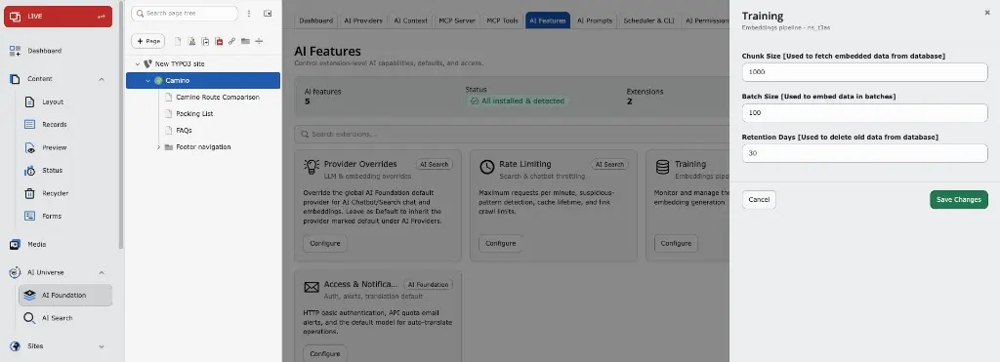

## Overview

This feature provides configurable database chunking to efficiently process large datasets while maintaining optimal performance and stability. Instead of loading all records in a single query, data is fetched and processed in smaller chunks, reducing memory usage and preventing execution timeouts.

The chunk size is configurable via the T3AF feature settings, allowing administrators to adjust it according to server capacity and dataset size.

## Default Configuration

By default, database chunking is enabled with a chunk size of **1000 records**.

If required, this value can be modified in **T3AF → AI Features → Training** to better suit the execution environment.

## Configuration Steps

1. Open **T3AF** in the TYPO3 backend.
2. Go to **AI Features**.
3. Open the **Training** card (Embeddings pipeline).
4. Adjust **Chunk Size**, **Batch Size**, and **Retention Days** as needed.
5. Click **Save Changes**.

Configure **Chunk Size**, **Batch Size**, and **Retention Days** under **T3AF → AI Features → Training**.

## Recommendations

**Chunk Size Guidelines:**

- **Small datasets (< 10,000 records):** Use default value (1000) or lower (500-800)
- **Medium datasets (10,000 - 50,000 records):** Use 1000-1500
- **Large datasets (> 50,000 records):** Use 1500-2000, but monitor server memory usage

<Note>
Adjusting the chunk size can significantly impact performance. Smaller chunks use less memory but may take longer to process. Larger chunks process faster but require more memory. Monitor your server’s memory usage when adjusting this value.
</Note>

## Benefits

- **Reduced Memory Usage:** Processing data in smaller chunks prevents memory exhaustion
- **Prevents Timeouts:** Smaller batches reduce the risk of PHP execution timeouts
- **Better Performance:** Optimized chunk sizes can improve overall processing speed
- **Flexible Configuration:** Administrators can adjust settings based on their specific environment
