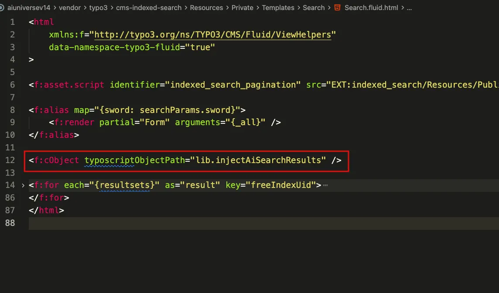
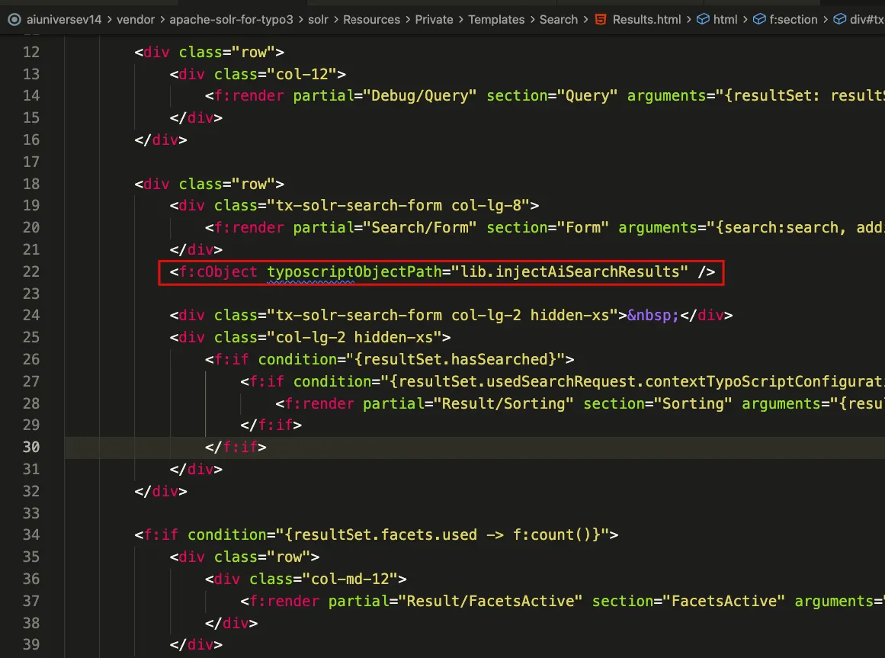

Use this when you already run **ke_search**, **indexed_search**, or **Solr** and want the T3AS AI overview to appear together with that search UI.

Site-wide search defaults are in **T3AS → Search** (see [5. Search tab](/en/latest/ExtNsT3AS/Configuration/Index#t3as-search-global-settings)). For the standalone frontend plugin, see [T3AS Search Plugin](/en/latest/ExtNsT3AS/FrontendPlugin/Index).

## Prerequisites for ke_search and indexed_search

When configuring T3AS with **ke_search** or **indexed_search**, make sure the following conditions are met:

1. **All website data indexed** — ensure the complete website content is indexed by the respective search extension before enabling T3AS.
2. **Scheduler execution** — run the required T3AS training scheduler task to keep the data fresh. See **Scheduler** on [Configuration](/en/latest/ExtNsT3AS/Configuration/Index).

## Setup overview

Setup has two parts:

1. Set **Search Class** in **T3AS → Search → Settings** so T3AS can read the visitor query from the third-party search field (see [5. Search tab](/en/latest/ExtNsT3AS/Configuration/Index#t3as-search-global-settings)).
2. Add the Fluid injection snippet to that extension’s search template (preferably in a **site package override**, not by editing the extension in `vendor/` / `typo3conf/ext` directly).

**Search Class values**

| Search extension | Search Class (CSS class) | Template to extend |
| --- | --- | --- |
| **ke_search** | `ke_search_sword` | `EXT:ke_search/Resources/Private/Templates/SearchForm.html` |
| **indexed_search** | `tx-indexedsearch-searchbox-sword` | `EXT:indexed_search/Resources/Private/Templates/Search/Search.fluid.html` |
| **Solr** | `tx-solr-q` | `EXT:solr/Resources/Private/Templates/Search/Results.html` |

<Note>
Enter **only the class name** in **Search Class** (for example `tx-solr-q`), without a leading `.`. The value must match the CSS class on the live search input for your setup. If your theme renames the input class, use that class instead.
</Note>

## Fluid injection snippet

Add this line where the AI overview should render (usually near the search form or above the classic result list):

```html
<f:cObject typoscriptObjectPath="lib.injectAiSearchResults" />
```

## ke_search

1. Set **Search Class** to `ke_search_sword`.
2. In your override of `SearchForm.html`, add the injection snippet.


*Example: AI overview rendered with the ke_search form after the Fluid snippet is in place.*

## indexed_search

1. Set **Search Class** to `tx-indexedsearch-searchbox-sword`.
2. In your override of `EXT:indexed_search/Resources/Private/Templates/Search/Search.fluid.html`, add the injection snippet (typically after the search form and before the result loop).



*indexed_search template — add `<f:cObject typoscriptObjectPath="lib.injectAiSearchResults" />` after the form render.*

## Solr

1. Set **Search Class** to `tx-solr-q`.
2. In your override of `EXT:solr/Resources/Private/Templates/Search/Results.html`, add the injection snippet (typically after the search form partial).



*Solr `Results.html` — add `<f:cObject typoscriptObjectPath="lib.injectAiSearchResults" />` after the search form.*

After saving the Search Class and template override, flush TYPO3 caches and test a search on the frontend. The AI overview should appear with the existing search results when a matching query is submitted.

## Enable AI Search plugin using TypoScript

To render the standalone AI Search plugin via TypoScript (not the third-party form injection above), add the following Fluid view helper where the plugin should appear. Set `searchPid` to the page ID that contains the T3AS Search plugin (for example `4`):

```html
<f:cObject typoscriptObjectPath="lib.renderAiSearchPlugin" data="{searchPid:4}"/>
```
