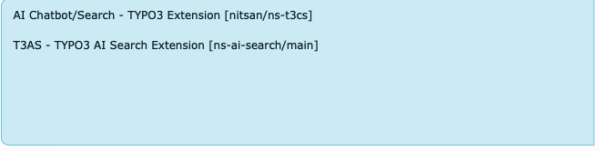

This guide helps you install **T3AS Premium** (`EXT:ns_t3as`) on a TYPO3 project for the first time.

T3AS needs **T3AF** (`EXT:ns_t3af`). T3AF connects your AI providers (API keys, models, prompts, and shared AI services). Without it, T3AS cannot run.

These extensions do **not** change how your website looks on the frontend by themselves. They work in the backend and power AI Search. **Keep both T3AS and T3AF enabled.**

## Quick overview for new customers

You will install and activate these pieces:

1. **License Manager** (`EXT:ns_license`) — unlocks your Premium download
2. **T3AS** (`EXT:ns_t3as`) — the AI Search extension (and related packages such as T3CS where required)
3. **T3AF** (`EXT:ns_t3af`) — shared AI engine used by T3AS (free on TER)
4. **Database updates** — so TYPO3 creates the required tables
5. **TypoScript includes** — load the required static TypoScript
6. **AI provider setup** — so T3AS can send AI requests
7. **Final check** — confirm modules load and the license is active

Follow the steps below in order. Choose **either** Non-Composer **or** Composer in Step 2 — not both.

After installation, you will use the T3AS backend module to:

- Manage **data sources** such as sitemaps, PDFs, TYPO3 pages, web pages, Q&A pairs, and optional index sources such as Ke Search or Solr.
- Run a **training pipeline** that syncs content, creates embeddings, and keeps AI search up to date.
- Configure and monitor **AI Search**.
- View **usage analytics** for search activity.

<Info>
If you are upgrading from an older version (**2.2.0** or earlier) to the latest release,
follow [Reinstall After Upgrading](/ExtNsT3AS/ReInstallEverything/Index) instead of this installation guide.
</Info>

## Before you start

Make sure you have:

- Backend access as an administrator
- Your **T3AS license key** from T3Planet
- Decided whether your project uses **Composer** or the **TYPO3 Extension Manager**
- An AI provider account/API key ready (for example OpenAI) for Step 6

## Step 1 — Install the License Manager

Install the latest version of `EXT:ns_license` before continuing.

The License Manager controls access to T3Planet Premium packages and is required to download and activate T3AS.

## Step 2 — Activate the License

Pick the path that matches your project.

### Non-Composer Installation

Use this workflow when your project installs T3Planet extensions from the TYPO3 backend:

1. Open **Admin tools** → **T3planet License Manager**.
2. Enter your T3AS license key.
3. Activate the license.
4. Confirm that the latest T3AS package is downloaded.
5. Confirm that T3AF (`EXT:ns_t3af`) is installed automatically or available after activation.

### Composer Installation

Use this workflow when your TYPO3 project is managed with Composer:

1. Check the T3Planet Composer repository configuration.
2. Update the `only` parameter so the project can download T3AS and T3CS: "only": [
  "nitsan/ns-t3as",
  "nitsan/ns-t3cs"
]
3. Install the T3AS package: composer require nitsan/ns-t3as
4. Verify that the installation completed successfully.
5. Confirm that T3AF (`nitsan/ns-t3af` / `EXT:ns_t3af`) is installed. If it is missing, install it using **Step 3 — Install T3AF**.

Full license activation details:
[https://docs.t3planet.de/en/latest/License/LicenseActivation/Index.html](/License/LicenseActivation/Index)

## Step 3 — Install T3AF

T3AF (`EXT:ns_t3af`) is required before T3AS can be used.
It provides the shared AI provider configuration, models, API access, logs, and service layer used by T3AS.

If T3AF was already installed in Step 2, you can skip to Step 4.

**T3AF** is the shared AI infrastructure for T3Planet AI Universe extensions.
Complete the parent setup first, then continue with the remaining T3AS steps below.

T3AF is available from the TYPO3 Extension Repository (TER).

Download / TER page: [https://extensions.typo3.org/extension/ns_t3af](https://extensions.typo3.org/extension/ns_t3af)

### Option 1 — Extension Manager (TER)

1. Open **Admin Tools** → **Extensions**.
2. Select **Get Extensions**.
3. Search for `ns_t3af` or **T3AF**.
4. Install and activate the extension.
5. Flush all TYPO3 caches.

### Option 2 — Composer

If T3AF is not already present after installing T3AS, install it with:

```bash
composer require nitsan/ns-t3af
```

Then flush all TYPO3 caches.

Helpful T3AF references:

- [T3AF Installation](/T3AF/Installation/Index)
- [T3AF Configuration](/T3AF/Configuration/Index)
- [AI Providers](/T3AF/Configuration/AIProviders/Index)

## Premium Version

**T3AS** is a Premium extension and requires a valid T3Planet license for download and activation.

For license activation and access to premium features, see:
[https://docs.t3planet.de/en/latest/License/Index.html](/License/Index)

<Note>
**T3AF** (`EXT:ns_t3af`) is free and available from the TYPO3 Extension Repository (TER).
Premium licensing applies to **T3AS** — not to T3AF.
</Note>

## Step 4 — Run Database Analyzer

After installing the extension, apply all pending database changes:

1. Open **Admin Tools**.
2. Go to **Maintenance**.
3. Open **Analyze Database Structure**.
4. Apply all pending database schema updates.

Run this before using T3AS modules in the TYPO3 backend.

## Step 5 — Configure/Load required TypoScripts

T3AS and T3CS ship static TypoScript that must be included on your site.

1. Switch to the root page of your site.
2. Open the **TypoScript** module and select **Edit TypoScript Record** / **Info/Modify**.
3. Click **Edit the whole template record** and open the **Includes** tab.
4. Under **Include static (from extensions)** / site sets, add:
  - `AI Chatbot/Search - TYPO3 Extension [nitsan/ns-t3cs]`
  - `T3AS - TYPO3 AI Search Extension [ns-ai-search/main]`
5. Save the template and flush TYPO3 caches.



Include the T3CS and T3AS static TypoScript sets.

## Step 6 — Configure the AI Provider

After installation:

1. Open **T3AF** in the TYPO3 backend.
2. Configure your preferred AI provider.
3. Save the provider and model configuration.
4. Verify the AI connection with a test request.

T3AS will not function correctly until T3AF has a working AI provider configuration.

## Step 7 — Verify the Installation

Before handing the system to editors, verify that:

- `EXT:ns_t3as` is installed and active.
- `EXT:ns_t3af` is installed and active.
- The T3AS license is active.
- Database Analyzer changes are applied.
- The AI provider is configured in T3AF.
- TYPO3 caches are cleared.
- T3AS backend modules load without errors.

If all items above are true, installation is complete. Next, add data sources and run training in the T3AS module.
