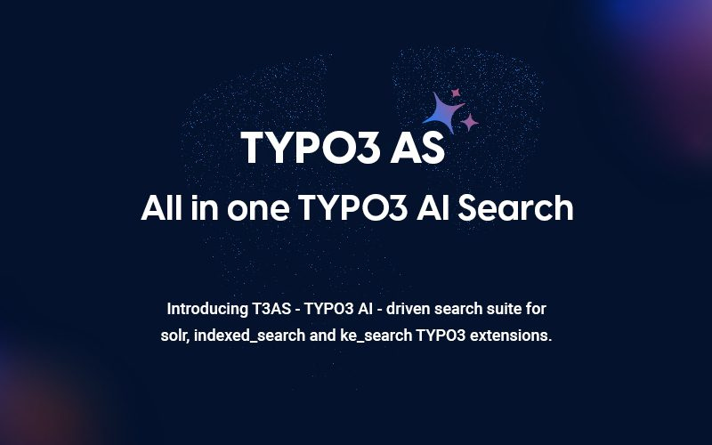

## EXT:ns_t3as

**T3AS (TYPO3 AI Search)** adds AI-powered search to your TYPO3 website. It works with your existing search setup — site content, Solr, ke_search, or indexed_search — and returns direct answers based on your trained data.

T3AS now works as a child extension of T3AF (`ns_t3af`), which provides the shared AI providers, authentication, common configuration, and core AI services used by the extension.

Instead of only showing a list of links, visitors get a clear answer with optional source references.

### Key Features

- **Natural language search** — Visitors can ask questions in everyday language
- **Answers from your content** — AI uses your trained pages, PDFs, and other sources
- **Easy setup** — Install, add data sources, train, and place the search plugin on a page
- **Chatbot mode** — Follow-up questions after the first answer
- **Search feedback** — Thumbs up/down ratings, visible in **Usage Analytics**
- **Voiceover** — Listen to answers read aloud
- **Result styles** — Short summaries or longer detailed answers
- **Predefined questions** — Clickable suggestions in the search box

### System Requirements

- TYPO3 v12 – v13
- PHP v8.2 – v8.4

**Required extensions:**

- EXT:backend
- EXT:filelist
- EXT:ns_t3af
- EXT:ns_t3cs
- EXT:fluid
- EXT:scheduler
- EXT:ns_license

See also:

- [T3AF System Requirements](/T3AF/Installation/Index#ns-t3af-system-requirements)
- [T3AF Installation](/T3AF/Installation/Index)

## Helpful Links

<Note>
- Product Page: [https://t3planet.de/t3as-typo3-erweiterung](https://t3planet.de/t3as-typo3-erweiterung)
- Support Portal: [https://t3planet.de/support](https://t3planet.de/support)
</Note>
