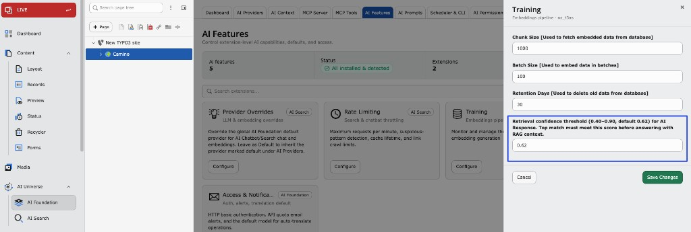

## Introduction

Retrieval confidence threshold is a global T3CS setting that controls how strong
a vector match must be before **T3AS** (AI search) treats retrieved content as
reliable enough for RAG (retrieval-augmented generation).

It replaces a former hard-coded value (`0.62`) with a configurable option in
**AI Foundation → AI Features → Training**.

Set **Retrieval confidence threshold** under **AI Foundation → AI Features →
Training** (Embeddings pipeline — `ns_t3as`).

## Property reference

| Property | Value |
| --- | --- |
| Setting key | `retrievalConfidenceThreshold` |
| Allowed range | `0.40` – `0.90` (values outside range are clamped) |
| Default | `0.62` |

## Purpose

Reduce answers built on weak or unrelated chunks (hallucination risk), while
avoiding false “no results” when the best match is good but reranking lowered
the displayed score below cosine similarity.

## Tuning guide

| Threshold | Effect |
| --- | --- |
| `0.58` – `0.60` | More answers; good when top matches often sit around `0.60`–`0.65` |
| `0.62` (default) | Balanced strictness |
| `0.65` – `0.70` | Stricter; fewer weak-context answers, more “no confident match” behavior |

<Note>
Changing the threshold does not require re-training embeddings; flush caches
and retest queries.
</Note>

## How the score is calculated

For each retrieved chunk, the gate uses:

**Item confidence** = `max(score, similarity)`

- **similarity** — cosine similarity between query and chunk embedding
- **score** — hybrid / reranked value (can be lower than similarity)

The top confidence among accessible chunks is compared to
`retrievalConfidenceThreshold`.

## Confidence gate passes if either

- Top confidence ≥ threshold, **or**
- **Term-anchored bypass:** at least one accessible chunk has confidence ≥
`0.45`, confidence ≥ `0.38` (absolute floor), and at least one extracted
query term appears in chunk content or path (word boundaries; path/hyphen-aware).
