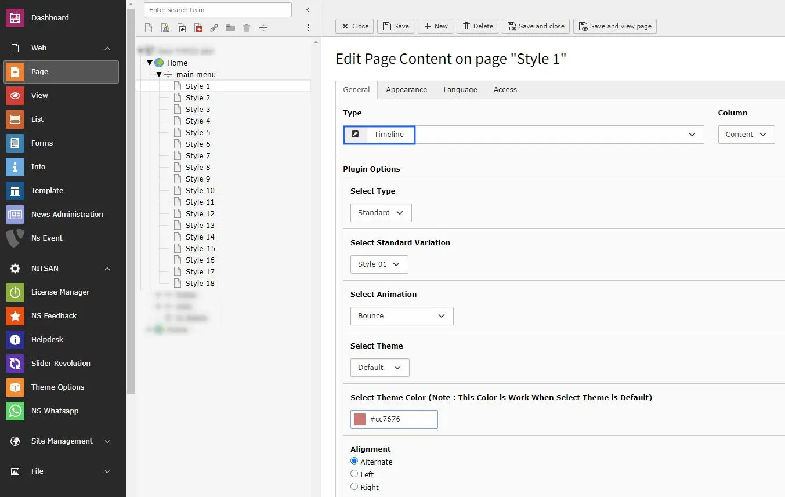
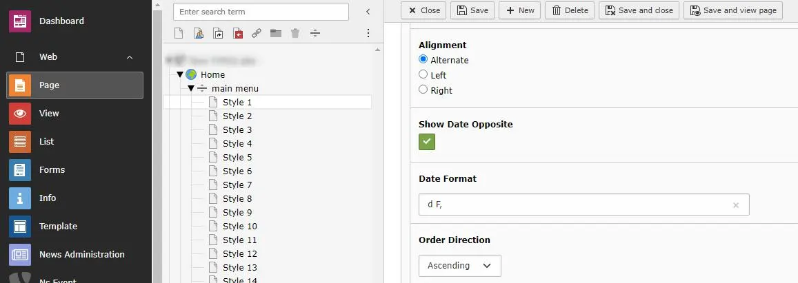
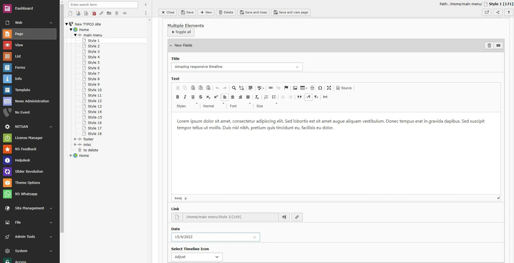

You can insert the timeline extension according to your website need. there are multiple layouts like Standard, news & events with multiple styles available for your websites requisite. Multiple animations & effects gives amazing look to your site.

**Step 1.** Insert extension from the page content > TimeLine

**Step 2.** Choose Type > Standard | News | Events

**Step 3.** Select Style Variation > Style 01 | Style 02 | Style 03…Style 18.

**Step 3.** Do Required configurations according to your website’s need.

<Note>
From extension version 14.0.1 onwards, Crop Variants are not provided by default in the extension configuration. If you need to use or customize Crop Variants, you can configure them manually by adding your own TYPO3 Crop Variant configuration. Please refer to the official TYPO3 documentation for [Crop Variants](https://docs.typo3.org/m/typo3/reference-coreapi/main/en-us/ApiOverview/CropVariants/ContentElement/Index.html)
</Note>
