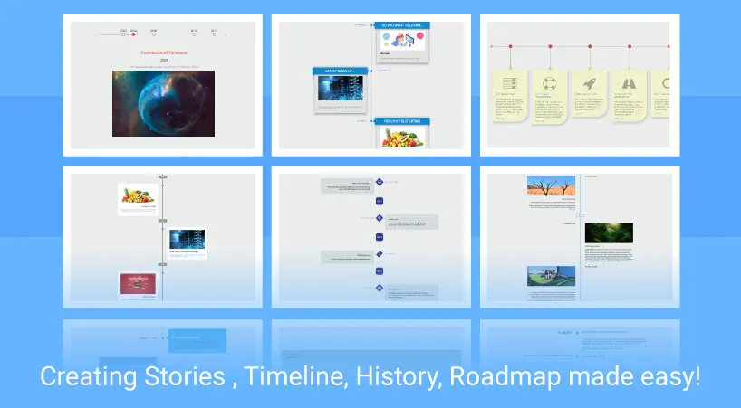

## NS Timeline

## What does it do?

All In One Timeline TYPO3 Extension lets you create stories, timeline, history, roadmap and what not with unlimited possibilities and 19 unique styles and layouts. Designed to create timeline easy and hassle-free, Timeline is the simplest way to integrate timeline to your site. Moreover the extension supports integration of TYPO3 Blog and News extension to display timeline posts.

If you’re looking for power, flexibility and top tier support – look no further.

## Helpful Links

<Note>

- **Product:** https://t3planet.de/ns-timeline-typo3-extension
- **TYPO3 Backend Live Demo:** https://demo.t3planet.de/live-typo3/t3t-extensions/typo3/?TYPO3_AUTOLOGIN_USER=editor-timeline
- **Front End Demo:** https://demo.t3planet.de/t3-extensions/timeline
- To make any domain-related changes or whitelist any development and staging domains, please reach our support center: https://t3planet.de/support

</Note>
