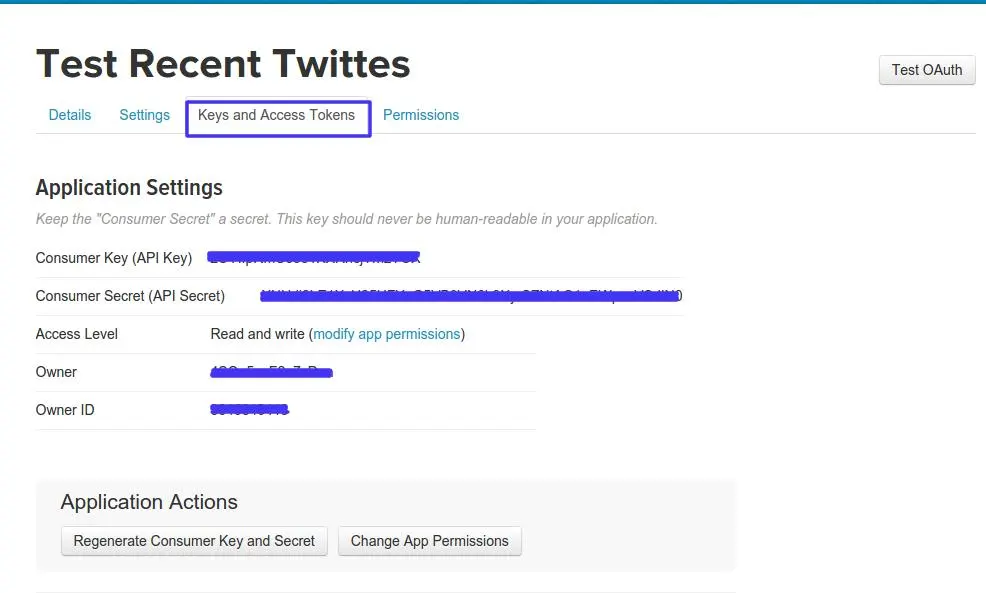
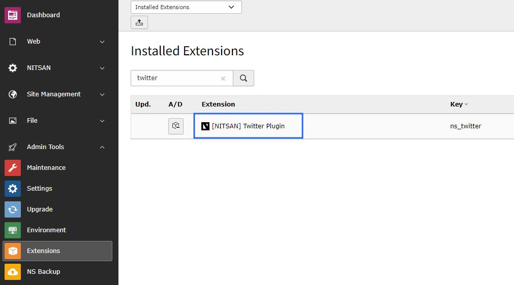
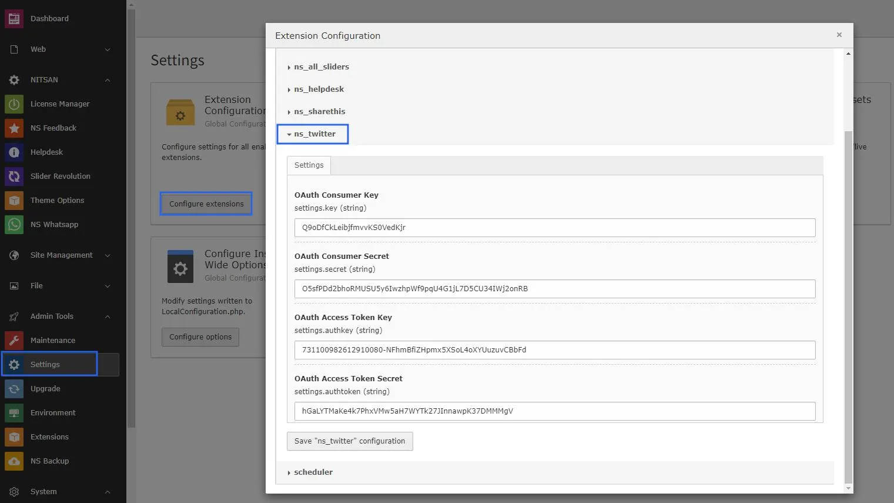
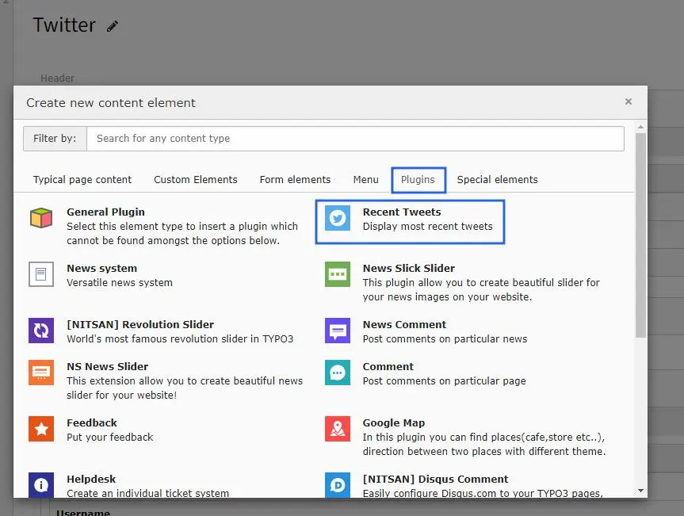
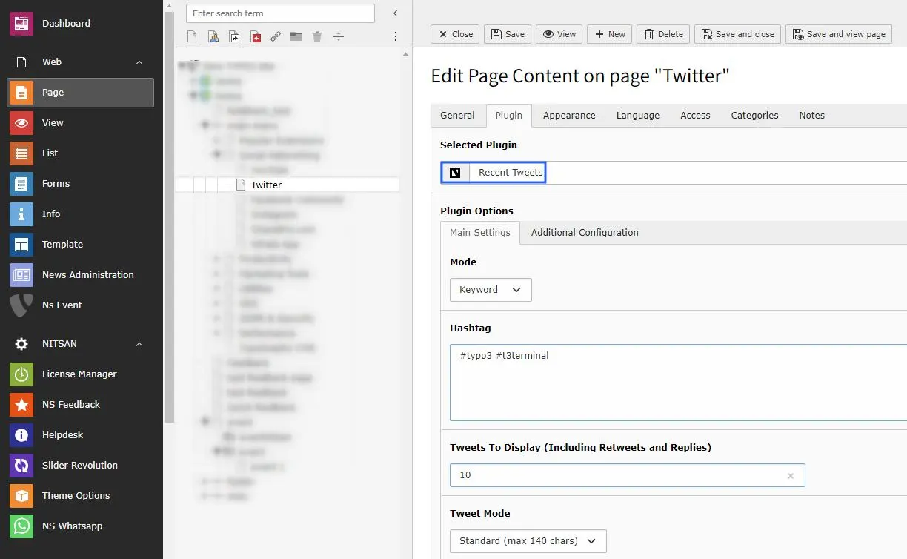
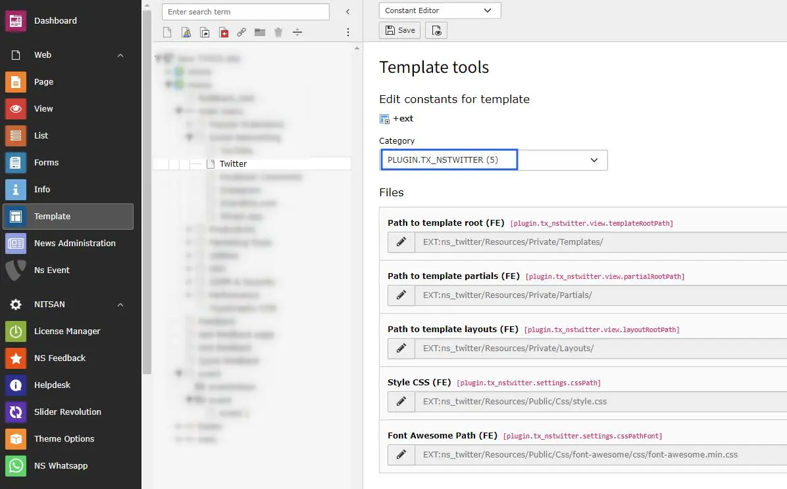

# Configuration

## Quick & Easy configuration of "NsTwitter" into TYPO3

### To activate the Twitter service for your TYPO3 site:

1. Sign Up with your twitter account details over here [https://apps.twitter.com/](https://apps.twitter.com/)

2. After Sign Up to your account **Create New App**

3. Click to **Create Your Twitter application**

4. Now you will get keys from this tab **Keys and Access Tokens**, Just note it down to setup at our TYPO3 extension.

## Setup all the configuration:

### 1. Switch to the module Admin tools *Extensions* and then edit **configuration**

### 2. Paste your required keys into this **settings**

### 3. **Add Plugin** to your page where you want to show your tweets.

### 4. **Configure** it as per your requirements.

### 5. You can add your own **CSS** path by configuring below constant file path or **remove path** that will **not add css** in your project.

## Clearing the cache

Please use the buttons 'Flush frontend caches' and 'Flush general caches'
from the top panel. The 'Clear cache' function of the install tool will also
work perfectly.
