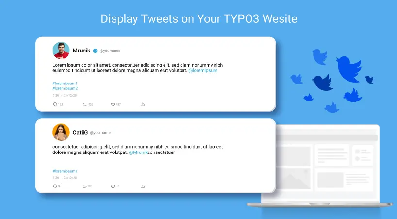

## NS Twitter

## What does it do?

Twitter for Websites is a suite of tools bringing Twitter content and functionality to your website page with Like, Retweet and Reply etc., functionality to your tweets directly from your TYPO3 website.

[NITSAN] Twitter TYPO3 Extension brings your all twitter timeline tweets to your TYPO3 site so your tweets will not be rate limited at Twitter!

## Helpful Links

<Note>

- **Product:** https://t3planet.de/twitter-typo3-extension
- **TYPO3 Backend Live Demo:** https://demo.t3planet.de/live-typo3/t3t-extensions/typo3/?TYPO3_AUTOLOGIN_USER=editor-twitter
- **Front End Demo:** https://demo.t3planet.de/t3-extensions/twitter
- To make any domain-related changes or whitelist any development and staging domains, please reach our support center https://t3planet.de/support

</Note>
