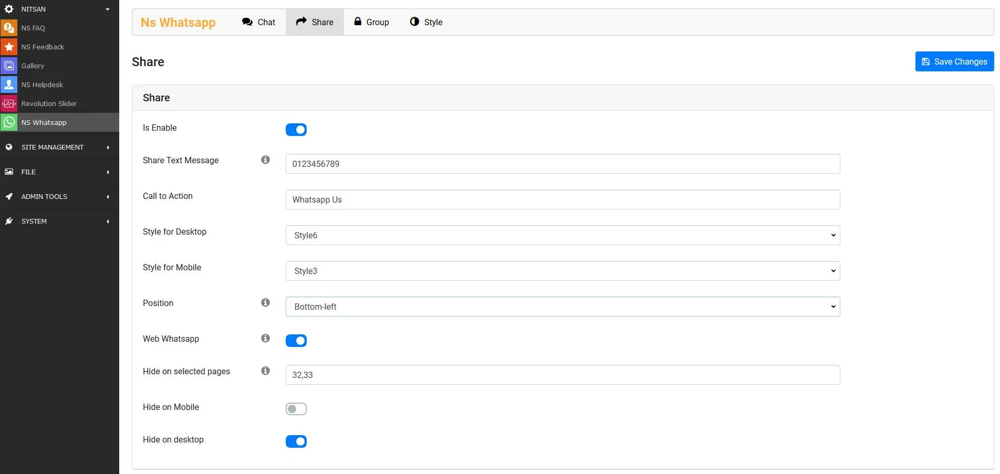
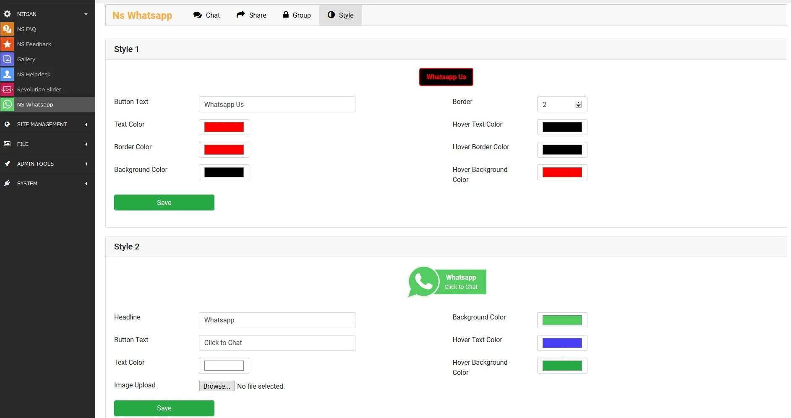
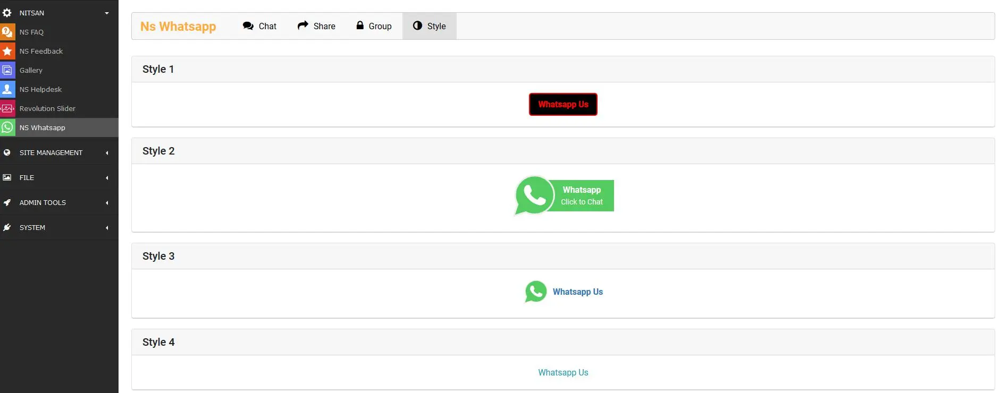
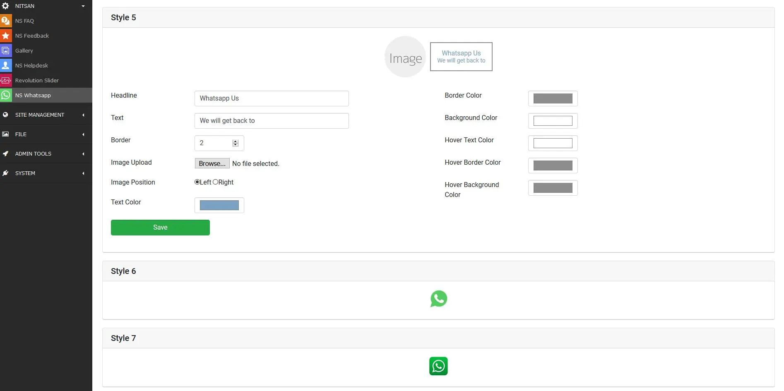

Once you install this extension, Your first-step should be to configure all the settings from "Global Configuration".

<Steps>
  <Step title="Step 1">
Go to Nitsan Module > NS Whatsapp
  </Step>
  <Step title="Step 2">
Click on "Chat / Share / Group" menu, Fill-up Whats app number, Click on the enable checkbox & insert all the required information and click on "Save Changes" button.
  </Step>
  <Step title="Step 3">
Click on "Style" menu, Give your own style to whatsapp widget & click on "Save Changes" button.
  </Step>
</Steps>

<Note>

All this configurations can be saved from Typo3 Constant Editor also.

</Note>

