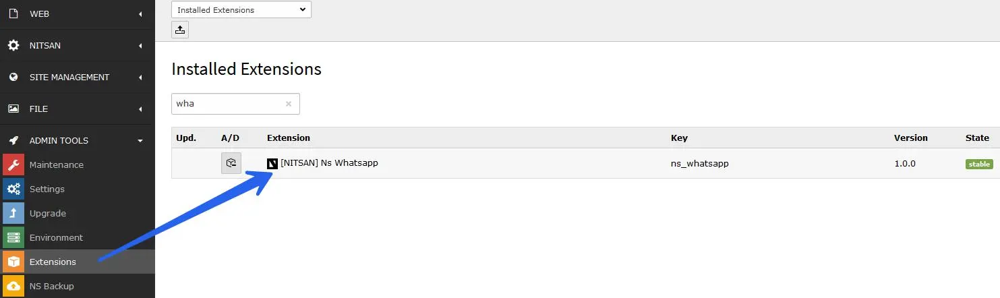
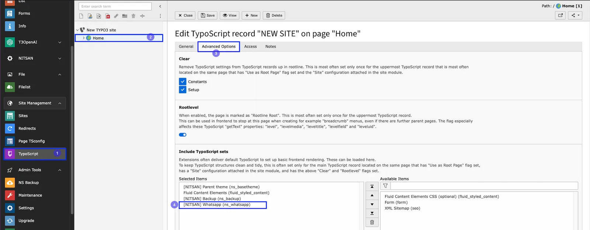

# Installation

Just install this extension the usual way like any other TYPO3 extension.

## For Premium Version - License Activation

To activate license and install this premium TYPO3 product, Please refer this documentation [License documentation](/License/Index)

## For Free Version

In the TYPO3 backend you can use the extension manager (EM).

<Steps>
  <Step title="Step 1">
Switch to the module “Extension Manager”.
  </Step>
  <Step title="Step 2">
Get the extension
  </Step>
  <Step title="Step 3">
Get it from the Extension Manager: Press the “Retrieve/Update” button and search for the extension key ns_whatsapp and import the extension from the repository.
  </Step>
  <Step title="Step 4">
Get it from typo3.org: You can always get the current version from https://extensions.typo3.org/extension/ns_whatsapp/ by downloading either the t3x or zip version. Upload the file afterwards in the Extension Manager.

  </Step>
  <Step title="Step 1">
Switch to the root page of your site.
  </Step>
  <Step title="Step 2">
Switch to the Template/TypoScript module and select Edit TypoScript Record.
  </Step>
  <Step title="Step 3">
Click the link Edit the whole template record and switch to the tab Includes.
  </Step>
  <Step title="Step 4">
Select ‘Nitsan Whatsapp at the field Include static (from extensions):
  </Step>
  <Step title="Step 5">
Include ‘Nitsan Whatsapp at the last place.

  </Step>
</Steps>

## How to Install TYPO3 Extension ns_whatsapp

**Extension Installation Via without Composer mode**
https://www.youtube.com/watch?v=SN5HoFQcDM4

**Extension Via Composer**
https://www.youtube.com/watch?v=_7ILu4lwU-k
