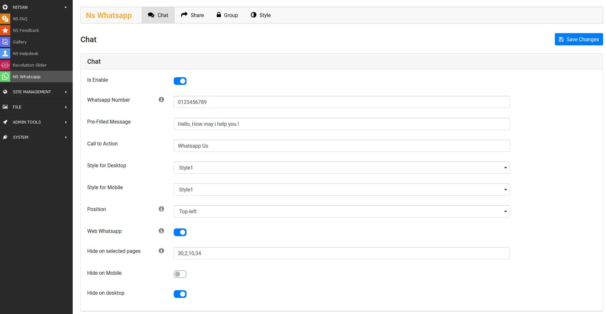
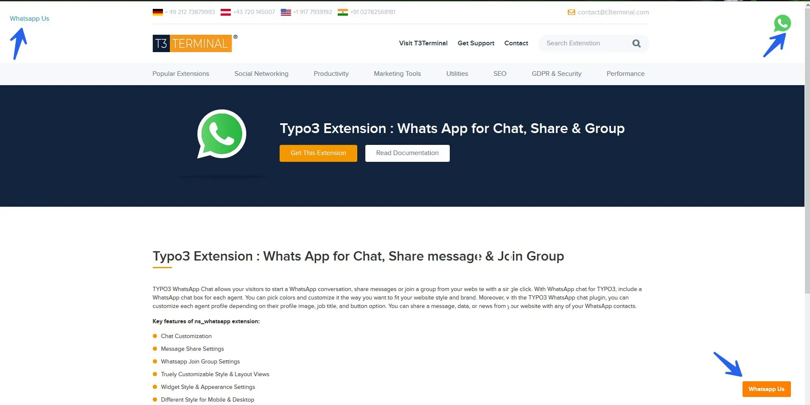

## NS Whatsapp

## What does it do?

EXT:ns_whatsApp Chat allows your visitors to start a WhatsApp conversation, share messages or join a group from your website with a single click. With WhatsApp chat for TYPO3, include a WhatsApp chat box for each agent. You can pick colors and customize it the way you want to fit your website style and brand. Moreover, with the TYPO3 WhatsApp chat plugin, you can customize each agent profile depending on their profile image, job title, and button option. You can share a message, data, or news from your website with any of your WhatsApp contacts.

## Features

- Chat Customization
- Message Share Settings
- Whatsapp Join Group Settings
- Truly Customizable Style & Layout Views
- Widget Style & Appearance Settings
- Different Style for Mobile & Desktop

## Back End Screenshots

## Front End Screenshots

