# Configuration

After Successful Installation You'll see Backend module "WP Migration"

This Module have two tabs,Let's check it one by one how it works,

## Import Manager

This tab is use to Import Pages/News/Blogs,custom post types and custom fields .

<Note>

To import content from WordPress to TYPO3, one key requirement is that the primary language of TYPO3 must match the primary language of WordPress.

</Note>

Please follow below steps to Import Pages/News/Blogs,

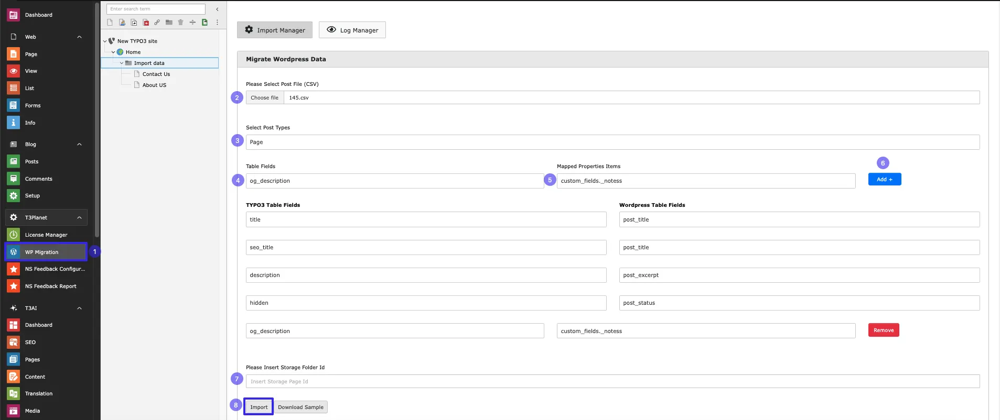

- **Step 1:** -> Select WP Migration module from Backend
- **Step 2:** -> Upload CSV file of Pages/News/Blogs
- **Step 3:** -> Select Post type like which you want to import
- **Step 4:** -> select Field from drop down which you want to map from word press to typo3 field!
- **Step 6:** -> Click on add
- **Step 7:** -> Add Storage folder id
- **Step 8:** -> Click on Import
- **Download Sample** -> If the user is unsure about the required file format, they can download a sample file.

After Import user can see logs of imported Data.

## Log Manager

User can see the logs with Columns Total Records,Total Inserted,Total Update,Record Storage ID and Import date with Success Message.

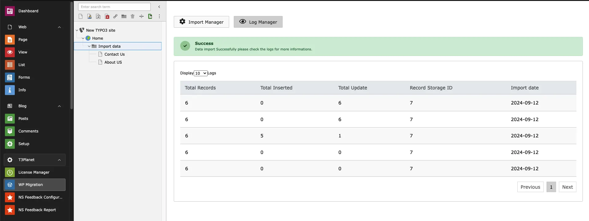

**After Import You can See your Imported data with Media in Folders which you configured while importing**

### Custome Field mapping

**After Import you will see Data of your wordpress field in typo3 in Folder With Content**

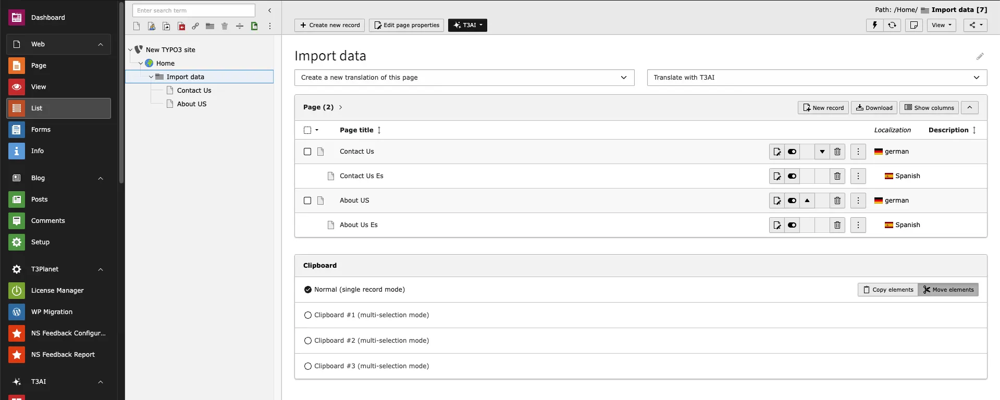
>
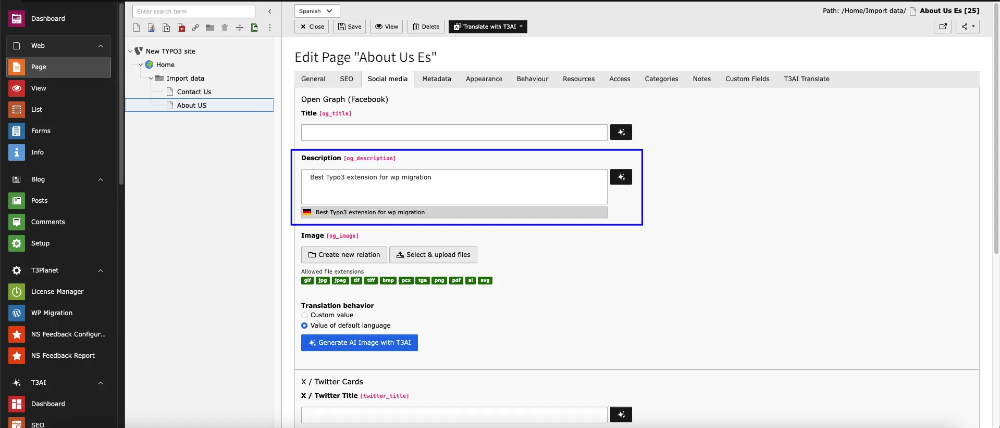

### Pages

**After Import you will see Pages in Folder With Content**

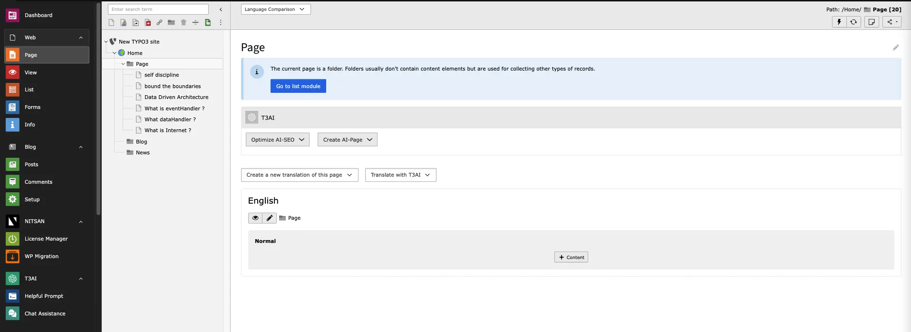
>
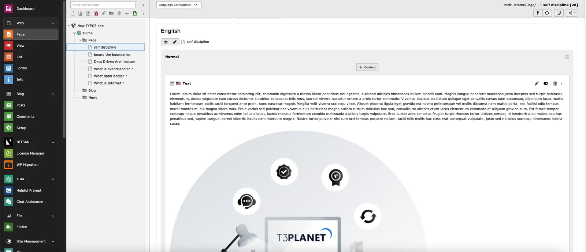

### Blogs

**After Import you will see Blogs in Folder With Content and Media**

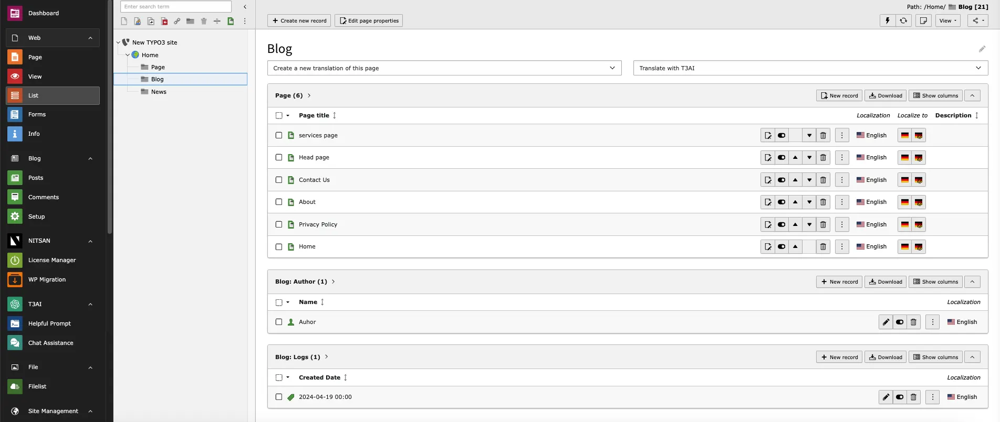
>
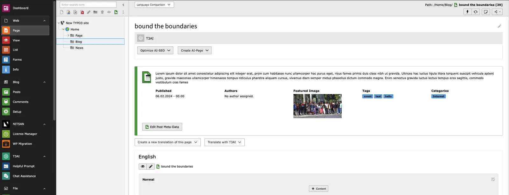

### News

**After Import you will see News in Folder With Content and Media**

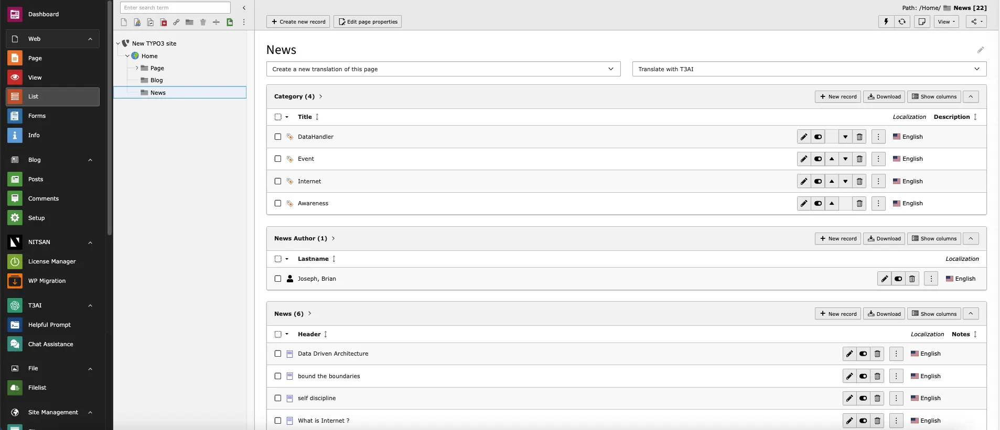
>
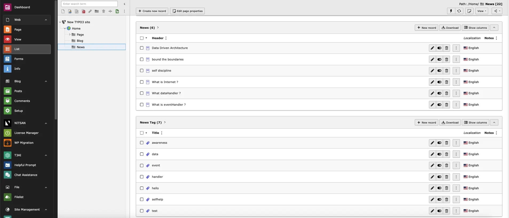
>
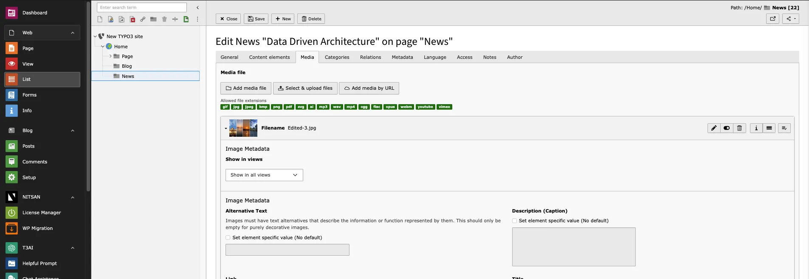

### Scheduler

#### Import Content from WordPress to TYPO3 via Scheduler

The TYPO3 Scheduler allows you to automate the process of importing content from WordPress into TYPO3. This functionality ensures content migration happens on a scheduled basis without manual intervention, saving time and effort.

To demonstrate the process visually, refer to the interactive walkthrough below:

    <iframe src="https://app.supademo.com/embed/cmbq89vheb9h0sn1r5toepmbv"
            loading="lazy"
            title="AI Co pilot"
            allow="clipboard-write"
            frameBorder="0"
            webkitallowfullscreen="true"
            mozallowfullscreen="true"
            allowfullscreen
            >
    </iframe>

**That's it, Now you can enjoy all the benifits of this extension :)**
