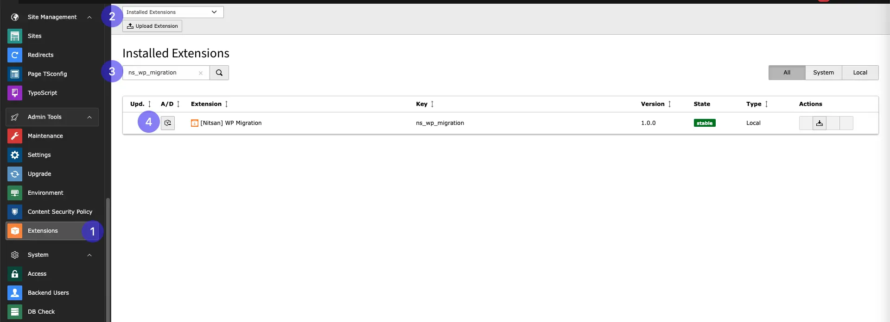
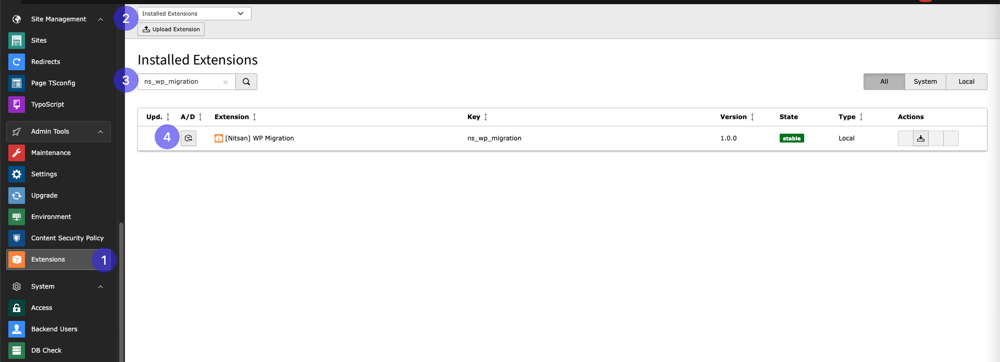

# Installation

Just install this extension the usual way like any other TYPO3 extension.

## For Free Version

**Via Composer using Command Line**

```
composer req nitsan/ns-wp-migration --with-all-dependencies
```

**Via Extensions Module**

In the TYPO3 backend you can use the extension manager (EM).

Step 1. Switch to the module “Extension Manager”.

Step 2. Get the extension

Step 3. Get it from the Extension Manager: Press the “Retrieve/Update” button and search for the extension key ns_gridtocontainer and import the extension from the repository.

Step 4. Get it from typo3.org: You can always get the current version from https://extensions.typo3.org/extension/ns_wp_migration/ by downloading either the t3x or zip version. Upload the file afterwards in the Extension Manager.



## How to Install TYPO3 Extension ns_wp_migration

**Extension Installation Via without Composer mode**
https://www.youtube.com/watch?v=SN5HoFQcDM4

**Extension Via Composer**
https://www.youtube.com/watch?v=_7ILu4lwU-k

## Figures


