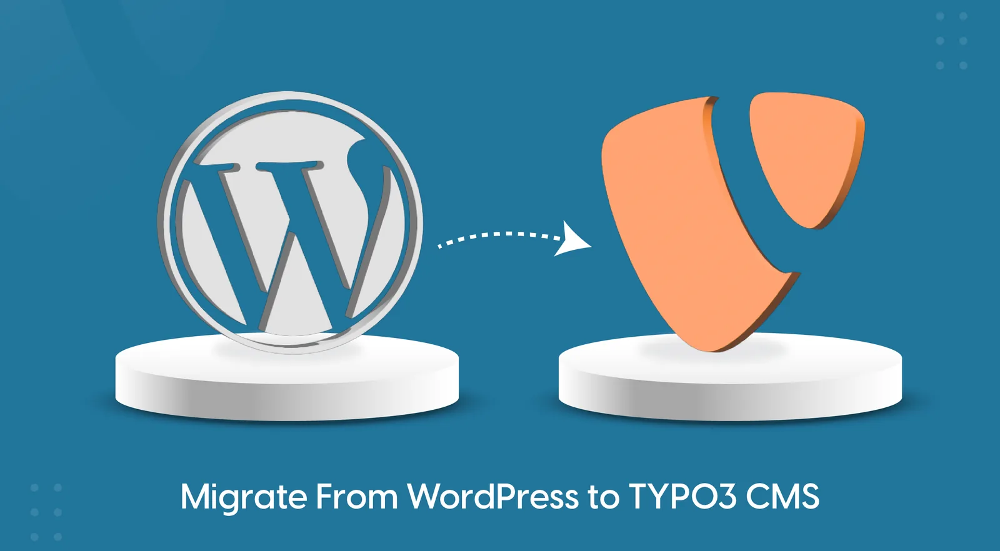

## NS Wp Migration

## What does it do?

Ext:ns_wp_migration is a powerful TYPO3 extension simplifies the import of Pages, Blogs, News, custom post types, and custom fields from WordPress to TYPO3

## Features

- Click Migration From Wodpress to TYPO3
- Multi Pages,News and Blog Migration Option
- Custom Post Types and Custom WP Fields migration
- Auto Migrate Text & Media Files

## Helpful Links

<Note>

- **Product:** https://t3planet.de/typo3-wp-migration-extension

</Note>
