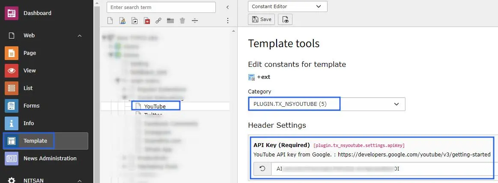
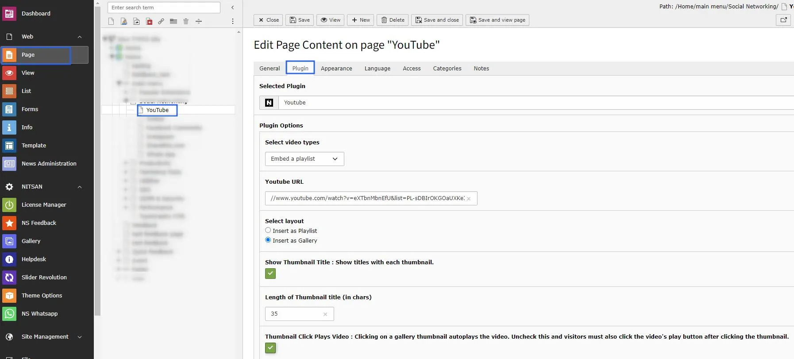
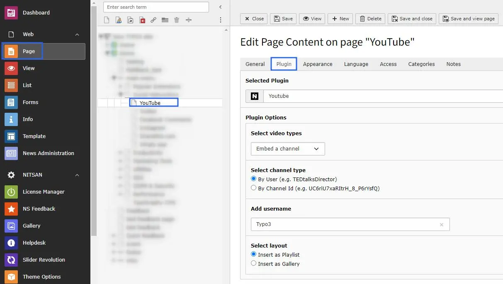
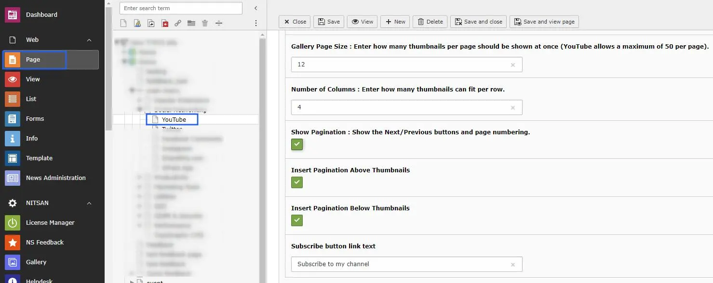
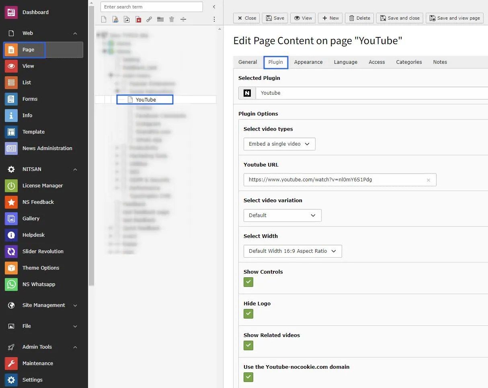
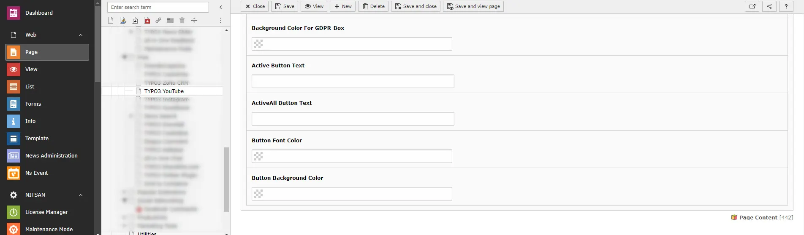
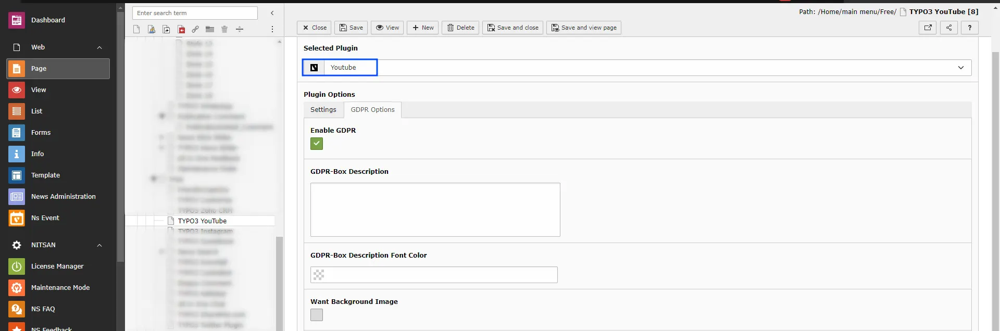

# Configuration

## 1. Add Youtube API key

>
> 1. Switch to the root page of your site.
> 2. Switch to the **Template module** and select *Constant Editor*.
> 3. Select Category = PLUGIN.TX_NSYOUTUBE (5)
> 4. Generate API key from this URL: [https://developers.google.com/youtube/v3/getting-started](https://developers.google.com/youtube/v3/getting-started)

## 2. Add Plugin To Page

> Add this great plugin to the page where you want to show your youtube videos and configure this plugin as per your requirement.

- **GDPR Box** -> Make sure your website collects all required user consent. Youtube allows you to display consent notices.

## Clearing the cache

Please use the buttons 'Flush frontend caches' and 'Flush general caches'
from the top panel. The 'Clear cache' function of the install tool will also
work perfectly.

## Figures

