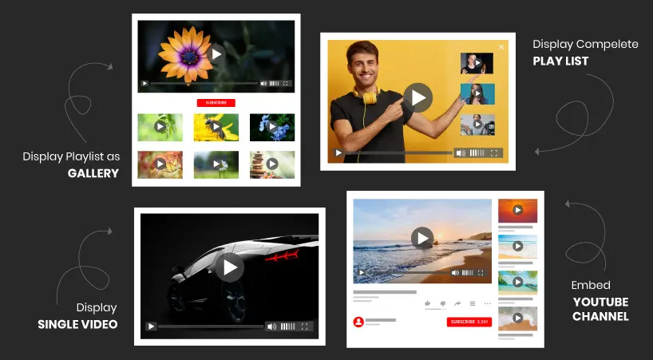

## ns_youtube

## What does it do?

One of the only TYPO3 extension which provides to integrate all the features of Youtube.com.

## Helpful Links

<Note>

- **Product:** https://t3planet.de/youtube-typo3-extension-free
- **TYPO3 Backend Live Demo:** https://demo.t3planet.de/live-typo3/t3t-extensions/typo3/?TYPO3_AUTOLOGIN_USER=editor-youtube
- **Front End Demo:** https://demo.t3planet.de/t3-extensions/youtube
- To make any domain-related changes or whitelist any development and staging domains, please reach our support center: https://t3planet.de/support

</Note>
