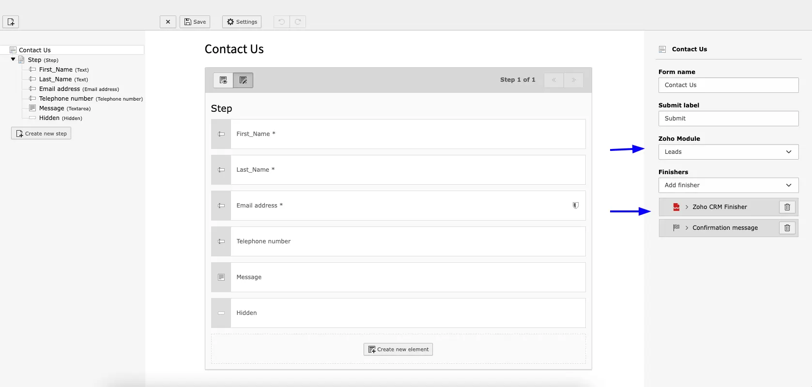
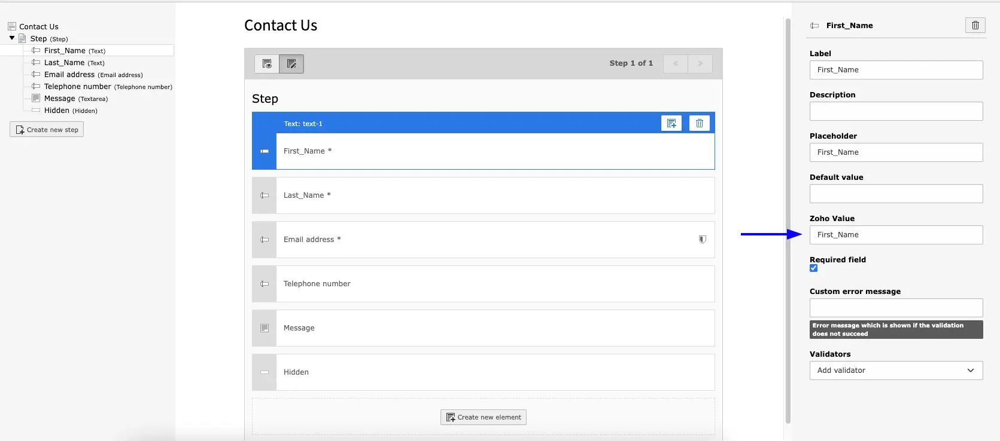
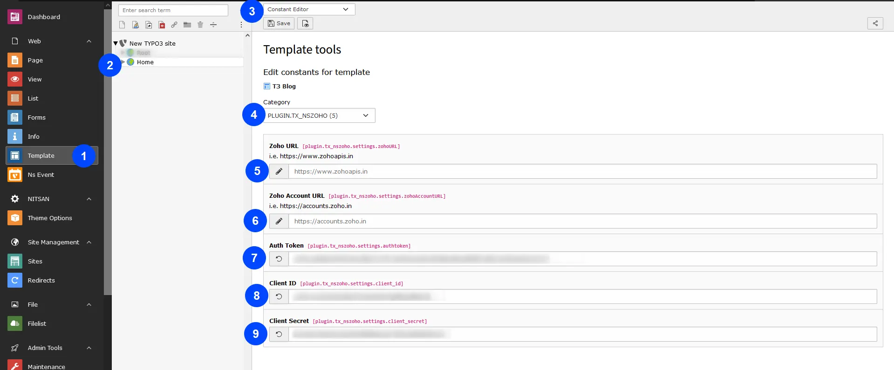

- **Step 1:** Go to Template
- **Step 2:** Select root page
- **Step 3:** Select constant Editor
- **Step 4:** Select > PLUGIN.TX_NSZOHO
- **Step 5:** Add Zoho URL
- **Step 6:** Add Zoho Account URL
- **Step 7:** Add Auth Token
- **Step 8:** Add Client ID
- **Step 9:** Add Client Secret key

Create Auth Token, Client ID and Client Secret from https://api-console.zoho.in/
Reference link for Step by step explanation: https://www.zoho.com/accounts/protocol/oauth-setup.html

Once Auth Token is generated, you need to set this at constants.

## Create Typo3 form from Backend and configure with zoho

- **Step 1:** Select “Zoho Module” & “Select Zoho CRM Finisher”

- **Step 2:** Add Zoho Value **[add field name same as in zoho API]**

## Figures

