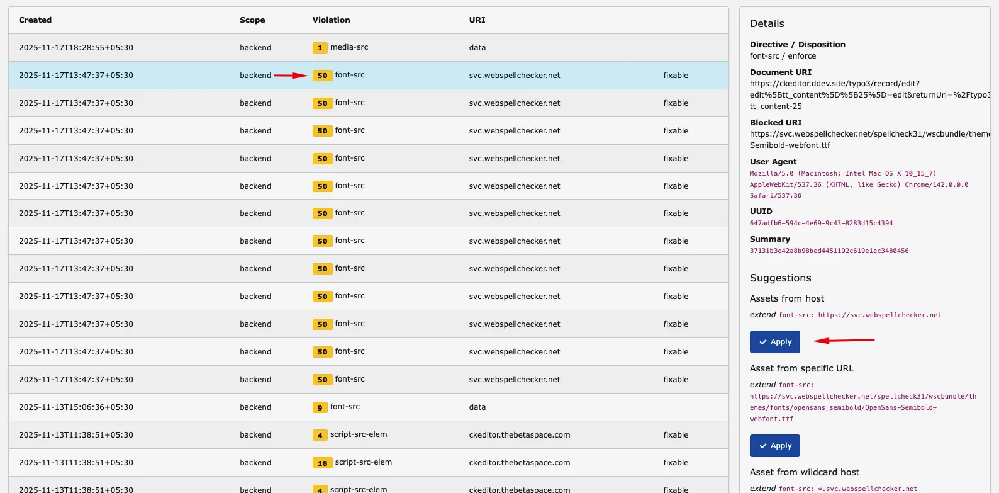
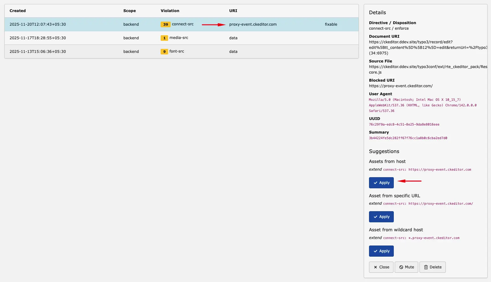
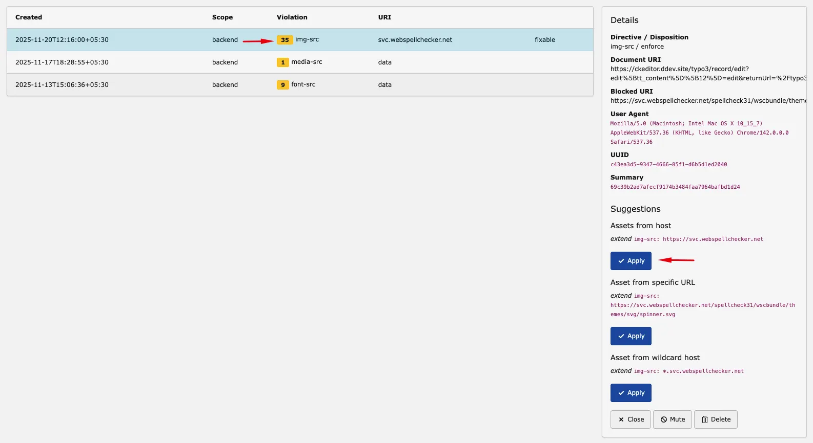
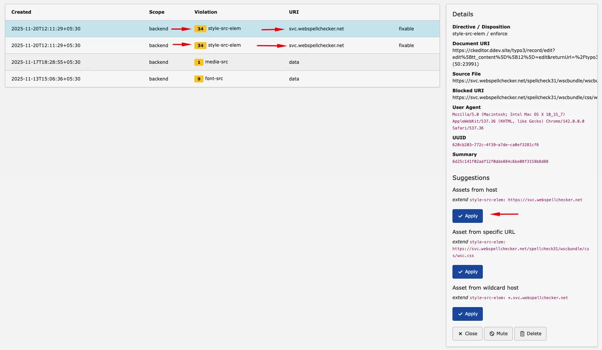
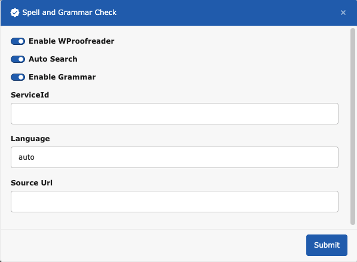

To use CKEditor premium features, you must add required CSP rules.
CSP means browser security rules for allowed connections and resources.

If these rules are missing, premium features may not work.

## Token URL

Required to validate your license token with CKEditor cloud services.
Without this rule, premium features cannot authenticate.

| Violation | URI | Example |
| --- | --- | --- |
| connect-src | ORGANIZATION_ID.cke-cs.com | lb8vps5lhb3m.cke-cs.com |

## Web Socket URI

Required for real-time communication.
Without this rule, WebSocket connections are blocked.

| Violation | URI | Example |
| --- | --- | --- |
| connect-src | wss://ORGANIZATION_ID.cke-cs.com | wss://lb8vps5lhb3m.cke-cs.com |

## CKEditor Proxy

Allows CKEditor to send specific service events through its secure proxy.
This helps premium features communicate reliably.

| Violation | URI | Example |
| --- | --- | --- |
| connect-src | proxy-event.ckeditor.com | proxy-event.ckeditor.com |

## Spell and Grammar Check - Font Source

Allows loading required fonts from WebSpellChecker.
Without this rule, the spelling tool may not display correctly.

| Violation | URI | Example |
| --- | --- | --- |
| font-src | svc.webspellchecker.net | svc.webspellchecker.net |

## Spell and Grammar Check - Image Source

Allows loading image files used by the spell-check interface.
If blocked, some UI elements may not display.

| Violation | URI | Example |
| --- | --- | --- |
| img-src | svc.webspellchecker.net | svc.webspellchecker.net |

## Spell and Grammar Check - Style Source

Allows stylesheets from WebSpellChecker.
If blocked, spell and grammar UI styles may break.

| Violation | URI | Example |
| --- | --- | --- |
| style-src-elem | svc.webspellchecker.net | svc.webspellchecker.net |

## Spell and Grammar Check Configuration

Get your service ID from: https://webspellchecker.com/wsc-proofreader/

For Source URL, use a CDN or your custom path.
Example: https://svc.webspellchecker.net/spellcheck31/wscbundle/wscbundle.js

## Version

For CKEditor Pack v44.0.0 and newer, use a valid license key.

## Case: Backend Not Responding

The backend may stop responding when CSP is configured incorrectly.

More details: https://forge.typo3.org/issues/106567
