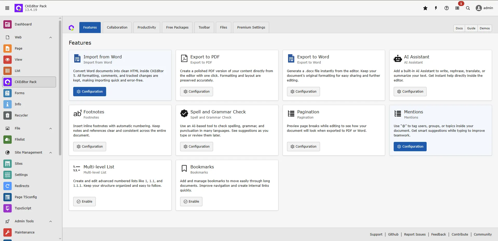

## Collaboration

## Real Time Collaboration

Collaborate seamlessly with live updates that keep every participant in sync.

  <iframe src="https://app.supademo.com/embed/cmi312p9j1szrqnb9jm6phdj8?step=13" loading="lazy" title="Real Time Collaboration Demo" allow="clipboard-write" frameBorder="0" webkitallowfullscreen="true" mozallowfullscreen="true" allowfullscreen ></iframe>

## Track Changes

Keep a detailed record of edits so collaborators can review changes before finalizing them.

  <iframe src="https://app.supademo.com/embed/cmi312p9j1szrqnb9jm6phdj8?step=15" loading="lazy" title="Track Changes Demo" allow="clipboard-write" frameBorder="0" webkitallowfullscreen="true" mozallowfullscreen="true" allowfullscreen ></iframe>

## Revision History

Access previous versions to compare edits, restore older copies, or rename revisions, with a built-in preview for quick inspection.

  <iframe src="https://app.supademo.com/embed/cmi312p9j1szrqnb9jm6phdj8?step=16" loading="lazy" title="Revision History Demo" allow="clipboard-write" frameBorder="0" webkitallowfullscreen="true" mozallowfullscreen="true" allowfullscreen ></iframe>

## Comment

Leave feedback by adding comments to text or images, reply in threads, and control access by assigning comments-only permissions.

  <iframe src="https://app.supademo.com/embed/cmi312p9j1szrqnb9jm6phdj8?step=14" loading="lazy" title="Comment Demo" allow="clipboard-write" frameBorder="0" webkitallowfullscreen="true" mozallowfullscreen="true" allowfullscreen ></iframe>

## Collaboration Features Overview

## Productivity

## Case Change

Convert selected text to uppercase, lowercase, or title case formats with a single action.

  <iframe src="https://app.supademo.com/embed/cmi2y270r1ph8qnb9dwrlcx72?step=9" loading="lazy" title="Case Change Demo" allow="clipboard-write" frameBorder="0" webkitallowfullscreen="true" mozallowfullscreen="true" allowfullscreen ></iframe>

## Format Painter

Copy the formatting from one piece of text and apply it to another for consistent styling.

  <iframe src="https://app.supademo.com/embed/cmi2y270r1ph8qnb9dwrlcx72?step=10" loading="lazy" title="Format Painter Demo" allow="clipboard-write" frameBorder="0" webkitallowfullscreen="true" mozallowfullscreen="true" allowfullscreen ></iframe>

## Strikethrough

Use strikethrough formatting to show that content has been crossed out without removing it.

  <iframe src="https://app.supademo.com/embed/cmi2y270r1ph8qnb9dwrlcx72?step=12" loading="lazy" title="Strikethrough Demo" allow="clipboard-write" frameBorder="0" webkitallowfullscreen="true" mozallowfullscreen="true" allowfullscreen ></iframe>

## Subscript

Format characters in a lowered position to create scientific or mathematical notations.

  <iframe src="https://app.supademo.com/embed/cmi2y270r1ph8qnb9dwrlcx72?step=13" loading="lazy" title="Subscript Demo" allow="clipboard-write" frameBorder="0" webkitallowfullscreen="true" mozallowfullscreen="true" allowfullscreen ></iframe>

## Superscript

Use superscript formatting to clearly display elevated characters in technical expressions.

  <iframe src="https://app.supademo.com/embed/cmi2y270r1ph8qnb9dwrlcx72?step=14" loading="lazy" title="Superscript Demo" allow="clipboard-write" frameBorder="0" webkitallowfullscreen="true" mozallowfullscreen="true" allowfullscreen ></iframe>

## Bookmark

Use bookmarks to define anchor spots that make it easy to jump to important sections.

  <iframe src="https://app.supademo.com/embed/cmi2y270r1ph8qnb9dwrlcx72?step=15" loading="lazy" title="Bookmark Demo" allow="clipboard-write" frameBorder="0" webkitallowfullscreen="true" mozallowfullscreen="true" allowfullscreen ></iframe>

## Document Outline

View a structured outline of headings to navigate long documents more easily.

  <iframe src="https://app.supademo.com/embed/cmi2y270r1ph8qnb9dwrlcx72?step=8" loading="lazy" title="Document Outline Demo" allow="clipboard-write" frameBorder="0" webkitallowfullscreen="true" mozallowfullscreen="true" allowfullscreen ></iframe>

## Footnotes

Create inline references that link to automatically numbered footnotes placed within the document.

  <iframe src="https://app.supademo.com/embed/cmi2y270r1ph8qnb9dwrlcx72?step=16" loading="lazy" title="Footnotes Demo" allow="clipboard-write" frameBorder="0" webkitallowfullscreen="true" mozallowfullscreen="true" allowfullscreen ></iframe>

## Show Blocks

Reveal block boundaries to understand the layout and identify headings, paragraphs, and other elements.

  <iframe src="https://app.supademo.com/embed/cmi2y270r1ph8qnb9dwrlcx72?step=18" loading="lazy" title="Show Blocks Demo" allow="clipboard-write" frameBorder="0" webkitallowfullscreen="true" mozallowfullscreen="true" allowfullscreen ></iframe>

## Table of Contents

Create a structured overview of all headings, with links that jump to each section.

  <iframe src="https://app.supademo.com/embed/cmi2y270r1ph8qnb9dwrlcx72?step=17" loading="lazy" title="Table of Contents Demo" allow="clipboard-write" frameBorder="0" webkitallowfullscreen="true" mozallowfullscreen="true" allowfullscreen ></iframe>

## Templates

Insert predefined templates to quickly build structured content or full document layouts.

  <iframe src="https://app.supademo.com/embed/cmi2y270r1ph8qnb9dwrlcx72?step=19" loading="lazy" title="Templates Demo" allow="clipboard-write" frameBorder="0" webkitallowfullscreen="true" mozallowfullscreen="true" allowfullscreen ></iframe>

## Text Part Language

Indicate the language of a text section to ensure correct interpretation by browsers and assistive technologies.

## Editoria11y – Live Accessibility Checker in CKEditor

The Editoria11y Live Accessibility Checker is integrated directly into CKEditor to help editors create accessible content while they are editing.

It automatically checks content for common accessibility issues, such as heading structure, alternative text for images, link text, and basic contrast-related problems. Issues are highlighted directly inside the editor, so editors can fix them before publishing.

The checker can be used in real time while typing or manually through a toolbar button. This makes accessibility checks easy and does not require leaving the TYPO3 backend or using external tools.

By using Editoria11y in CKEditor, editors can improve content accessibility early and better follow WCAG guidelines and European accessibility requirements.

  <iframe src="https://app.supademo.com/embed/cmjbh49pw2zapf6zpsmamxkiz?embed_v=2&utm_source=embed" loading="lazy" title="Strikethrough Demo" allow="clipboard-write" frameBorder="0" webkitallowfullscreen="true" mozallowfullscreen="true" allowfullscreen ></iframe>

## Content Conversion & Embedding

## Emoji

Insert emojis anywhere in the content using a simple picker for quick visual expression.

  <iframe src="https://app.supademo.com/embed/cmi32zr5x1vr4qnb9tbt34rfu?step=10" loading="lazy" title="Emoji Demo" allow="clipboard-write" frameBorder="0" webkitallowfullscreen="true" mozallowfullscreen="true" allowfullscreen ></iframe>

## Export PDF

Generate a PDF of your content directly from the editor, preserving formatting and layout.

  <iframe src="https://app.supademo.com/embed/cmi32zr5x1vr4qnb9tbt34rfu?step=11" loading="lazy" title="Export PDF Demo" allow="clipboard-write" frameBorder="0" webkitallowfullscreen="true" mozallowfullscreen="true" allowfullscreen ></iframe>

## Export Word

Save your document as a Word file (.docx) directly from the editor, keeping all formatting intact.

  <iframe src="https://app.supademo.com/embed/cmi32zr5x1vr4qnb9tbt34rfu?step=13" loading="lazy" title="Export Word Demo" allow="clipboard-write" frameBorder="0" webkitallowfullscreen="true" mozallowfullscreen="true" allowfullscreen ></iframe>

## Import Word

Bring content from a Word document into the editor while retaining formatting and structure.

  <iframe src="https://app.supademo.com/embed/cmi32zr5x1vr4qnb9tbt34rfu?step=15" loading="lazy" title="Import Word Demo" allow="clipboard-write" frameBorder="0" webkitallowfullscreen="true" mozallowfullscreen="true" allowfullscreen ></iframe>

## Slash Command

Use a slash ("/") to quickly access commands, insert elements, or apply formatting directly within the editor.

  <iframe src="https://app.supademo.com/embed/cmi32zr5x1vr4qnb9tbt34rfu?step=18" loading="lazy" title="Slash Command Demo" allow="clipboard-write" frameBorder="0" webkitallowfullscreen="true" mozallowfullscreen="true" allowfullscreen ></iframe>

## Spell & Grammar Check

## Spell & Grammar Check

Check and correct spelling and grammar throughout your document to ensure accuracy and clarity.

  <iframe src="https://app.supademo.com/embed/cmi32pd0n1va7qnb9q9uwmz09" loading="lazy" title="Spell & Grammar Check Demo" allow="clipboard-write" frameBorder="0" webkitallowfullscreen="true" mozallowfullscreen="true" allowfullscreen ></iframe>

## Configuration

