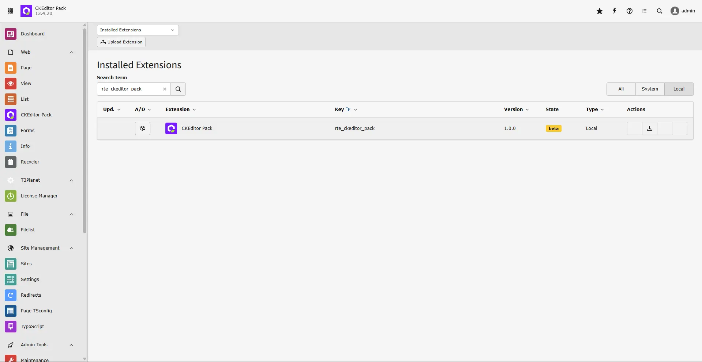

Install CKEditor Pack with one of these methods.

## Via Composer using Command Line

```
composer req t3planet/rte-ckeditor-pack
```

## Via Extensions Module

You can also install it in the TYPO3 backend with Extension Manager.

- Open the module **Extension Manager**.
- Click **Retrieve/Update**.
- Search for extension key `rte_ckeditor_pack`.
- Import the extension from the repository.
- Or download it from https://extensions.typo3.org/extension/rte_ckeditor_pack/ and upload the `t3x` or `zip` file.



## Drag-n-Drop Toolbar & Manage Preset

Follow the demo to configure free features, toolbar drag-and-drop, and preset management.

<div className="t3-embed">
  <iframe src="https://app.supademo.com/embed/cmhyjl7xp4l1617y0gi1erk6t" loading="lazy" title="Drag-n-Drop Toolbar & Manage Preset Demo" allow="clipboard-write" frameBorder="0" webkitallowfullscreen="true" mozallowfullscreen="true" allowfullscreen ></iframe>
</div>

## Figures


