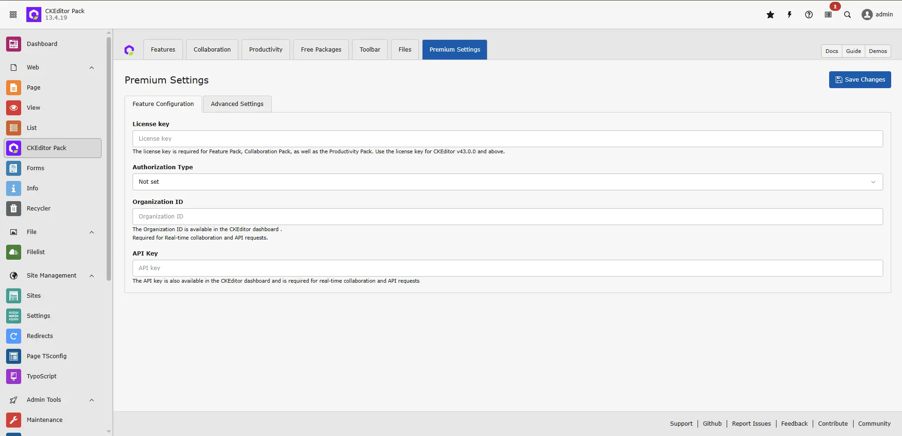
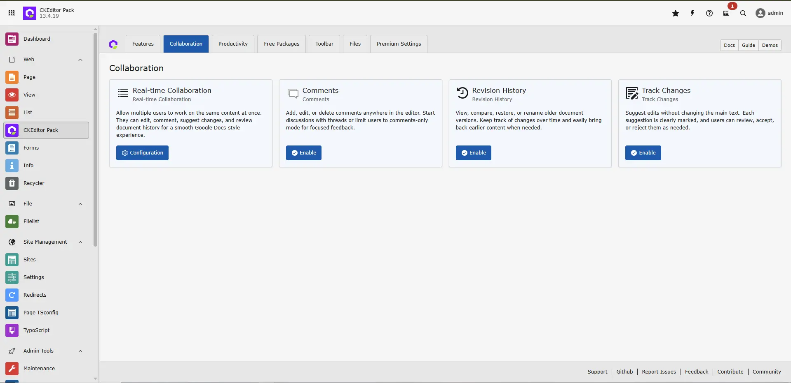
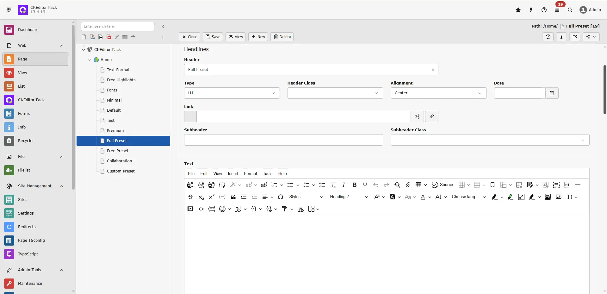

## Requirements

To run CKEditor Pack without compatibility problems, use these versions:

- **PHP Version: 8.1.0-8.4.99**
- **TYPO3 version: v12.4.x and v13.4.x**

## Feature Demo

<iframe src="https://app.supademo.com/showcase/cmi2zqurw02nhzj0i1dtuu5vr?utm_source=link&demo=1&step=1" loading="lazy" title="CKEditor Pack Features Demo" allow="clipboard-write" frameBorder="0" webkitallowfullscreen="true" mozallowfullscreen="true" allowfullscreen></iframe>

Use this demo to see tutorials for CKEditor Pack features:

  <iframe src="https://app.supademo.com/showcase/cmi2zqurw02nhzj0i1dtuu5vr?utm_source=link&demo=1&step=1" loading="lazy" title="CKEditor Pack Features Demo" allow="clipboard-write" frameBorder="0" webkitallowfullscreen="true" mozallowfullscreen="true" allowfullscreen ></iframe>

## Backend Screenshots

## CKEditor Pack Dashboard

## CKEditor Premium Settings

## CKEditor Pack Collaboration Feature

## Features Overview

