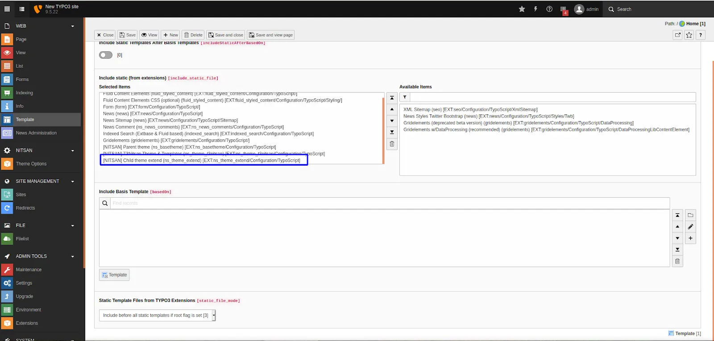
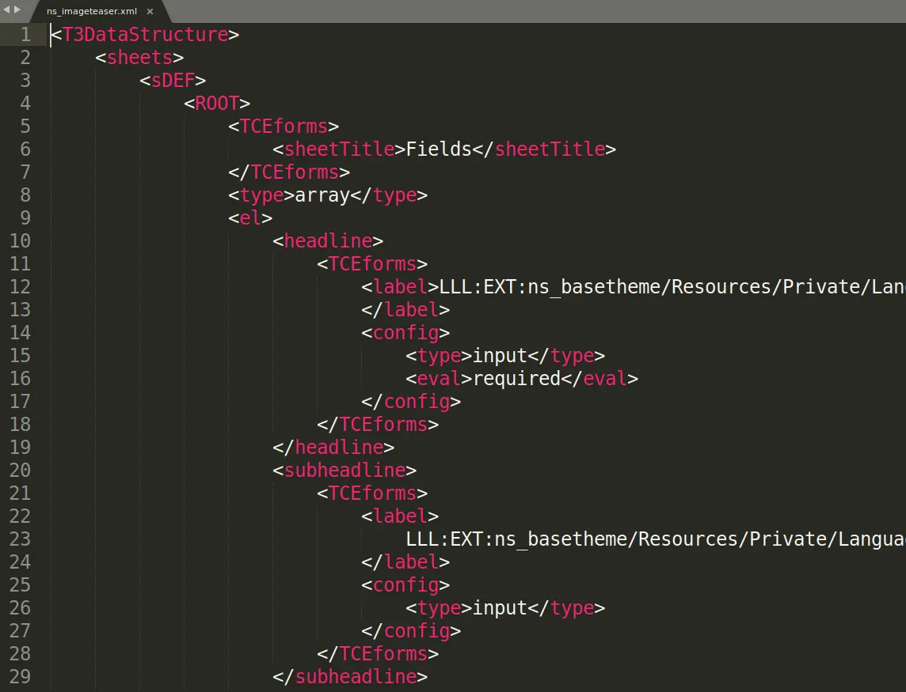
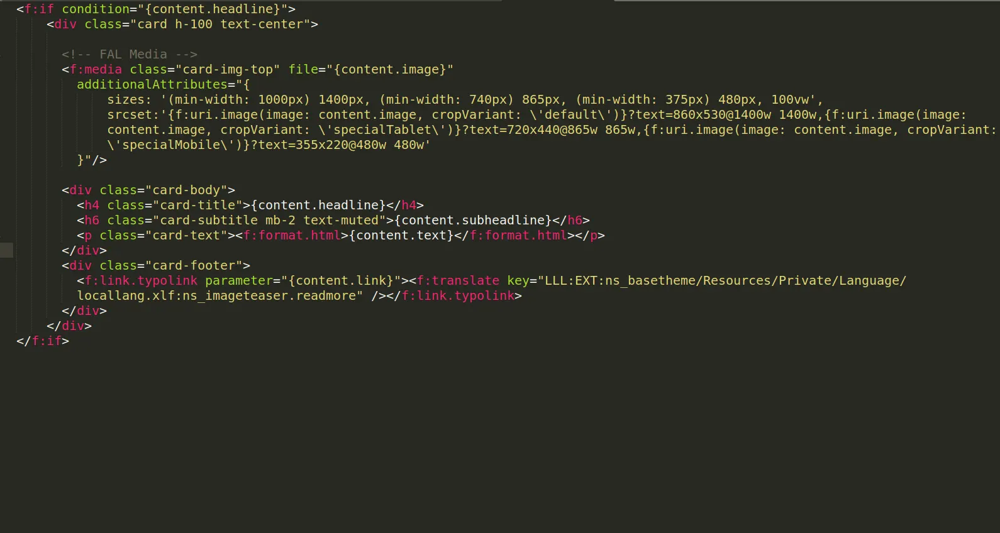
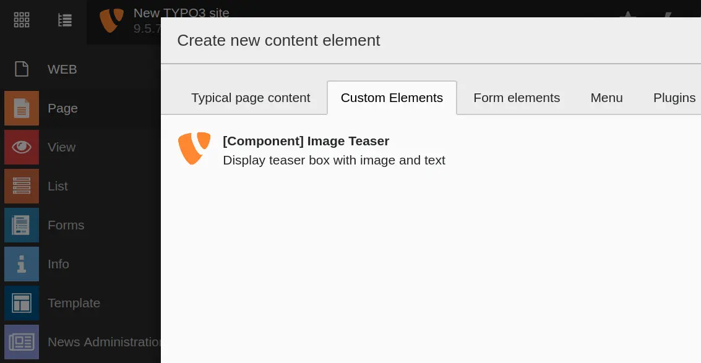
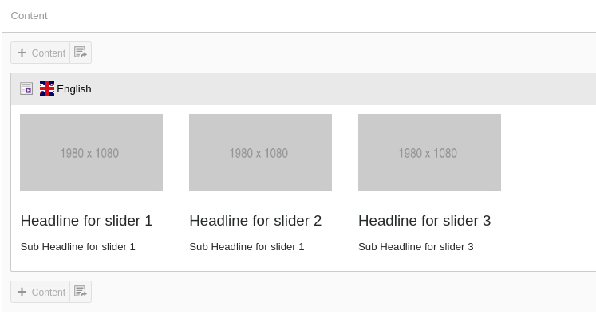

## Why Best Practice with Extending the TYPO3 Template?

Are you looking to extend our TYPO3 templates? Extend means, If you want to customize and perform tasks like creating a new element, change backend layout, change fluid template, configure Typoscript etc. Then follow this TYPO3 templates customization section.

Why is this TYPO3 template customization important? Because it will give assurity to easily upgrade our TYPO3 templates for all future TYPO3 versions.

<Warning>
You should not directly make changes to our TYPO3 templates extension, Avoid to make any changes into **EXT:ns_basetheme & EXT:ns_theme_`<name>`**.
</Warning>

We are proud of TYPO3 integrator/developer-friendly development approach, Let’s check out how :)

## How to Update Future TYPO3 Template Updates?

To make compatible with future TYPO3 versions, mostly we make changes into EXT:ns_basetheme and all works automatically because EXT:ns_basetheme contains all the major PHP and TypoScript settings. But some TYPO3 versions may also require to make little changes to EXT:ns_theme_`<name>`. That’s why to make sure to not lose your changes, we highly recommend following TYPO3 templates development approach.

## Extend TYPO3 Templates Development Approach

**#1 EXT:ns_basetheme**

Our main parent TYPO3 template where all common configuration (TypoScript, PHP, YAML etc) has been defined, it’s like the main parent TYPO3 template framework. It’s free to use, available at TER [https://extensions.typo3.org/extension/ns_basetheme](https://extensions.typo3.org/extension/ns_basetheme)

**#2 EXT:ns_theme_`<name>`**

This is your free or bought premium TYPO3 template.

**#3 EXT:ns_theme_extend**

To extend or customize your bought TYPO3 template, you should install and work on this TYPO3 template extension.

## Install & Configure EXT:ns_theme_extend

### Install TYPO3 Template with Composer

```language
composer require nitsan/ns-theme-extend --with-all-dependencies
```

<Note>
If you are installing Template using Composer then you will have to uninstall and re-install TYPO3 Template EXT:ns_theme_extend
</Note>

### Install TYPO3 Template without Composer

<Note>
You can download EXT:ns_theme_extend from https://extensions.typo3.org/extension/ns_theme_extend
</Note>

T3Planet’s TYPO3 Templates are very easy to install and configure.

Step 1: Go to Extension Manager

Step 2: Select “Get extensions” from the drop-down at top. Update the Extension Repository by clicking on “Update Now” button at top-right.


Step 3: Once Repository is updated, switch back to Installed Extension view. Install Ext:ns_theme_extend.

### Activate the TypoScript

You need to add the EXT: ns_theme_extend template at the last.

1. Switch to the root page of your site.
2. Switch to the Template module and select Info/Modify.
3. Click the link Edit the whole template record and switch to the tab Includes.
4. Select [NITSAN] ns_theme_extend at the field Include static (from extensions):
5. Include [NITSAN] ns_theme_extend (IMPORTANT: Make sure to include this template at last place).



## General TYPO3 Template Customization

After installation & configuration, You can extend everything from **ns_theme_`<name>`** to this extend TYPO3 template **ns_theme_extend**.

If you are an experienced TYPO3 integrator/developer, you can easily extend TypoScript, Fluid-templates, Backend layouts, PageTSConfig etc. into **ns_theme_extend** TYPO3 template.

## Frontend Customization

You can refer following paths to override your css and js changes.

1. Main Frontend Fluid Templates: typo3conf/ext/ns_theme_extend/Resources/Private/
2. CSS Files: typo3conf/ext/ns_theme_extend/Resources/Public/css/
3. JavaScript Files: typo3conf/ext/ns_theme_extend/Resources/Public/js/

## How to Customize the existing Content Element?

****Step 1**. Backend Flexform**
**Copy**: typo3conf/ext/ns_theme_`<name>`/Configuration/FlexForms/ns_`<elementname>`.xml
**Paste**: typo3conf/ext/ns_theme_extend/Configuration/FlexForms/ns_`<elementname>`.xml



****Step 2**. Frontend Fluid Template**
**Copy**: typo3conf/ext/ns_theme_`<name>`/Resources/Private/Components/**Ns`<ElementName>`.html**
**Paste**: typo3conf/ext/ns_theme_extend/Resources/Private/Components/**Ns`<ElementName>`.html**

****Step 3**. Backend Preview Fluid Template**
**Copy**: typo3conf/ext/ns_theme_`<name>`/Resources/Private/Components/Backend/**Ns`<ElementName>`.html**
**Paste**: typo3conf/ext/ns_theme_extend/Resources/Private/Components/Backend/**Ns`<ElementName>`.html**



****Step 4**. Configure Lables Localization**
**Copy**: typo3conf/ext/ns_theme_`<name>`/Resources/Private/Language/locallang_db.xlf
**Paste**: typo3conf/ext/ns_theme_extend/Resources/Private/Language/locallang_db.xlf

**Example**

```HTML
<trans-unit id="wizard.ns_<elementname>">
<source>[Name]</source>
</trans-unit>
<trans-unit id="wizard.ns_<elementname>.desc">
<source>[Description]</source>
</trans-unit>
```

## Create New Content Elements

**Step 1**. Create Backend Flexform

```language
typo3conf/ext/ns_theme_extend/Configuration/FlexForms/ns_<elementname>.xml
```

You need to configure FlexForm configuration to generate form, You can check existing references in your theme folder.

**Step 2**. Create Frontend Fluid Template

```language
typo3conf/ext/ns_theme_extend/Resources/Private/Components/Ns<ElementName>.html
```

You just need to render elements with TYPO3’s core Fluid-Template.

**Step 3**. Create Backend Layout Fluid Template

```language
typo3conf/ext/ns_theme_extend/Resources/Private/Components/Backend/Ns<ElementName>.html
```

**Step 4**. Add Label Localization

```language
typo3conf/ext/ns_theme_extend/Resources/Private/Language/locallang_db.xlf
```

**Example**

```language
<trans-unit id="wizard.ns_<elementname>">
<source>[Name]</source>
</trans-unit>
<trans-unit id="wizard.ns_<elementname>.desc">
<source>[Description]</source>
</trans-unit>
```

**New Element In Wizard**



**Backend Preview**



## How to override partials,constant and css/js

To customize or extend the design and functionality of your TYPO3 site, you can override key components such as Partials, Header content, CSS/JS assets, and Constants.
Go to below path,
**typo3conf/ext/ns_theme_extend/Configuration/TypoScript/Page/page.typoscript**

```typoscript
plugin {
    ns_theme_extend {
        settings {
            pbz-custom-gray = {$ns_theme_extend.website.headerlayout.pbz-custom-gray}
        }
    }
}

// Initiate Page Object
page = PAGE
page {
    10 {
        file = EXT:ns_theme_extend/Resources/Private/Partials/Header.html
        partialRootPaths.10 = EXT:ns_theme_extend/Resources/Private/Partials/
        settings < plugin.ns_theme_t3karma.settings
        settings {
            headerMainColor = {$ns_theme_extend.website.headerlayout.headerMainColor}
            headerMainTextColor = {$ns_theme_extend.website.headerlayout.headerMainTextColor}
            headerMainSubmenuTextColor = {$ns_theme_extend.website.headerlayout.headerMainSubmenuTextColor}
            headerTopColor = {$ns_theme_extend.website.headerlayout.headerTopColor}
            headerTopTextColor = {$ns_theme_extend.website.headerlayout.headerTopTextColor}
            pbz-custom-gray = {$ns_theme_extend.website.headerlayout.pbz-custom-gray}
        }
    }

    bodyTag >
    bodyTagCObject = USER
    bodyTagCObject.userFunc = NITSAN\NsThemeT3extend\Utility\BodyTagHelper->buildBodyTag

    // Initiate all the css-together
    includeCSS {
        190 = EXT:ns_theme_extend/Resources/Public/css/custom.css
    }

    // Initiate all the js-together
    includeJSFooter {
        190 = EXT:ns_theme_extend/Resources/Public/js/custom.js
    }
}
```
