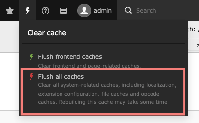

## Templates frontend assets building Methods

We have configured the frontend building structure in 2 different ways for individual templates.

### **Case 1. Using Frontend YARN Methods**

- In most of the templates we have to implement this building process and it’s a new standard process.
- Overall building structure is based on Node and YARN.
- So, First Install the compatible Node Versions(14.19.0 and above) ([https://nodejs.org/en/download](https://nodejs.org/en/download))
- Then after installing the YARN - Building Package Manager ([https://classic.yarnpkg.com/lang/en/docs/install/#mac-stable](https://classic.yarnpkg.com/lang/en/docs/install/#mac-stable)).

**You can detect this method if this file exists `yarn.lock` to the following path:**

```language
ns_theme_TEMPLATE-KEY/Resources/Public/Build/yarn.lock
```

From now you need to fire the following commands:

**Just for your information command should be fire on this path:**

```language
ns_theme_TEMPLATE-KEY/Resources/Public/Build
```

**Getting Started:**

```language
yarn install
```

**Add Any packages(plugins):**

```language
yarn add PACKAGE_NAME
```

**To Test Stylesheets:**

```language
yarn lint:stylesheets
```

**To Test Javascript:**

```language
yarn lint:javascript
```

**To Build Project:**

```language
yarn build
```

After the yarn build command, Your Building process started. Just change your SCSS/JS files and your changes should reflect at the front end.

### **Case 2. Using TYPO3 SASS Methods**

- We have used this method rarely in templates.
- After doing changes on any SCSS files, you must clear the backend cache.
- After clearing the cache just reloads your frontend page, Your changes will be reflected on it.

**Backend Cache Clear Screenshot:**



**You can detect this method if this file exists `gulpfile.js` to the following path:**

```language
ns_theme_TEMPLATE-KEY/Resources/Public/Build/gulpfile.js
```

### **Case 3. Custom CSS**

If you don’t want to compile and build CSS using our mentioned in frameworks, then you can easy-go with custom CSS applied.

Just add your custom style on custom.css from the following path

```language
ns_theme_TEMPLATE-KEY/Resources/Public/css/custom.css
```

Thats It!..:)
