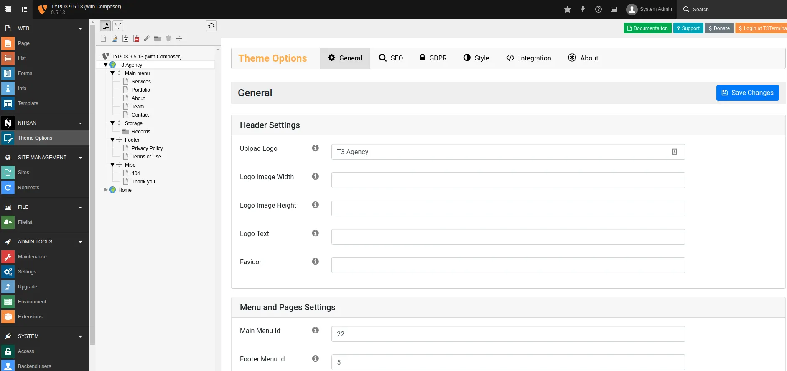

## Global-Level Configuration

- Go to NITSAN > Theme Options
- Click on "Root/Main" page from Page-Tree
- You can configure General, SEO, GDPR, Style, Integration etc.
- All the theme options are self-explain, We recommend to configure everything once.

Note: After installation, Most important is to set correct ID's of menu/pages to create proper menu and content. Sometime TYPO3 mis-configured Page-ID, Please go to General > Menu and Pages Settings and set appropriate page-ids.

## Page-Level Configuration

Basically, we have used the TYPO3 core's constant concept, so you just need to "Create Extension Template" for particular page. then, You can configure all options for particular page.
