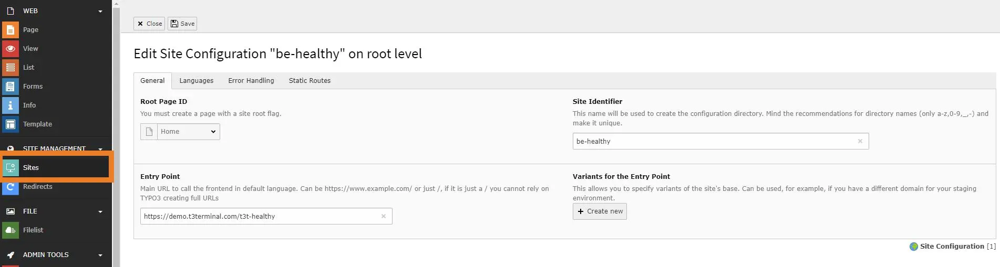
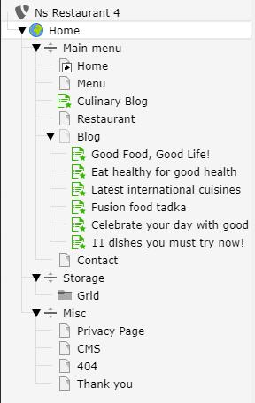
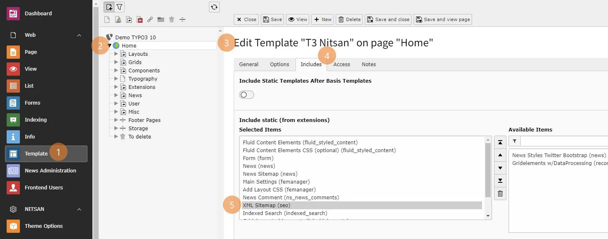
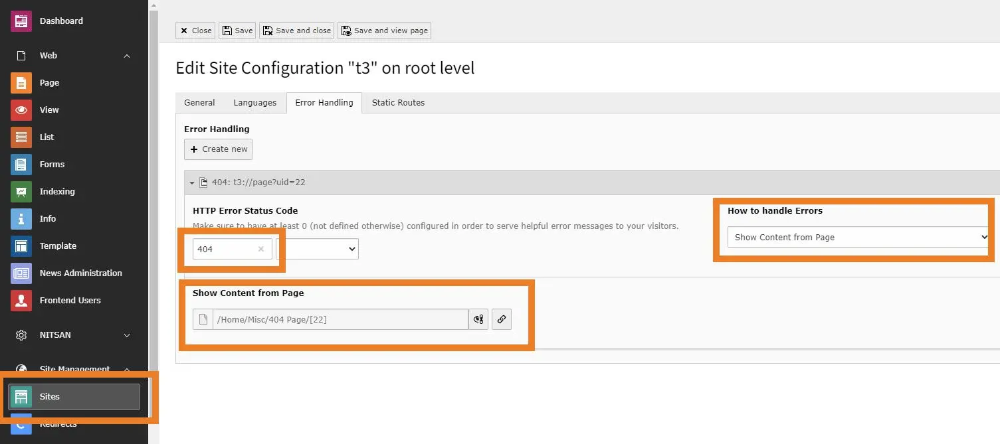

# Installation

## Important Notes Before Installation

You should install the TYPO3 template at the new blank TYPO3 Instance! If you are trying to install the template in your existing used TYPO3 Instance, your current data may lose.

## For Premium Templates

To activate license and install this premium TYPO3 product, Please refer this documentation [License documentation](/License/Index)

## For Free Templates

### Installation with Composer

You can find composer command at our particular TYPO3 template product page https://t3planet.de/typo3-templates

<Note>

For TYPO3 \<= 10, Please de-activate and activate again the template extension from Extensions Manager.

</Note>

<Warning>

For TYPO3 >= v11 composer-based TYPO3 instance, Please don't forget to run below commands.

</Warning>

```python
vendor/bin/typo3 extension:setup
```

### Installation without Composer

T3Planet's TYPO3 Templates is easy to install and configure as just like other TYPO3 extension.

Step 1: Go to Extension Manager

Step 2: Select “Get extensions” from the drop-down at top. Update the Extension Repository by clicking on "Update Now" button at top-right.


Step 3: Once Repository is updated, switch back to Installed Extension view. Install your purchased TYPO3 template zip eg., ns_theme_themename_x.x.x.zip


<Tip>

In case if you are facing memory space issue after installing Template extension then make sure that your server has minimum 100 MB upload size limit. Otherwise, You can extract template zip and copy it to typo3conf/ext folder.

</Tip>

## Important Configuration

### Site Management

Go to Site Management > Sites > Edit Record > You need to configure "Entry Point" by entering your website URL



<Note>

If you have composer based TYPO3 installation, then make create folder /config/ folder at your root, and copy/paste /public/typo3conf/ext/ns_basetheme/sites folder - to get default Site management configuration.

</Note>

### Page Tree

Once you install your TYPO3 Template extension, it will automatically generate "Page tree" in your TYPO3 backend with all the pages and content.



### SEO Setup for TYPO3 9 and TYPO3 10

Once you have completed Site Management, you can setup SEO for the site. For this, you have to add XML Sitemap in Include Static in Template record. You can perform this as shown in below screenshot.



To configure error Handling in Site and setup 404, you need to perform steps as mentioned below:

Step 1. Go to Sites Module.
Step 2. Select the Site
Step 3. Switch to Error Handling tab and click on Create New button.
Step 4. Set appropriate HTTP Error Status Code and set how to Handle Errors field.


