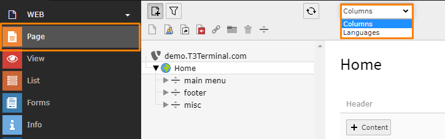
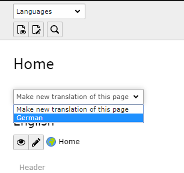
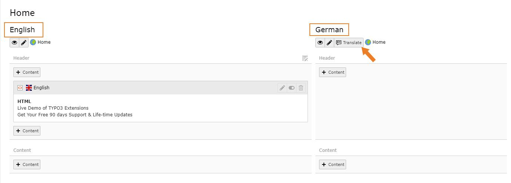
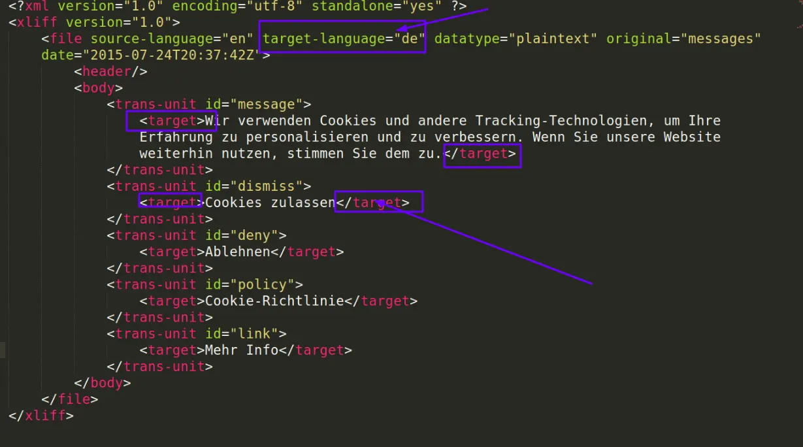

You can add multiple Languages to your TYPO3 Template and create your website with multiple languages. To create multi-language site, please perform following steps:

## Add Language to Pages

Once Language is configured, you need to translate pages & content to new language.

- Go to Page Module, select root page and switch to Language option in drop-down at top.

- Click on Make new Translation of this page drop-down and select language

- It will create a page in selected language. Click on Save & Close button.

Once it is saved there will be 2 sections in backend, one for each language.

You can Translate/Copy content elements of existing language to new language using Translate button in New Language.

## How to change and add another language labels?

- 1. All Labels which are managed at file level are stored at this language file
     : extension_key/Resources/Private/Language/locallang.xlf
- 2. To make translation in another language, create the second language file by creating a copy of locallang.xlf at same folder. For example, de.locallang.xlf
- 3. Now you can change labels and text as per new language as highlighted in below screenshot:

