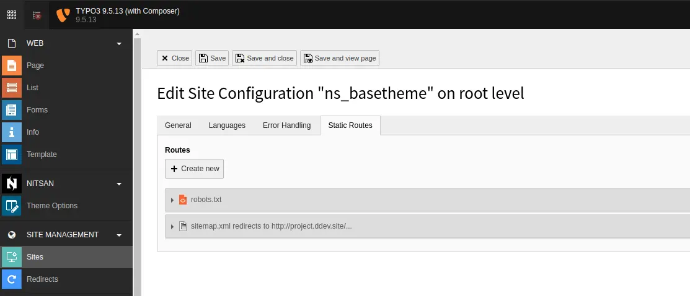
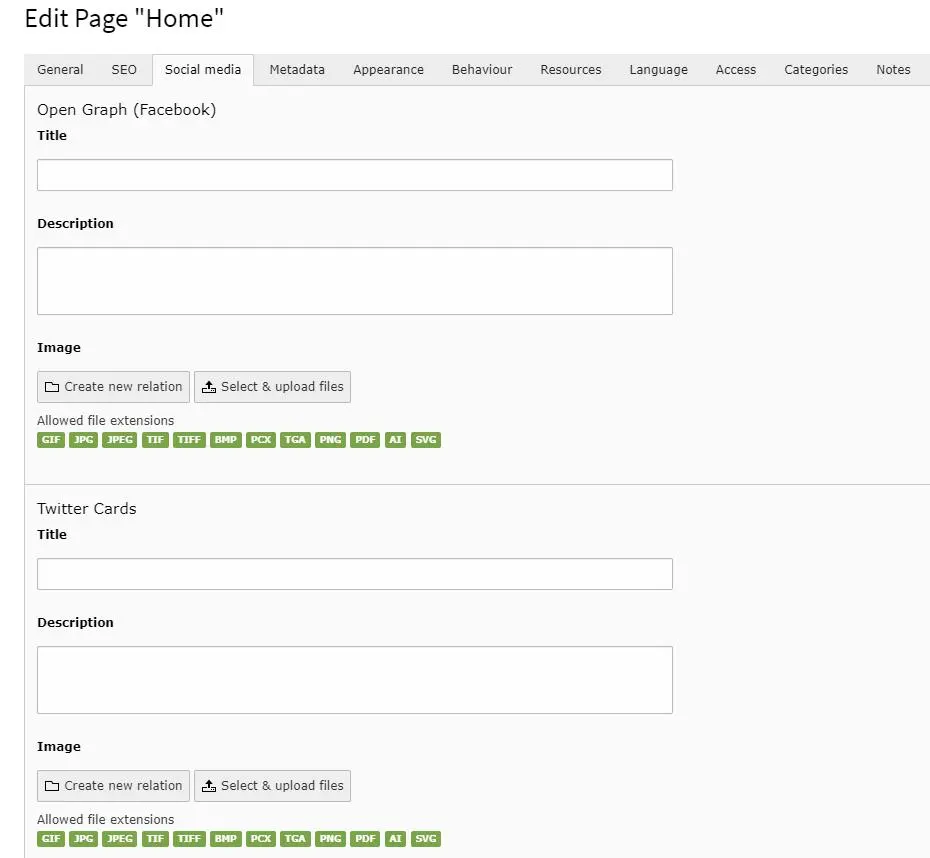
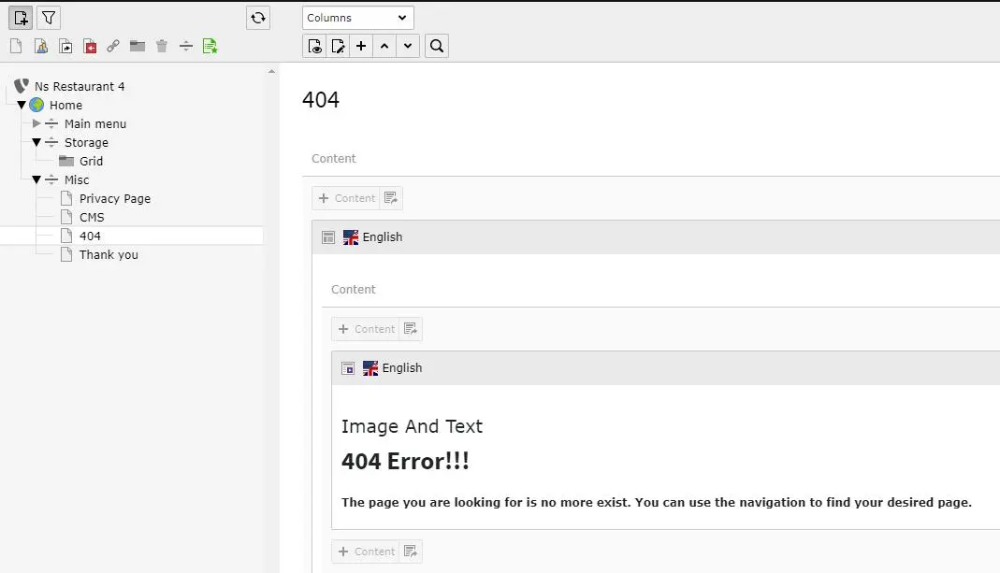
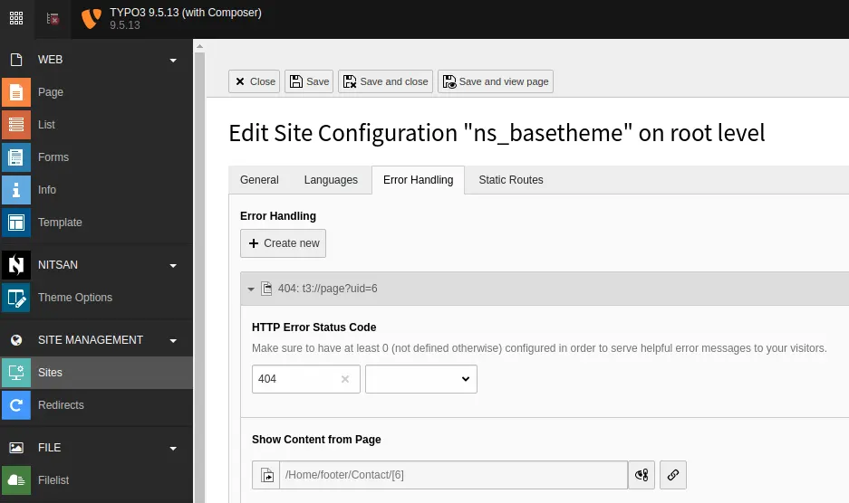
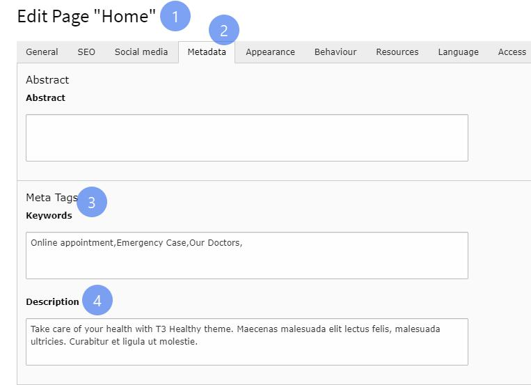
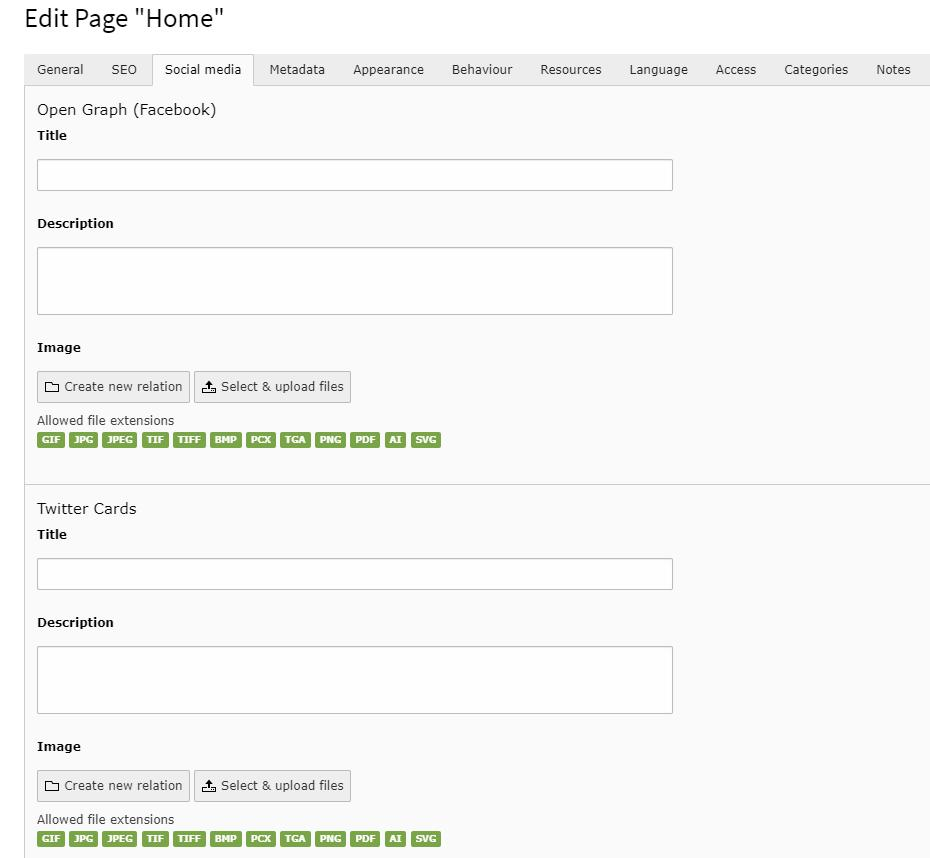
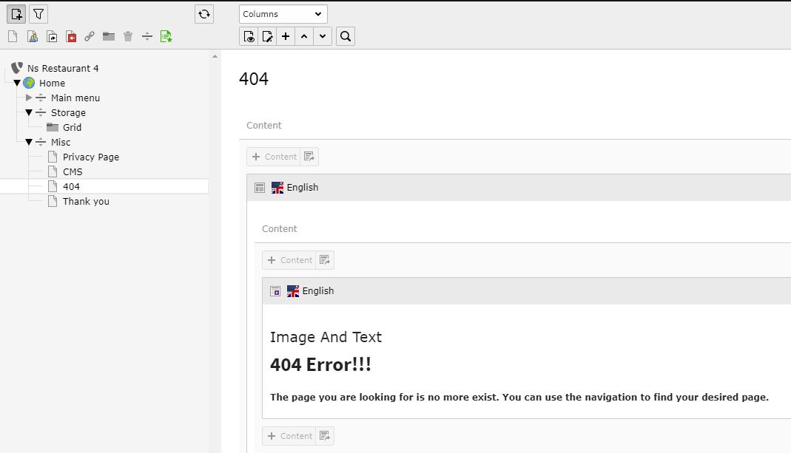

## SEO (Search Engine Optimization)

## 1. Sitemap

You can access Sitemap of template by appending sitemap.xml at the end of BaseURL of template.

For example: https://www.domain.com/sitemap.xml

We have already take care during installation of Template but, Please make sure you've already settings from Site Management > Sites > Edit ns_basetheme > Static Routes

## 2. Robots.txt

You can access Robots.txt of template by appending robots.txt at the end of BaseURL of template

For example: https://www.domain.com/robots.txt

## 3. Set Meta Description & Tags

Set Meta Description and Tags of any page from Metadata tab in page properties. Check below screenshot.

## 4. Setup OG tags for Social Media

When any page is shared on Social Platforms like Facebook, Twitter, OG tags setup for that page will be used for page preview. Set them as below.

## 5. Setup 404 page

You will get pre-configured 404 page with the template. You can access and modify it from Root Page > Misc > 404. Check below image for more info.

We have already take care during installation of Template but, Please make sure you've already settings from Site Management > Sites > Edit ns_basetheme > Error Handling

## Figures

