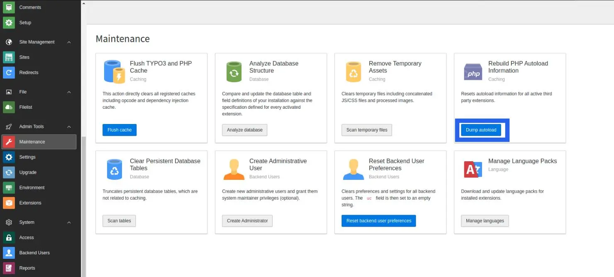
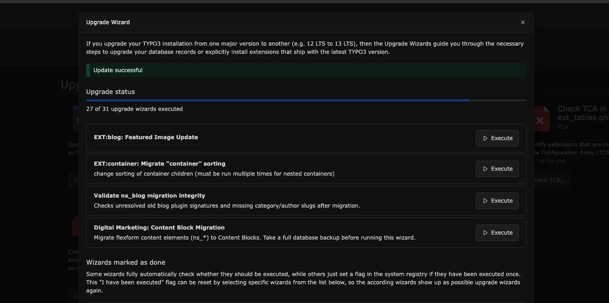

**Step 1.** Setup TYPO3 v11 with your existing database & files

**Step 2.** Now you need to migrate gridelements to container for this you need to follow this step

## Migrate from EXT.gridelements to EXT.container

Latest version of TYPO3 templates products have major breaking changes to migrate from outdated EXT.gridelements to modern EXT.container. Please take a look at the step-by-step migration guide below.

**Step 1.** Go to NITSAN > License Manager > Update to latest version of EXT.ns_theme_name

**Step 2.** Update EXT.ns_basetheme atleast version

**Step 3.** Go to Admin Tools > Maintenance module > Clear cache. Also, click on the “Dump Autoload” button. Or run the below command for the composer-based TYPO3 instance.

```bash
composer dump-autoload
```

**Step 4.** Install EXT.container extension

**Step 5.** Go to Admin Tools > Upgrade > Click on “Run Upgrade Wizard”

**Step 6.** Click on the “Execute” button of “Grid to Container Migration”




**Step 7.** Go to Admin Tools > Extensions > De-activate & Delete EXT.gridelements

**Step 8.** Go to Admin Tools > Maintenance > Clear Cache.

That’s it! All the grids are migrated (structure and data) from EXT.gridelements to EXT.container TYPO3 extension.

## After Migration follow below step for Upgrade v12

**Step 1.** Export the full database after the migration.

**Step 2.** Set up fresh TYPO3 v12 and import the database.

**Step 3.** Activate the template using a license key.

## Upgrade Product ≥ v13.1.0 (Migration from FlexForm Elements to Content Blocks)



From version **13.1.0** onwards, this product introduces major changes by migrating from outdated **FlexForm-based elements** to modern **Content Blocks (EXT)**. Please follow the step-by-step migration guide below.

1. Go to **Admin Tools → T3planet License** and update **Theme (EXT)** to the latest version.
2. Make sure the **Content Blocks extension (EXT)** is installed, as it is required for this migration.
3. Go to **Admin Tools → Maintenance** module and clear the cache. Also, click on the **Dump Autoload** button.
  For composer-based TYPO3 installations, run the following command:

  ```bash
  composer dump-autoload
  ```

<Warning>
Before running the **Upgrade Wizard**, please ensure that you create a **backup of your database**.
</Warning>

1. Go to **Admin Tools → Upgrade** and click **Run Upgrade Wizard**.
2. Click the **Execute** button for **theme: Content Block Migration**.

After completing these steps, all **Custom Elements (structure and data)** will be successfully migrated from **FlexForm Elements** to **Content Blocks (EXT)**.
