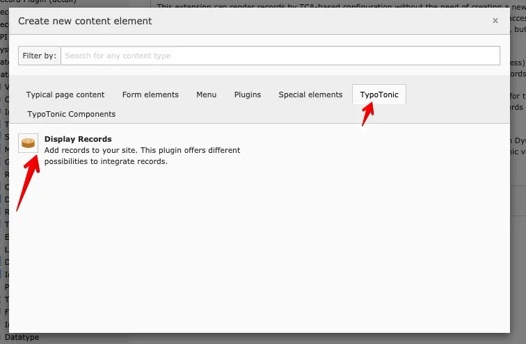
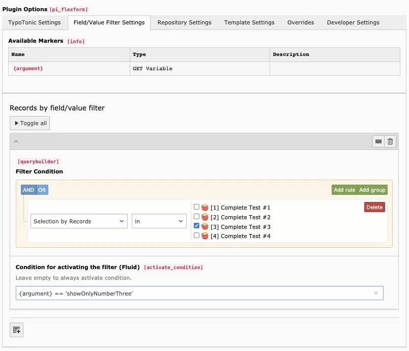
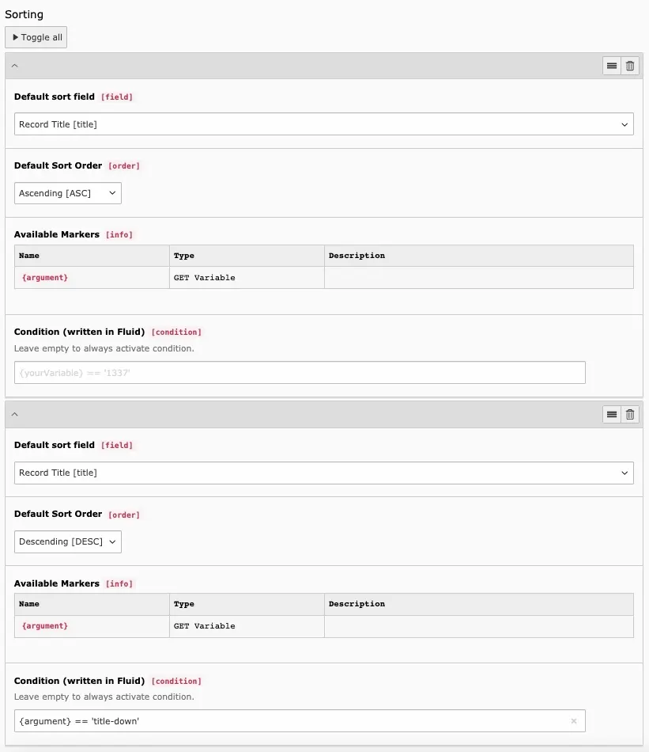

This page covers FlexForm settings shared across the Core frontend plugins (**List**, **Detail**, **Dynamic**, **Plain**).

## Plugin roles

- **List** — Multiple records injected into `{records}` (default variable name configurable).
- **Detail** — One fixed record selected in the plugin → `{record}`.
- **Dynamic** — One record chosen from the URL (detail listener) → `{record}`.
- **Plain** — Renders Fluid without loading a record. Useful for custom markup or variables only.

## Datatype

Select which Datatype's records the plugin works with.

## Record

Shown for single-record plugins such as **Detail**. Select the record to display.

## Page for Detail View

Link list items to a detail page that contains a **Dynamic** plugin.
You can set the target page with a Fluid condition (empty or true = valid).

```html
<dv:link.record record="{record}" pageUid="{detailPid}" additionalParams="{paramOne:'One'}">{record.title}</dv:link.record>
```

See [ViewHelpers](/en/latest/ExtTypoTonic/ViewHelpers/Index).

## Record Storage Page

Select the page where records for this Datatype are stored.



*Selecting a Record Storage Page*

## Field/Value Filter Settings

- **Available Markers** — Markers available in filter Fluid, based on injected variables.
- **Filter Condition** — Controls which records are returned (modifies the query).
- **Condition for activating the filter (Fluid)** — Empty = always active.



*Example filter configuration*

## Repository Settings

- **Limit** — Maximum number of records.
- **Sorting** — One or more sort orders; each can be activated via a variable (for example a GET parameter).
- **Condition for activating the sorting (Fluid)** — When this sorting applies.



*Example: sorting driven by a GET parameter*

## Template Settings

- **Template Selection**
  - **Debug Template** — Default debug output.
  - **Select a custom template path** — Fluid file from the filesystem.
  - **Enter custom fluid code** — Inline Fluid in the plugin.
  - **Your configured template** — Templates predefined in TypoScript. See [Templating](/en/latest/ExtTypoTonic/GettingStarted/Templating/Index).
- **Render this Template without Sitetemplate** — Plugin output only.
- **Template Switch** — Alternate template when a Fluid condition matches.
- **Variable Injection** — Which Template Variables are injected.

## Overrides

A Template Variable can replace a plugin setting when that variable has a value.

## Developer Settings

- **Debug** — Show the SQL query above the rendered output.
- **Custom Headers** — Set response headers (for example `Content-Type` for XML/JSON, or `Content-Disposition` for downloads).
