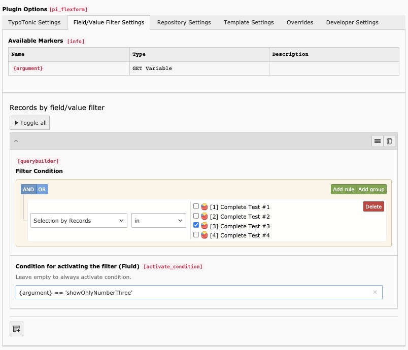
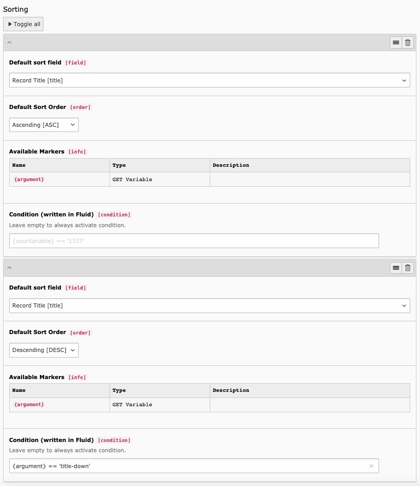

This is the main plugin for showing TypoTonic records on the frontend. It can show a list of records, or the details of a single record.

## Configuration

### Plugin Type

The Plugin Type decides what is injected into your Fluid template.

- **List** — Multiple records, injected into `{records}`.
- **Detail** — One fixed record, selected in the plugin, injected into `{record}`.
- **Dynamic Detail** — One record, chosen dynamically from a URL parameter, injected into `{record}`.
- **Raw Fluid** — Renders Fluid code without loading any record. Useful for showing custom content or variables without a record context.

### Datatype

Select which Datatype's records this plugin shows.

### Record

Only shown for single-record plugin types, such as **Detail**. Select the specific record to show.

### Page for Detail View

Link a record to a detail page that contains a **Dynamic Detail** plugin.
You can set the target page with a Fluid condition, so different conditions can link to different detail pages. A condition is valid when it is empty or evaluates to true.

Link a record with the `t:link.record` ViewHelper:

```html
<t:link.record record="{record}" pageUid="{detailPid}" additionalParams="{paramOne:'One'}">{record.title}</t:link.record>
```

See [ViewHelpers](/ExtTypoTonic/ViewHelpers/Index) for all available ViewHelpers.

### Record Storage Page

Select the page where the records for this Datatype are stored.


*Selecting a Record Storage Page*

## Field/Value Filter Settings

- **Available Markers** — Shows which markers are available in your Fluid filter code, based on the variables you selected for injection.
- **Filter Condition** — Build a filter to control which records are shown. Filters modify the underlying database query.
- **Condition for activating the filter (Fluid)** — A Fluid condition that decides when the filter is active. Leave it empty to always activate the filter.



*Example filter configuration*

## Repository Settings

- **Limit** — The maximum number of records to show.
- **Sorting** — Configure one or more sort orders. Each sorting can be activated through a variable, for example a GET parameter, so you can offer several sort options on the same page.
- **Condition for activating the filter (Fluid)** — Same as above, a Fluid condition that decides when this sorting is active.



*Example: sorting that changes direction based on a `?argument=title-down` parameter*

## Template Settings

- **Template Selection** — Choose how the template is rendered:

  - **Debug Template** — Shows debug information. This is the default.
  - **Select a custom template path** — Choose a Fluid file from your file system.
  - **Enter custom fluid code** — Write Fluid code directly in the plugin.
  - **Your configured template** — Shows any templates you predefined in TypoScript. See [Templating](/ExtTypoTonic/GettingStarted/Templating/Index).

- **Render this Template without Sitetemplate** — Shows only this plugin's output, without the rest of the page template.
- **Template Switch** — Use a different template when a Fluid condition matches, instead of the template selected above.
- **Variable Injection** — Select which Template Variables are injected into the Fluid template. When a condition field is shown elsewhere in the plugin, this section tells you which variables you can use in it.

## Overrides

Overrides let a Template Variable replace a plugin setting automatically, whenever that variable has a value.

## Developer Settings

- **Debug** — Shows the SQL query used to fetch records, above the rendered page.
- **Custom Headers** — Sends or overwrites response headers. Use this to output XML or JSON with a `Content-Type` header, or force a file download with `Content-Disposition`.
